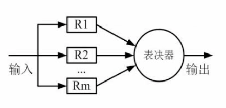

# 计算机组成与体系结构

## 数据的表示
- ### 进制转换
  - 其他进制转换成十进制（<mark>**按权展开**</mark>）  
    例如二进制10100.01=1x2<sup>4</sup>+1x2<sup>2</sup>+1x2<sup>-2</sup>  
    同理八进制、十六进制

  - 十进制转换成其他进制（<mark>**短除法**</mark>）  
      除以进制并且记录余数  
      **注意从下往上**

  - 十进制转换八进制  
      如果是10进制转换为8进制，则从右到左分段，每三个一段

  - 十进制转十六进制  
      如果是10进制转换为16进制，则从右到左分段，每四个一段
- ### 编码问题
  - 原码  
    最高位用于符号位，正数0，负数1

  - 反码  
    正数同原码一样  
    负数的符号位不变，后面的所有位都取反

  - 补码  
    正数同原码一样  
    负数在反码的基础上+1

  - 移码  
    补码的基础上首位（符号位）取反
- ### 编码表示范围
  原码：-(2<sup>n-1</sup>-1)~2<sup>n-1</sup>-1  
  反码：-(2<sup>n-1</sup>-1)~2<sup>n-1</sup>-1  
  补码：-2<sup>n-1</sup>~2<sup>n-1</sup>-1  
    <mark>**原码和反码有+0和-0分区分，而补码没有**</mark>
- ### 浮点数运算
  <mark>**通常表示为N=MxR<sup>e</sup>**</mark>  
  <mark>**其中R为进制，M为尾数，e为阶码）**</mark>
  - **步骤:**  
  <mark>**1. 对阶**</mark>  
  <mark>**2. 位数计算**</mark>  
  <mark>**3. 结构格式化**</mark>

  注意对阶应该对大的部分对阶，例如1x10<sup>3</sup>和1.19x10<sup>2</sup>，应该化为0.119x10<sup>3</sup>和1x10<sup>3</sup>
## 计算机结构
主机基本组成：
  - CPU
    - 运算器
      - 算数逻辑单元(A)
      - 累加寄存器(AC)
      - 数据缓冲寄存器(DR)
      - 状态条件寄存器(PSW)
    - 控制器
      - 程序计数器(PC)
      - 指令寄存器(IR)
      - 指令译码器
      - 时序部件
  - 主存储器
## Flynn分类法
| 体系结构类型 | 控制部分 | 关键特性 | 代表 |
| :-:| :-: | :-: |:-:|
| 单指令流数据流(SISD) | 控制部分:一个<br>处理器：一个<br>主存模块:一个 | —— | 单处理器系统|
| 单指令流多数据流(SIMD) | 控制部分:一个<br>处理器：多个<br>主存模块:多个 |各个处理器以异步<br>的形式执行同一条指令 |并行处理机<br>**阵列处理机**<br>超级向量处理机|
|多指令流单数据流(MISD)|控制部分:多个<br>处理器：一个<br>主存模块:多个|被证明不可能|目前没有|
|多指令多数据流(MIMD)|控制部分:多个<br>处理器：多个<br>主存模块:多个|能实现作业、任务、<br>指令等各级全面并行|多处理机系统<br>多计算机

<mark>**注意代表的类型(重点)**</mark>  
<mark>**注意多个核心处理器的电脑不属于单指令流单数据流，属于单指令流多数据流**</mark>
<br><br><br><br><br><br>
## CISC（复杂指令集）和RISC（精简指令集）
| 指令集 | 指令 | 寻址方式 | 实现方式 | 其他 |
|:-:|:-:|:-:|:-:|:-:|
|CISC|数量多，使用频率<br>差别大，可变长格式|支持多种|微程序控制技术<br>（微码）|研制周期长|
|RISC|数量少，使用频率<br>接近，定长格式，大<br>部分为单周期指令，<br>操作寄存器，只有<br>Load/Store操作内存|支持方式少|增加了通用寄存器，<br>硬布线逻辑控制为主，<br>适合采用流水线|优化编译，有<br>效支持高级语言|

**目前绝大多数的计算机都使用CISC（复杂指令集）而移动设备，尤其是手机，Pad基本上都是用RISC（精简指令集）**
## 流水线
- ### 流水线的概念
  **流水线的通常流程:取值、分析、执行**
  <table>
  <tr>
      <td>取值</td>
      <td>1</td>
      <td></td>
      <td></td>
      <td>2</td>
      <td> </td>
      <td> </td>
      <td>3</td>
      <td> </td>
      <td> </td>
  </tr>
  <tr>
      <td>分析</td>
      <td> </td>
      <td>1</td>
      <td> </td>
      <td> </td>
      <td>2</td>
      <td> </td>
      <td> </td>
      <td>3</td>
      <td> </td>
  </tr>
  <tr>
      <td>执行</td>
      <td> </td>
      <td></td>
      <td>1</td>
      <td> </td>
      <td></td>
      <td>2</td>
      <td> </td>
      <td></td>
      <td>3</td>
  </tr>
  </table>
  （上图）没有使用流水线执行指令情况
  <table>
  <tr>
      <td>取值</td>
      <td>1</td>
      <td>2</td>
      <td>3</td>
      <td></td>
      <td> </td>
      <td> </td>
      <td></td>
      <td> </td>
      <td> </td>
  </tr>
  <tr>
      <td>分析</td>
      <td> </td>
      <td>1</td>
      <td>2</td>
      <td>3</td>
      <td></td>
      <td> </td>
      <td> </td>
      <td></td>
      <td> </td>
  </tr>
  <tr>
      <td>执行</td>
      <td> </td>
      <td></td>
      <td>1</td>
      <td>2</td>
      <td>3</td>
      <td></td>
      <td> </td>
      <td></td>
      <td></td>
  </tr>
  </table>
  （上图）使用流水线执行指令情况

- ### 流水线的时间计算

  - 流水线周期  
    <mark>**流水线周期指的是执行时间最长的一段，步骤中最耗时的流程**</mark>
  - 流水线计算公式  
  <mark>**一条指令执行时间+(执行条数-1)x流水线周期**</mark>  
        1. <mark>**理论公式：(t<sub>1</sub>+t<sub>2</sub>+…+t<sub>n</sub>)+(n-1)x△t**</mark>  
        2. <mark>**实践：(k+n-1)x△t**</mark>
  
    备注：△t为一个流水线周期时间
<br><br><br><br>   
```
例题：若指令流水线把一条指令氛围取值、分析和执行三个部分，且三个部分的时间分别为取值：2ns，分析2ns，执行1ns，那么流水线周期是多少？100条指令全部执行完毕需要时间是多少？
```
<table>
<tr>
    <td>取值</td>
    <td>1</td>
    <td>2</td>
    <td>3</td>
    <td>…</td>
    <td>n</td>
    <td> </td>
    <td></td>
    <td> </td>
    <td> </td>
</tr>
<tr>
    <td>分析</td>
    <td> </td>
    <td>1</td>
    <td>2</td>
    <td>3</td>
    <td>…</td>
    <td>n</td>
    <td> </td>
    <td></td>
    <td> </td>
</tr>
<tr>
    <td>执行</td>
    <td> </td>
    <td></td>
    <td>1</td>
    <td>2</td>
    <td>3</td>
    <td>…</td>
    <td>n</td>
    <td></td>
    <td></td>
</tr>
</table>

**根据图表可得，1:2只有取值，因此需要1ns2:3和3:4需要照应到1的取分析和执行过程，因此需要2ns**

```
解：
1.流水线周期是 2 ns
2.(2+2+1)+99x2=203 ns
```

- ### 流水线的吞吐率计算
   - <mark>**流水线的吞吐率(TP)=指令条数/流水线执行时间**</mark>

      以上述例题为例，则TP=100/203
  - <mark>**流水最大吞吐率=1/△t**</mark>
- ### 流水线加速比计算
  - <mark>**流水线加速比S=不使用流水线执行时间/使用流水线执行时间**</mark>

      以上述例题为例，如果不使用流水线，则执行时间为500，则S=500/203
- ### 流水线的效率
  流水线的效率是指流水下设备利用率，在时空图上，流水线的效率定义为n个任务占用的时空去与k个流水段总的时空去之比

  <mark>**即流水线中所占用的时空÷所有时空**</mark>
  
  例如这样的任务流程:  
  周期取最大值3△t：
  <table>
  <tr>
    <td>s1</td>
    <td>s2</td>
    <td>s3</td>
    <td>s4</td>
  </tr>
  <tr>
    <td>△t</td>
    <td>△t</td>
    <td>△t</td>
    <td>3△t</td>
  </tr>
  </table>
  则将这样的任务用时空图表示为：
  <table>
  <tr>
    <td>s1</td>
    <td>1</td>
    <td></td>
    <td></td>
    <td>2</td>
    <td></td>
    <td></td>
    <td>3</td>
    <td></td>
    <td></td>
    <td>4</td>
    <td></td>
    <td></td>
    <td></td>
    <td></td>
    <td></td>
  </tr>
  <tr>
    <td>s2</td>
    <td></td>
    <td>1</td>
    <td></td>
    <td></td>
    <td>2</td>
    <td></td>
    <td></td>
    <td>3</td>
    <td></td>
    <td></td>
    <td>4</td>
    <td></td>
    <td></td>
    <td></td>
    <td></td>
  </tr>
  <tr>
    <td>s3</td>
    <td></td>
    <td></td>
    <td>1</td>
    <td></td>
    <td></td>
    <td>2</td>
    <td></td>
    <td></td>
    <td>3</td>
    <td></td>
    <td></td>
    <td>4</td>
    <td></td>
    <td></td>
    <td></td>
  </tr>
  <tr>
    <td>s4</td>
    <td></td>
    <td></td>
    <td></td>
    <td>1</td>
    <td>1</td>
    <td>1</td>
    <td>2</td>
    <td>2</td>
    <td>2</td>
    <td>3</td>
    <td>3</td>
    <td>3</td>
    <td>4</td>
    <td>4</td>
    <td>4</td>
  </tr>
  </table>

  - <mark>**计算流水线效率公式为E=n个任务占用的时空区/k个流水段的时空区**</mark>

  例如上述内容占用的时空区为(△t + △t + △t + 3△t) x 4=24△t  
  总共有15△t x 4 = 60△t  
  则流水线效率为24△t / 60△t = 2/5
## 层次化存储结构
<table>
<tr>
  <td>很快</td>
  <td>CPU(的寄存器)</td>
  <td></td>
  <td>容量很小</td>
</tr>
<tr>
  <td>快</td>
  <td>Cache(缓存)</td>
  <td>按内容存取</td>
  <td>容量小</td>
  <td>KB或者MB为单位</td>
</tr>
<tr>
  <td>慢</td>
  <td>主存(内存)</td>
  <td></td>
  <td>容量大</td>
  <td>以GB为单位</td>
</tr>
  <tr>
  <td>很慢</td>
  <td>辅存(外存)</td>
  <td>硬盘、光盘、U盘等</td>
  <td>容量很大</td>
  <td></td>
</tr>
</table>

**注意：按内容存取的存储器又叫做相联存储器**

- ### Cache
  - Cache的概念
  
    Cache工作于处理器和主存之间，<mark>**用于提高CPU输入输出的速率**</mark>，突破CPU与存储系统之间传送宽带限制。

    在整个计算机存储体系中，除了CPU的寄存器，Cache的访问速度是最快的。

    Cache改善系统性能的依据就是 <mark>**程序的局部性原理**</mark>
    
    如果以h代表Cache的访问命中率，t<sub>1</sub>表示Cache的周期时间，t<sub>2</sub>表示主存储器周期时间，以读操作为例，使用"Cache+主存储器"的系统的平均周期是t<sub>3</sub>，则：

    <mark>**t<sub>3</sub> = h x t<sub>1</sub> +(1-h) x t<sub>2</sub>**</mark>

    其中(1-h)又称为失效率(未命中率)
    ```
    例题：假设Cache的命中率为95%，Cache周期是1ns，主存储器的周期是1ms（注：1ms=1000ns)，那么使用“Cache+主存储器“的系统平均周期是多少？
    ```
    ```
    解：t=95% x 1ns + (1-95%) x 1000ns
     上式=50.95ns
    ```

  - 局部性原理
  
    局部性原理分为 <mark>**时间局部性**</mark> 和 <mark>**空间局部性**</mark>
    
    时间局部性：刚刚访问结束的指令再次访问  
    空间局部性：访问刚刚访问的邻近的地址

    <br>
- ### 主存
  - 主存的分类
    <table>
    <tr>
      <td rowspan="2">随机存储器</td>
      <td>DRAM(动态RAM)</td>
    </tr>
    <tr>
      <td>SRAM(静态RAM)</td>
    </tr>
    <tr>
      <td rowspan="4">只读存储器</td>
      <td>MROM(掩模式ROM)</td>
    </tr>
    <tr>
      <td>PROM(一次性可编程ROM)</td>
    </tr>
    <tr>
      <td>EPROM(可擦除的PROM)</td>
    </tr>
    <tr>
      <td>Flash(闪存)</td>
    </tr>
    </table>
  - 主存的编址
    
    8x4位的存储器如下图

    | | | | | |
    |:-:|:-:|:-:|:-:|:-:|
    |000|*|*|*|*|
    |001|*|*|*|*|
    |010|*|*|*|*|
    |011|*|*|*|*|
    |100|*|*|*|*|
    |101|*|*|*|*|
    |110|*|*|*|*|
    |111|*|*|*|*|

    **8个地址空间每个，每个地址空间存储了4bit空间**

    使用两块这样的存储器可以组成8x8位存储器  
    也可以组成16x4位的存储器
    ```
    例：内存地址从AC000H到C7FFFH，共有____K个地址单元，如果该内存地址按字(16bit)编址，由28片存储芯片构成。已知构成此内存的芯片每片由16K个存储单元，则该芯片每个存储单元存储___位
    ```
    ```
    解：
    1.大的地址-小的地址，即
    C7FFF-AC000+1=1C000=1C000
    1C000的10进制为114688
    114688÷1024=112 K
    2.112K÷16K=7个
    也就是至少需要7个就可以满足容量，总共用了28片
    即(28÷7)*?=16 bit
    可以得出每个芯片是4位
    ```
- ### 磁盘
    - 磁盘结构与参数

      磁盘主要分为磁道、扇区和磁头  
      <mark>**存取时间=寻道时间+等待时间(平均定位时间+转动延迟)**</mark>
    - 相关计算
      ```
      例：假设某磁盘的每个磁道划分为11个物理块，每块存放1个逻辑记录。逻辑记录R0,R1……R10存放在同一个磁道上，记录存放顺序如下表所示
      ```
      |物理块|1|2|3|4|5|6|7|8|9|10|11|
      |:-:|:-:|:-:|:-:|:-:|:-:|:-:|:-:|:-:|:-:|:-:|:-:|
      |逻辑记录|R0|R1|R2|R3|R4|R5|R6|R7|R8|R9|R10|
      ```
      如果磁盘旋转周期为33ms，当磁头当前处在R0的开始处，若系统使用单缓冲区顺序处理这些记录，每个记录处理时间为3ms，则处理这11个记录的最长时间为___；若对信息存储进行优化分布后，处理11个记录的最少时间为___。
      ```
       

      ```
      1.解：
      转一圈周期是33ms，则每转到相邻的扇页区需要33÷11=3ms
      转到R0末尾的时候开始处理R0的数据(3ms)，略过R1
      因此如果需要处理完R1数据，就需要再转一圈(33ms)，总共需要36ms
      针对R0，只需要6ms即可，但是对于R1~R10一共需要33x10ms
      因此这一问答案为33x10+6=336ms
      ```
      

      ```
      2.解：
      如上图所示，可以依次读取R0，处理R0，读取R1，处理R1……
      这样便不需要重新再转一圈读取和处理，没有时间浪费
      这样只需要转2圈，66ms
      ```
## 总线
- ### 总线分类
  - 内部总线
  - 系统总线
    - 数据总线
    - 地址总线(计算机系统的位数)
    - 控制总线
  - 外部总线
## 系统可靠性分析与设计
- ### 串联系统和并联系统
  - 串联  
    串联模型中如果输入经由n个系统输出，其可靠性分别为R<sub>1</sub>、R<sub>2</sub>、R<sub>3</sub>……R<sub>n</sub>  
    那么系统的可靠性R为：  
    <mark>**R=R<sub>1</sub> x R<sub>2</sub> x R<sub>3</sub> x …… R<sub>n</sub>**</mark>

    失效率(<mark>**仅适用于少量**</mark>)为：  
    <mark>**S=(1 - R<sub>1</sub>) + (1 - R<sub>2</sub>) + (1 - R<sub>3</sub>) + …… + (1 - R<sub>n</sub>)**</mark>
  - 并联  
    并联系统中只有所有的系统失效才能失效  
    因此如果在并联模型中输入经由n个系统输出，其可靠性分别为R<sub>1</sub>、R<sub>2</sub>、R<sub>3</sub>……R<sub>n</sub>  
    那么系统的可靠性R为：  
    <mark>**R=1 - (1 - R<sub>1</sub>) x (1 - R<sub>2</sub>) x (1 - R<sub>3</sub> x …… x(1 - R<sub>n</sub>)**</mark>
    ```
    由下图所示，求系统的可靠性
    ```
    

    ```
    解:R x (1 - (1 - R)^3) x (1 - (1 - R)^2)
    ```
  - 模冗余系统与混合系统  
      
    R<sub>1</sub>～R<sub>m</sub>的作用相同，最终系统通过表决器来选择其中之一（通常少数服从多数，相当于屏蔽错误）

    模冗余系统与混合系统几乎不考察
## 校验码
- ### 码距
  通常通过增大码距的方式（增加冗余信息）来进行差错控制

  码距就是指从A->B需要改变多少位

  1. 例如1位长度的二进制编码，A=0，B=1，那么A和B之间的最小码距为1  
  2. 例如2位长度的二进制编码，A=11，B=00，那么A和B之间的最小码距为2  
  3. 例如3为长度的二进制编码，A=111，B=000，那么A和B之间的最小码距为3

  在上述的情况中，使用一位的二进制无法检查错误与否，使用两位二进制可以知道有错与否，但是无法知道其原本的内容，而使用三位二进制的编码，不仅可以知道错误与否，还可以知道其原本的编码
- ### 循环校验码(CRC)
  **循环校验码可以用于检查是否有错但是无法用于纠正错误**  
  其原理是使用模二方法相除检测是否有余数
  ```
  例：原始报文为11001010101，其生成的多项式为：x^4+x^3+x+1。对其进行CRC编码后的结果为多少？
  ```

<br>

  ```
  解：将生成的二项式转换为二进制形式
  x^4+x^3+x+1
  =>11011
  然后将原始报文后面加上这个二进制位数-1个0
  也就是说将11001010101=>110010101010000
        _________________
  11011 )110010101010000
         11011
         ——————————
            10010
            11011
            ————————
             10000
             11011
             ————————
              10111
              11011
              ————————
               11000
               11011
               ————————
                  11000
                  11011
                  ————————
                   0011
  因此末尾的四个位为0011，则CRC编码后的结果为110010101010011

  ```
- ### 海明校验码
  <mark>**公式2<sup>k</sup>-1≥n+k以确定k,n为原始数据,k即为校验位数**</mark>  
  ```
  例:求信息1011的海明码
  ```
  |位数|7|6|5|4|3|2|1|
  |:-:|:-:|:-:|:-:|:-:|:-:|:-:|:-:|
  |二进制|111|110|101|100|011|010|001|
  |信息位|1|0|1||1|||
  |校验位||||p2||p1|p0|
  ```
  解：1011一共4位，因此第一步求2^k-1≥4+k
  求得k最小是3，因此需要3位校验位，设为p0,p1,p2
  校验位分别为2^0、2^1和2^2位置上，即第一位，第二位和第四位上
  p0 位是第一位，即001位，查找xx1的位置异或运算：
  第3、5、7位异或（不同为1，相同为0）
  p1 位是第二位，即010位，查找x1x的位置异或运算
  第3、6、7位异或
  p2 位是第四位，即100位，查找1xx的位置异或运算
  第5、6、7位异或
  ```
  ||公式|结果|
  |:-:|:-:|:-:|
  |p0|1⊕1⊕1|1|
  |p1|1⊕0⊕1|0|
  |p2|1⊕0⊕1|0|
  ```
  将结果填入表中，则最终得到：
  1010101
  即：
  ```
  |位数|7|6|5|4|3|2|1|
  |:-:|:-:|:-:|:-:|:-:|:-:|:-:|:-:|
  |二进制|111|110|101|100|011|010|001|
  |结果|1|0|1|**`0`**|1|**`0`**|**`1`**|
  ***
  **``注意下面的是另一题了``**
  ```
  例:若收到的信息为1011101，那么是否有错，错在哪一位？
  ```
  |位数|7|6|5|4|3|2|1|
  |:-:|:-:|:-:|:-:|:-:|:-:|:-:|:-:|
  |二进制|111|110|101|100|011|010|001|
  |结果|1|0|0|**`1`**|1|**`0`**|**`1`**|
  ```
  解：一共7位可得校验位是1,2,4，分别设为p0,p1,p2则:
  p0=1⊕0⊕1=0
  p1=1⊕0⊕1=0
  p2=0⊕0⊕1=0
  其中p0、p2有错
  p0鉴别的是3、5、7
  p1鉴别的是3、6、7
  p2鉴别的是5、6、7
  由此可得有错的是第五位
  ```