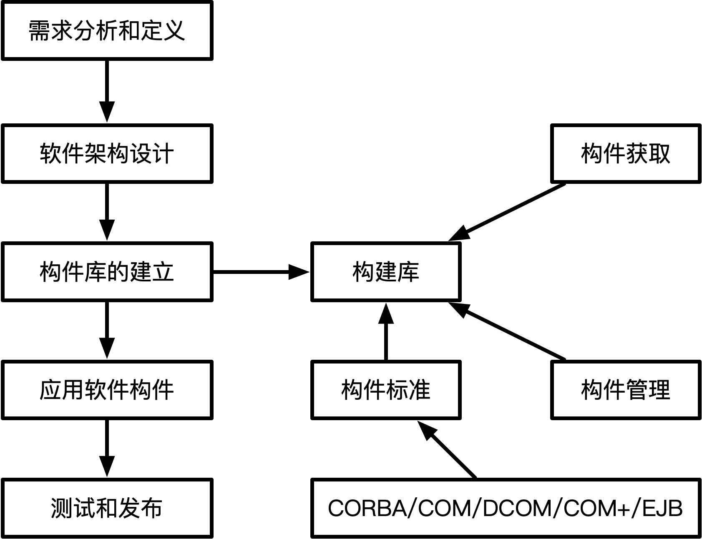
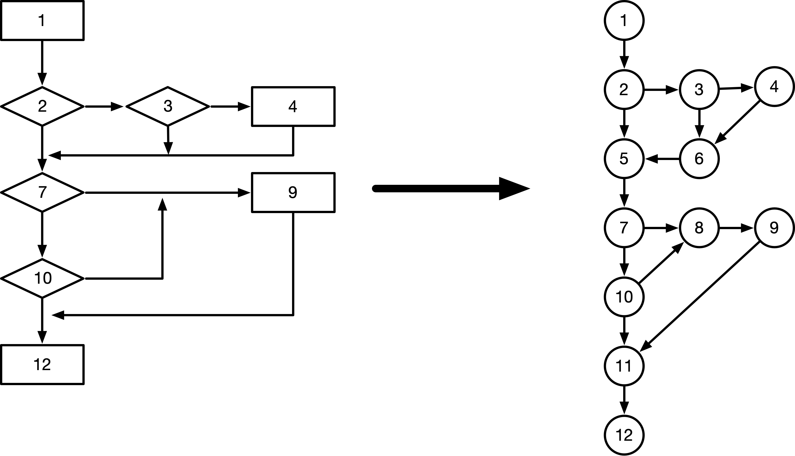
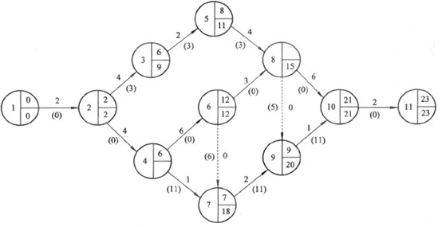
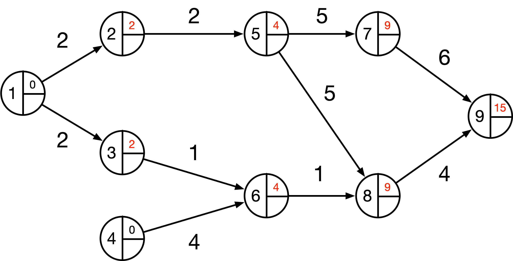

# 软件工程
## 软件开发模型
- ### 瀑布模型(SDLC)
  

  定义阶段：**软件设计**和**需求分析**  
  开发阶段：**软件设计**，**程序编码**和**软件测试**
  维护阶段：**运行维护**

  存在的问题：需求分析难以把控，出现需求问题需要重新回到需求分析

  <mark>**瀑布模型适用场景：需求明确**</mark>
- ### 原型模型和演化模型
  

  <mark>**原型强调构造一个简易的系统，针对需求不明确的情况**</mark>  
  <mark>**通过原型来获取需求(原型交互)**</mark>  
  演化模型是从原型发展而来，即演化原型成为最终的产品  
  螺旋模型虽然也是从原型发展而来，但是其兼具瀑布模型的特征和演化模型的特征  
- ### 增量模型
  增量模型兼具瀑布模型和原型的特点，<mark>**一步一步执行**</mark>，可以把待开发的软件系统模块化，将每个模块作为一个增量组件，<mark>**从而分批次地分析、设计、编码和测试这些增量组件**</mark>
<br><br><br><br>

- ### 螺旋模型
  <mark>**兼具多个模型的特点**</mark>，大致分为制定计划、风险分析、实施工程和客户评估这几个方面<mark>**（引入了风险分析这个环节，其它模型都没有，是螺旋模型最显著的特征）**</mark>
- ### V模型
  

  特点：
  - <mark>**经过四重测试**</mark>，包括单元测试、集成测试、系统测试和验收测试
  - 在需要分析阶段就进行验收测试和系统测试，在概要设置阶段进行集成测试，在详细设计阶段进行单元测试，<mark>**即提前测试**</mark>
- ### 喷泉模型
  特点：  
  <mark>**面向对象，迭代且无间隙**</mark>
- ### RAD(快速开发模型)
  使用SDLC（瀑布模型）和CBSD（构建组建模型组成）

  特点：
  <mark>**快速构建应用系统**</mark>
- ### CBSD
  

  把软件中模块组成标准的构建，构件进行组装

  特点：  
  <mark>**极大提高软件开发的复用性，极大节约开发的总时长，增加软件可靠性，节省成本**</mark>
<br><br><br><br>

- ### 敏捷开发方法
  

  特点：  
  <mark>**适用于小型项目，强调小步**</mark>
## 信息系统开发方法
  - ### 结构化法：
    特点：
    - 用户至上
    - 严格区分工作阶段，每阶段有任务和成果
    - 强调系统开发过程的整体性和全局性
    - 系统开发过程工程化，文档资料标准化
    - 自顶向下，逐步分解（求精）

    缺点：
    - 灵活性比较差
<br><br>

  - ### 原型法：
    特点：
    - <mark>**适用于需求不明确的开发**</mark>
    - 包括抛弃式原型和演化式原型
<br><br>

  - ### 面向对象
    特点：
    - <mark>更好的**复用性**(与结构化法相对应)</mark>
    - 关键在于建立一个全面、合理、统一的模型
    - 分析、设计、实现三个阶段，需求和界限不明确
<br><br><br><br>

  - ### 面向服务方法
    - SO方法主要有三个主要的抽象级别：操作、服务和业务流程
    - SOAD氛围三个层次：基础设计层（底层服务构件）、应用结构 层（服务之间的接口和服务级协定）和业务组织层（业务流程建模和服务流程编排）
    - 服务建模：分为服务发现、服务规约和服务实现三个阶段
## 需求开发
- ### 需求分类和需求获取
  分类：  
  - 业务需求
  - 用户需求
  - 系统需求
    - 功能需求
    - 性能需求
    - 设计约束(比如设计语言)
<br><br>

  质量功能展开（顾客驱动产品开发方法）：
  - 基本需求（用户明确提出）
  - 期望需求（用户没有明确提出，但是理所应当的需求）
  - 兴奋需求（用户没有明确提出，比较新鲜的需求，但是需要严格控制）
## 结构化设计
- ### 基本原则
  - 自顶向下，逐步求精
  - 信息隐蔽
  - 模块独立<mark>**（高内聚、低耦合、复杂度）**</mark>  
  **`（模块不独立会导致修改复杂）`**
  
  其它原则：  
  - 保持模块的大小适中
  - 尽可能减少调用的深度（防止因为多层调用修改不变）
  - 多扇入，小扇出<mark>**（多被调用，少调用其它模块）**</mark>
  - 单入口，单出口
  - 模块的作用域应该在模块之内
  - 功能应该可预测
<br><br>

- ### 内聚和耦合
  内聚指的是一个模块内部之间的紧密程度（<mark>越高越好</mark>）  
  内聚类型排序（高内聚到低内聚）:  
  功能内聚>顺序内聚>通信内聚>过程内聚>瞬时内聚（时间内聚）>逻辑内聚>偶然内聚（巧合内聚）

  耦合指的是不同模块外部之间的紧密程度（<mark>越低越好</mark>）  
  耦合类型排序（低耦合到高耦合）:  
  非直接耦合>数据耦合>标记耦合>控制耦合>外部耦合>公共耦合>内容耦合

- ### 变换型系统结构
  
## 软件测试
- ### 测试原则
  - 尽早、不断地测试
  - 程序猿避免测试自己设计的程序
  - 既要选择有效、合理的数据，也要选择无效、不合理的数据
  - 修改后进行回归测试（修改bug之后重新测试）
  - 尚未发现的错误数量与该程序已发现错误数成正比（重点测试bug多的模块）

- ### 测试的类型
  分为动态测试和静态测试，其中动态测试指的是利用到计算机，而静态测试没有利用到计算机
  - 动态测试：
    - 黑盒测试法
    - 白盒测试法
    - 灰盒测试
  - 静态测试：
    - 桌前检查（自己浏览检查）
    - 代码走查（人工执行）
    - 代码审查（交叉人员检查）

- ### 测试用例设计
  - 黑盒测试法（不知道程序结构）
    - 等价类划分（用不同的数值类别测试，同一类选择一个进行测试）
    - 边界值分析（测试边界值，在数值中>和≥区别）
      ```
      例：要求输入年龄范围是0～150的整数，那么测试边界的数应该有___
      ```
      ```
      解：-1、0、1、149、150、151
      ```
    - 错误推测（通常需要经验，推测可能出现问题的地方）
    - 因果图（通过结果推测问题）
  - 白盒测试法（知道程序的内部结构）
    - 基本路径俄式
    - 循环覆盖测试
    - 逻辑覆盖测试
      - <mark>**语句覆盖（所有语句都要被执行）**</mark>
      - <mark>**判定覆盖**</mark>
      - <mark>**条件覆盖（判断条件中所有分支都要覆盖）**</mark>
      - 条件判断覆盖
      - 修正的条件判断覆盖
      - 条件组合覆盖
      - 点覆盖
      - 边覆盖
      - 路径覆盖
  ```
  例：下图程序流程中如果要通过语句覆盖和判定覆盖测试，分辨需要测试哪些步骤
  ```
  

  ```
  解：
  语句覆盖：1→2→3和1→4→5→6→7即可
  判定覆盖：1→2→3、1→4→3、1→2→6→7和1→4→5→6→7
  ```
- ### 测试阶段
  - 单元测试（模块功能的测试）
  - 集成测试（各个模块联合在一起测试，即测试模块合作）
    - 一次性组装
    - 增量组装（逐步组装测试）
  - 确认测试（确认需求测试）
    - 内部确认测试
    - Alpha测试（实验室测试)
    - Beta测试
    - 验收测试（用户参与测试）
  - 系统测试（压力、性能、可靠性方面测试）
    - 负载测试（不同负载下性能表现）
    - 强度测试（在系统异常情况下表现）
    - 压力测试（在级限制情况下表现）
- ### McCabe
  假设在一个图中有m个有向线段，b是图中的结点个数，那么<mark>**环路复杂度V(G)=m-n+2**</mark>
  
  将流程图转换为图：注意分岔全部转换为结点

  
## 系统运行与维护
- 可维护性
  - 易分析性（可分析性，<<mark>**需要编码结构规范**</mark>）
  - 易改变性（可改变性，<mark>**修改代码的难易程度，通常由耦合程度决定**</mark>）
  - 稳定性
  - 易测试性（可测试性）
- 维护类型
  - 改正性维护（25%，<mark>**软件开发的瑕疵，用户发现后改正的维护**</mark>）
  - 适应性维护（20%，<mark>**通常指的是对系统的适应**</mark>）
  - 完善性维护（50%，<mark>**扩充性能和完善功能**</mark>）
  - 预防性维护（5%，<mark>**现在不会出现的问题但是以后可能会出现问题或者容易维护的维护**</mark>）
<br><br><br><br><br><br><br><br><br><br><br><br>

## 软件过程改进
- ### CMMI
  （能力成熟度模型集成）

  - 阶段（组织能力成熟度）
    <table>
    <tr>
      <td width="80"><b>成熟度等级</b></td>
      <td><b>过程域</b></td>
    </tr>
    <tr>
      <td>混乱</td>
      <td>——</td>
    </tr>
    <tr>
      <td>已管理级</td>
      <td>需求管理、项目计划、配置管理、项目监督和控制、供应商合同管理、度量和分析、过程和产品质量保证</td>
    </tr>
    <tr>
      <td>已定义级</td>
      <td>需求开发、技术解决方案、产品集成、验证、确认、组织级过程焦点、组组织级培训、集成项目管理、风险管理、集成化的团队、决策分析和解决方案、组织级集成环境</td>
    </tr>
    <tr>
      <td>定量管理级</td>
      <td>组织级别过程性能、定量项目管理</td>
    </tr>
    <tr>
      <td>优化级</td>
      <td>组织级改革与实施、因果分析和解决方案</td>
    </tr>
    </table>
  - 连续式（软件过程能力）
    <table>
    <tr>
      <td width="80">连续式分组</td>
      <td>过程域</td>
    </tr>
    <tr>
      <td>过程管理</td>
      <td>组织级过程焦点、组织级过程定义、组织级培训，组织级过程性能、组织级改革与实施</td>
    </tr>
    <tr>
      <td>项目管理</td>
      <td>项目计划、项目监督与控制、供应商合同管理、集成项目管理、风险管理、集成化的团队、定量项目管理</td>
    </tr>
    <tr>
      <td>工程</td>
      <td>需求管理、需求开发、技术解决方案、产品集成、验证、确认</td>
    </tr>
    <tr>
      <td>支持</td>
      <td>配置管理、度量和分析、过程和产品质量保证、决策分析和解决方案、组织级集成环境、因果分析和解决方案</td>
    </tr>
    </table>
## 项目管理
九大知识领域
- 范围管理
- <mark>**时间管理**</mark>
- 成本管理
- 质量管理
- 人力资源管理
- 沟通管理
- <mark>**风险管理**</mark>
- 采购管理
- 整体管理

<br><br><br><br>

- ### 甘特图(Gantt图)和PERT图
  甘特图(Gantt图)，例如下图所示  
    
  优点：  
  甘特图反映了时间和任务的规律，图形化概要，通用技术，易于理解。  
  缺点：  
  具有局限性，没有明确不同任务之间的依赖关系

  PERT图，例如下图所示  
    
  优点：  
  明确不同任务之间的依赖关系  
  缺点：  
  没有明确时间和任务的关系

  ```
  进度安排的常用图形描述方法有Gantt图和PERT图。Gantt图不能清晰地描述___；PERT图可以给出哪些任务完成之后才能开始另一些任务。下图所示的PERT图中，事件6的最晚开始时间为___
  1.
  A.每个任务从何开始      B.每个任务到何时结束
  C.每个任务的进展情况    D.每个任务之间的依赖关系
  2.
  A.0     B.3
  C.10    D.11
  ```
  

  ```
  解：
  1.D
  2.先正推，推得最早完成时间为15
  ```
  

  ```
  逆推，得到答案C
  ```
  
<br><br><br><br><br><br><br>
- ### 风险管理
  指的是损失或者损害的可能性

  风险的类别：  
  - 项目风险（例如预算问题产生的风险）
  - 技术风险（例如技术不成熟或者陈旧导致不可控的风险）
  - 商业风险（例如产品不符合市场需求）

  风险曝光度：<mark>**风险出现的概率 x 风险可能造成的损失**</mark>