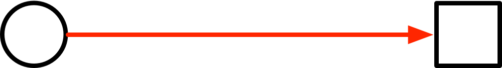
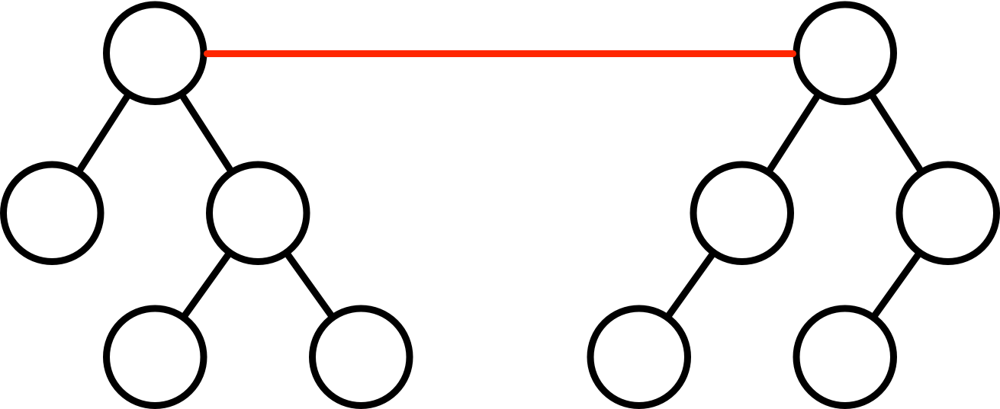
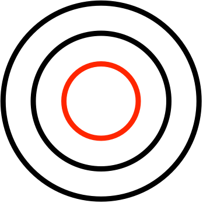
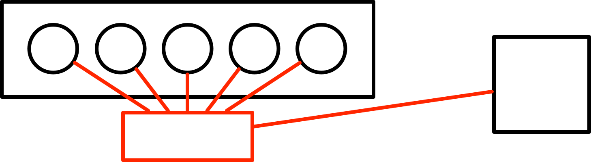
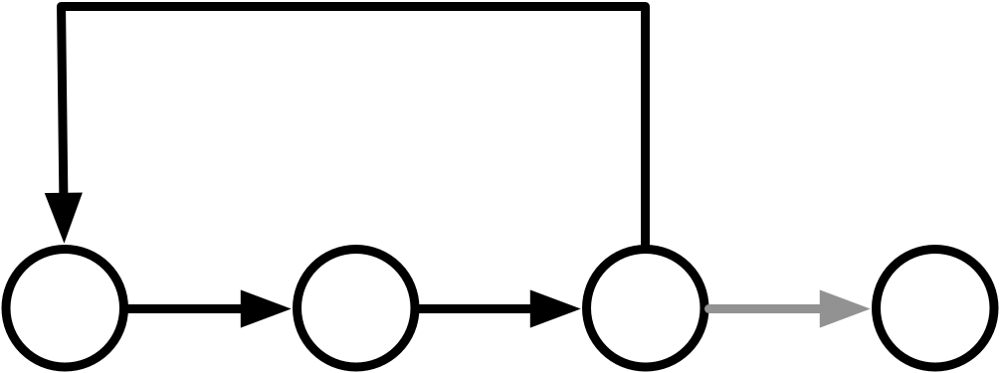
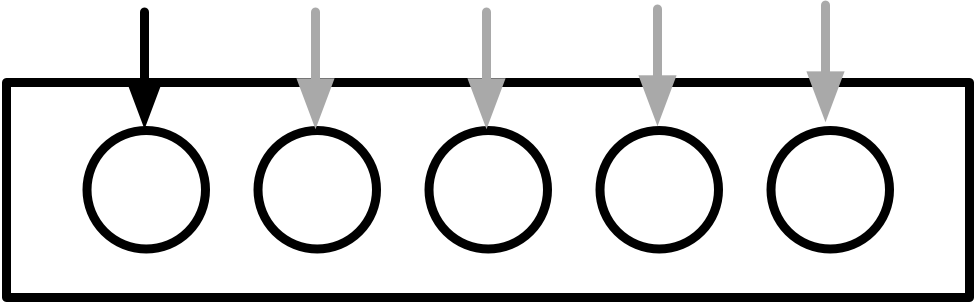
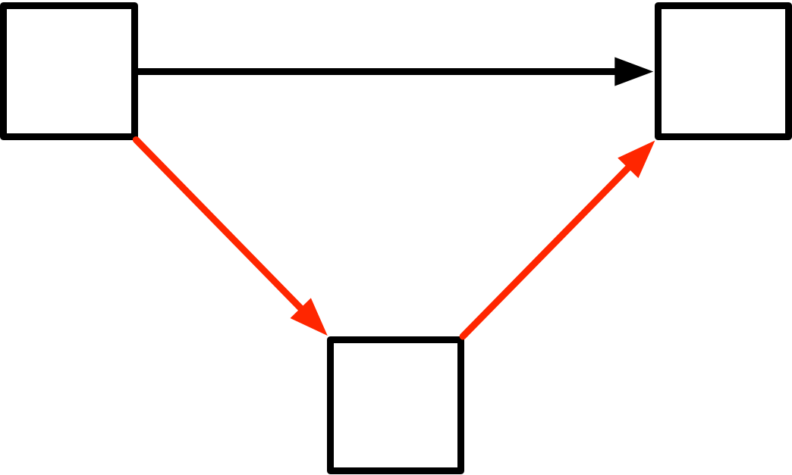
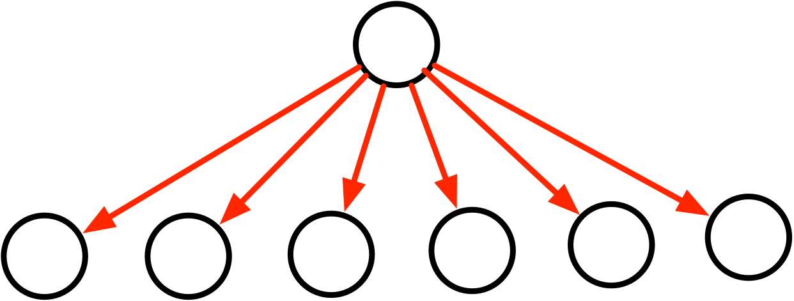

# 面向对象开发
## 需求分析
- ### 相关概念
- 对象（例如人和物，其特点用属性表示）
- 类（实体类【例如人和物的对象】、边界类【系统边界，与外部系统沟通】、控制类【类与类的衔接】）
- 抽象
- 封装（数据封装在一起，使得通过接口控制数据）
- 继承和泛化（有子类、父类，具有继承特性）
- 多态（做同样操作控制不同对象，操作存在差异）
- 接口（只有方法的定义没有方法的实现）
- 消息（对象交互的机制）
- 组建
- 模式和复用
## 设计原则
- 单一职责原则  
  设计目的单一的类，降低耦合度
- 开发·封闭原则  
  对扩展开放，对修改封闭  
  用新的类解决问题，不去修改原有的类
- 李氏替换原则  
  子类可以替换父类（减少重载）
- 依赖倒置原则  
  依赖于抽象，而不是具体实现  
  针对接口编程，不要针对对象编程  
  即依赖接口
- 接口隔离原则  
  使用多个专门的接口比使用单一的接口要好
- 组合重用原则  
  尽量使用组合，而不是使用继承来时限重用的目的
- 迪米特原则（最少知识法则）  
  一个对象应当对其他有尽可能少的了解
## UML
- 构造块
  - 事物
  - 关系
  - 图
    - 结构图（静态图）
      - 类图
      - 对象图
      - 包图
      - 组合结构图
      - 构件图
      - 部署图（软件的部件应该部署在哪个硬件节点上）
      - 制品图
    - 行为图（动态图）
      - `用例图（用例）（需要看情况）`
      - 顺序图/序列图（按时间顺序）
      - 通信图/协作图（没有强调时间顺序）
      - 定时图
      - 状态图（表达状态变化情况）
      - 活动图（与流程图结构一致）
      - 交互概览图
- 规则
- 公共机制
## 面向对象设计
- ### 设计模式的概念
  架构模式  
  软件设计的高层决策，例如C/S结构就属于架构模式，架构模式反映了开发软件系统过程中所作的基本设计决策

  设计模式  
  主要关注软件系统的设计，与具体实现语言无关

  惯用法  
  最底层的模式，关注软件系统的设计与实现，实现时通过某种特定的程序设计语言来描述构件和构件之间的关系。每种编程语言都有自己特定的模式。即语言的惯用法，例如引用-计数器就是C++语言中的一种惯用法
           

- ### 创建型模式
  <table>
  <tr>
    <td width="90"><b>设计模式名称</b></td>
    <td><b>简要说明</b></td>
  </tr>
  <tr>
    <td>抽象工厂模式</td>
    <td>提供一个接口，可以创建一系列相关或相互依赖的对象，而无需指定它们具体的类</td>
  </tr>
  <tr>
    <td>构件器模式</td>
    <td>将一个复杂类的表示与其构造相分离，使得相同的构建过程都能够得出不同的表示</td>
  </tr>
  <tr>
    <td>工厂方法模式</td>
    <td>定义一个创建对象的接口，但是由子类决定需要实例化哪一个类。工厂方法使得子类实例化的过程推迟</td>
  </tr>
  <tr>
    <td>原型模式</td>
    <td>用原型实例指定创建对象的类型，并且通过拷贝这个原型来创建新的对象</td>
  </tr>
  <tr>
    <td>单例模型</td>
    <td>保证一个类只有一个实例，并提供一个访问它的全局访问点（类似于浏览器窗口中的标签）</td>
  </tr>
  </table>

- ### 结构型模式
  <table>
  <tr>
    <td width="90"><b>设计模式名称</b></td>
    <td><b>简要说明</b></td>
    <td width="90"><b>速记关键字</b></td>
  </tr>
  <tr>
    <td>适配器模式</td>
    <td>将一个类的接口转换成用户希望得到的另一种接口，它使得原本不相容的接口得以协同工作</td>
    <td>转换接口</td>
  </tr>
  <tr>
    <td>桥接模式</td>
    <td>将类的抽象部分和它的实现部分分离开来，使它们可以独立地变化</td>
    <td>继承树拆分</td>
  </tr>
  <tr>
    <td>组合模式</td>
    <td>将对象组合成树型结构以表示“整体-部分”的层次结构，使得用户对单个对象和组合对象的使用具有一致性</td>
    <td>树形目录结构</td>
  </tr>
  <tr>
    <td>装饰模式</td>
    <td>动态地给一个对象添加一些额外的职责，它提供了用子类扩展功能的一个灵活的替代，比派生一个子类更加灵活</td>
    <td>附加职责</td>
  </tr>
  <tr>
    <td>外观模式</td>
    <td>定义一个高层接口，为子系统中的一组接口提供一个一致的外观，从而简化了该子系统的使用</td>
    <td>对外统一接口</td>
  </tr>
  <tr>
    <td>享元模式</td>
    <td>提供支持大量细粒度对象共享的有效方法</td>
  </tr>
  <tr>
    <td>代理模式</td>
    <td>为其他对象提供一种代理以控制这个对象的访问</td>
  </tr>
  </table>
        

- ### 结构型模式示意图
  <table>
  <tr>
    <td><b>设计模式名称</b></td>
    <td><b>示意</b><td>
  </tr>
  <tr>
    <td>适配器模式</td>
    <td></td>
  </tr>
  <tr>
    <td>桥接模式</td>
    <td></td>
  </tr>
  <tr>
    <td>组合模式</td>
    <td></td>
  </tr>
  <tr>
    <td>装饰模式</td>
    <td></td>
  </tr>
  <tr>
    <td>外观模式</td>
    <td></td>
  </tr>
  </table>
- ### 行为型模式
  <table>
  <tr>
    <td width="90"><b>设计模式名称</b></td>
    <td><b>简要说明</b></td>
    <td width="120"><b>速记关键字</b></td>
  </tr>
  <tr>
    <td>职责链模式</td>
    <td>通过给多个对象处理请求的机会，减少请求的发送者与接收者之间的耦合。将接收对象链接起来，在链中传递请求，直到有一个对象处理这个请求</td>
    <td>传递职责</td>
  </tr>
  <tr>
    <td>命令模式</td>
    <td>将一个请求封装为一个对象，从而可以用不同的请求对客户进行参数化，将请求排队或记录请求日志，支持可撤销的操作</td>
    <td>日志记录，可撤销</td>
  </tr>
  <tr>
    <td>解释器模式</td>
    <td>给定一种语言，定义它的文法表示，并定义一个解释器，该解释器用来根据文法表示来解释语言中的句子</td>
    <td></td>
  </tr>
  <tr>
    <td>迭代器模式</td>
    <td>提供一种方法来顺序访问一个聚合对象中的各个元素，而不需要暴露该对象的内部表示</td>
    <td></td>
  </tr>
  <tr>
    <td>中介者模式</td>
    <td>用一个中介对象来封装一系列的对象交互，它使各对象不需要显式相互调用，从而达到低耦合，还可以独立地改变对象间的交互</td>
    <td>不直接引用</td>
  </tr>
  </table>
    
  <table>
  <tr>
    <td width="90"><b>设计模式名称</b></td>
    <td><b>简要说明</b></td>
    <td width="120"><b>速记关键字</b></td>
  </tr>
  <tr>
    <td>备忘录模式</td>
    <td>在不破坏封装性的前提下，捕获一个对象的内部状态，并在该对象之外保存这个状态，从而可以在以后将该对象恢复到原先保存的状态</td>
    <td></td>
  </tr>
  <tr>
    <td>观察者模式</td>
    <td>定义对象间的一种一对多的依赖关系，当一个对象的状态发生改变时，所有依赖于它的对象都得到通知并且自动更新（例如单元格计算）</td>
    <td></td>
  </tr>
  <tr>
    <td>状态模式</td>
    <td>允许一个对象在其内部状态改变时改变它的行为</td>
    <td>状态变成类</td>
  </tr>
  <tr>
    <td>策略模式</td>
    <td>定义一系列算法，把它们一个个封装起来，并且使他们之间可互相替换，从而让算法可以独立于使用它的用户而变化</td>
    <td>多方案切换</td>
  </tr>
  <tr>
    <td>模板方法模式</td>
    <td>定义一个操作中的算法骨架，而将一些步骤延迟到子类中，使得子类可以不改变一个算法的结构即可重新定义算法的某些特定步骤</td>
    <td></td>
  </tr>
  <tr>
    <td>访问者模式</td>
    <td>表示一个作用于某对象结构中的各个元素操作，使得在不改变各元素的类的前提下定义作用于这些元素的新操作</td>
    <td></td>
  </tr>
  </table>
- ### 行为型模式示意图
  <table>
  <tr>
    <td><b>设计模式名称</b></td>
    <td><b>示意</b></td>
  </tr>
  <tr>
    <td>职责链模式</td>
    <td>
  </tr>
  <tr>
    <td>迭代器模式</td>
    <td></td>
  </tr>
  <tr>
    <td>中介者模式</td>
    <td></td>
  </tr>
  <tr>
    <td>观察者模式</td>
    <td></td>
  </td>
  </table>