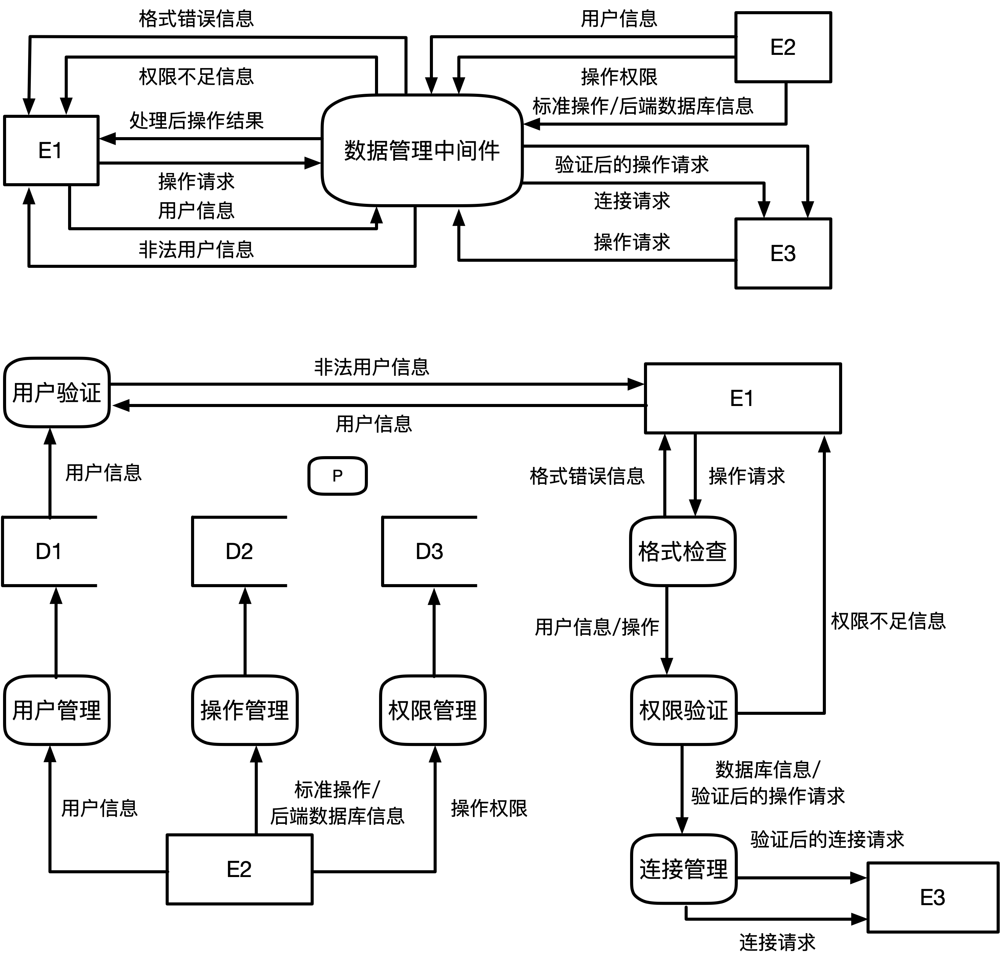
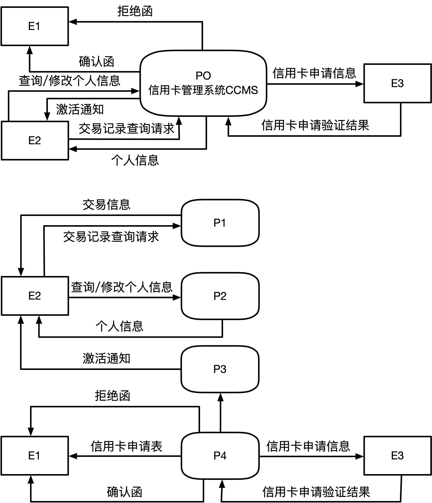

# 数据流图(DFD)
## 基本概念
<table>
<tr>
  <td width="60"><b>元素</b></td>
  <td><b>说明</b></td>
  <td><b>图元</b></td>
</tr>
<tr>
  <td>数据流</td>
  <td>由一组固定成分的数据组成，表示数据的流向。每个数据流通畅有一个合适的名词，反映数据流的含义</td>
  <td></td>
</tr>
<tr>
  <td>加工</td>
  <td>加工描述了输入数据流到输出数据流之间的变换，也就是输入数据流做了什么处理后变成了输出数据流</td>
  <td></td>
</tr>
<tr>
  <td>数据存储 （文件）</td>
  <td>用来表示暂时存储的数据，每个文件都有名字。流向文件的数据流表示写文件，流出的表示读文件</td>
  <td></td>
</tr>
<tr>
  <td>外部实体</td>
  <td>指存在于软件系统外的人员或组织</td>
  <td></td>
</tr>
</table>

<mark>**数据流图中没有联系，只有在ER有**</mark>
- ### 数据流图的分层
## 数据字典
<table>
<tr>
  <td><b>符号</b></td>
  <td><b>含义</b></td>
  <td><b>举例说明</b></td>
</tr>
<tr>
  <td>=</td>
  <td>被定义为</td>
  <td></td>
</tr>
<tr>
  <td>+</td>
  <td>与</td>
  <td>x=a+b，表示x由a和b组成</td>
</tr>
<tr>
  <td>[…,…]或 […|…]</td>
  <td>或</td>
  <td>x=[a,b],x=[a|b]，表示x由a或由b组成</td>
</tr>
<tr>
  <td>{…}</td>
  <td>重复</td>
  <td>x={a}，表示x由0个或者多个a组成</td>
</tr>
<tr>
  <td>(…)</td>
  <td>可选</td>
  <td>x=(a)，表示a可在x中出现，也可以不出现
</tr>
</table>

## 数据流图平衡原则
- ### 父图和子图之间的平衡
- ### 子图之间的平衡
  只有输入没有输出称之为黑洞，只有输出没有输入称之为奇迹（两者都是不正常现象）
     

## 案例分析
例1：  
【说明】  
&ensp;&ensp;&ensp;&ensp;某大型企业的数据中心为了集中管理、控制用户对数据的访问并且支持大量的链接需求，想要构件数据库管理中间件，其主要功能如下：  
&ensp;&ensp;&ensp;&ensp;(1)数据管理员可以通过中间件进行用户管理、操作管理和权限管理，用户管理维护用户信息，用户信息（用户名、密码）存储在用户表中；操作管理维护数据实体的标准操作及其所属的后端数据库信息，标准操作和后端数据库信息存放在操作表中；权限管理维护权限表，该表存储用户可以执行的操作信息  
&ensp;&ensp;&ensp;&ensp;(2)中间件验证前端应用提供的用户信息。若验证不通过，返回非法用户信息；若验证通过，中间件将等待前端应用提交操作请求  
&ensp;&ensp;&ensp;&ensp;(3)前端应用题叫操作请求后，中间件先对请求进行格式检查，如果格式不正确，返回非法用户信息；若格式正确，则进行权限验证（验证用户是否有权执行请求的操作），若用户无权执行该操作，则返回权限不足以信息，否则进行连接操作  
&ensp;&ensp;&ensp;&ensp;(4)连接管理连接相应的后台数据库并提交操作。连接管理先检查是否存在空闲的数据库连接，如果不存在，新建连接；如果存在，则重用连接。  
&ensp;&ensp;&ensp;&ensp;(5)后端数据库执行操作并将结果传给中间件，中间件对收到的操作结果进行处理后，将其返回前端应用。  
&ensp;&ensp;&ensp;&ensp;现采取结构化方法对系统进行分析与设计，获得如图所示的顶层数据流图和数据流图

【问题1】  
使用说明中的词语，给出E1~E3名称  
【问题2】  
使用说明中的词语，给出D1~D3名称  
【问题3】  
给出图中加工P的名称及其输入、输出流
||名称|起点|终点|
|:-:|:-:|:-:|:-:|
|输入流|||P|
|输出流||P||

除了加工P的输入与输出流外，还缺少两条数据流，给出起点终点  
【问题4】  
绘制数据流图时，需要注意加工的绘制，给出三种在绘制加工的输入、输出时可能出现的错误

**`下面为解答`**
***
【问题1】  
E1：前端应用  
E2：数据管理员  
E3：后台数据库  
【问题2】  
D1：用户表  
D2：操作表  
D3：权限表  
【问题3】  
||名称|起点|终点|
|:-:|:-:|:-:|:-:|
|输入流|操作结果|E3|P|
|输出流|处理后的操作结果|P|E1|

缺失从D2到权限验证和D3到权限验证的数据流  
【问题4】  
数据流没有平衡，例如黑洞和平衡  
数据流命名问题，输入和输出流名称一样  
输入流输入之后不会产生输出流

**`下面为另外一题`**
***
例2：  
&ensp;&ensp;&ensp;&ensp;阅读以下说明和数据流图，回答问題1至问题4，将解答填入答题纸的对应栏内。  
【说明】  
&ensp;&ensp;&ensp;&ensp;现谁备为某银行开发一个信用卡管理系统CCMS，该系统的基本功能为：  
&ensp;&ensp;&ensp;&ensp;(1)信用卡申请。非信用卡客户填写信用卡申请表，说明所要申请的信用卡类型及申请者的基本信息，提交CCMS。如果信用卡申请被银行接受，CCMS将记录该客户的基本信息，并发送确认函给该客户，告知客户信用卡的有效期及信贷限额：否则该客户将会收到一封拒绝函。非信用卡客户收到确认函后成为信用卡客户。  
&ensp;&ensp;&ensp;&ensp;(2)信用卡激活。信用卡客户向CCMS提交激活请求，用信用卡号和密码激活该信用卡。激活操作结束后，CCMS将激活通知发送给客户，告知客户其信用卡是否被成功激活。  
&ensp;&ensp;&ensp;&ensp;(3)信用卡客户信息管理。信用卡客户的个人信息可以在CCMS中进行在线管理。每位信用卡客户可以在线查询和修改个人信息。  
&ensp;&ensp;&ensp;&ensp;(4)交易信息查询。信用卡客户使用信用卡进行的每一笔交易都会记录在CCMS 中。信用卡客户可以CCMS查询并核实其交易信息（包括信用卡交易记录及交易额）。  

【问题1】  
根据【说明】，将途中的E1～E3填充完整  
【问题2】  
图（上）中缺少三条数据流，根据【说明】，分别指出这三条数据流的起点和终点（注：数据流的起点和终点均采用途中的符号和描述）  
【问题3】  
图（下）中有两条数据流是错误的，请指出这两条数据流的名称，并改正（注：数据流的起点和终点均采用途中的符号和描述）  
【问题4】  
根据【说明】，将图中的P1~P4的处理名称填写完整

**`下面为解答`**
***
解：  
【问题1】  
E1：非信用卡客户  
E2：信用卡客户  
E3：银行  
【问题2】  
E1->CCMS：提交申请表  
E2->CCMS：激活请求  
CCMS->E2：交易信息  
【问题3】  
信用卡申请表方向反  
激活请求起点在E2  
【问题4】  
P1：交易信息查询  
P2：信息管理  
P3：信用卡激活  
P4：信用卡申请