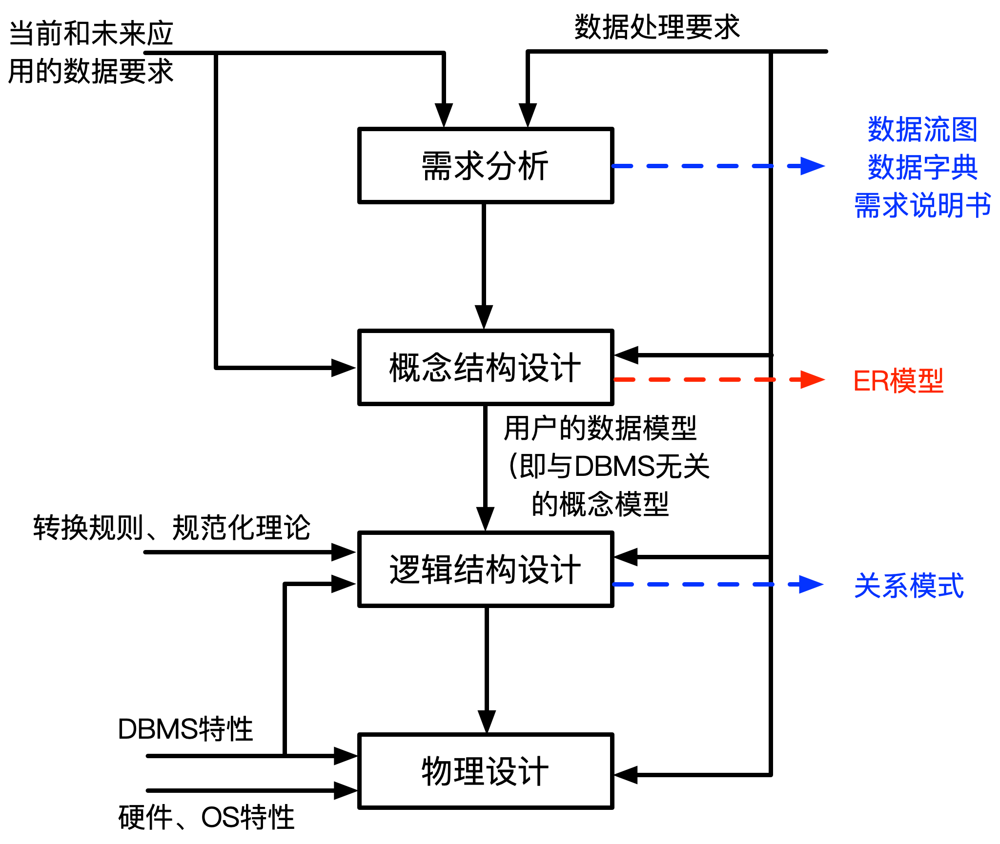
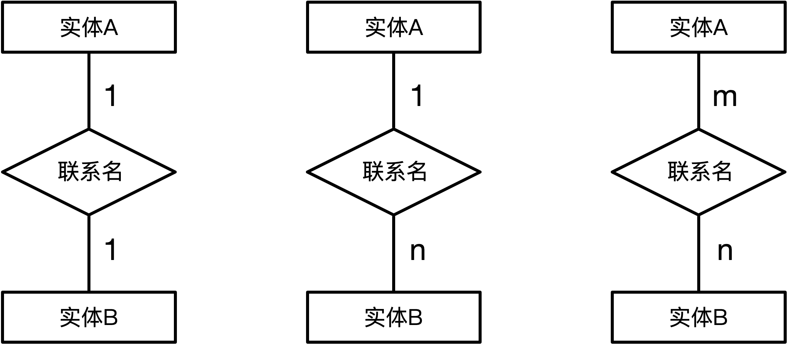
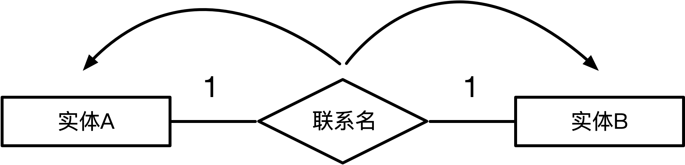
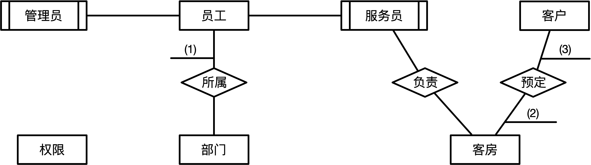
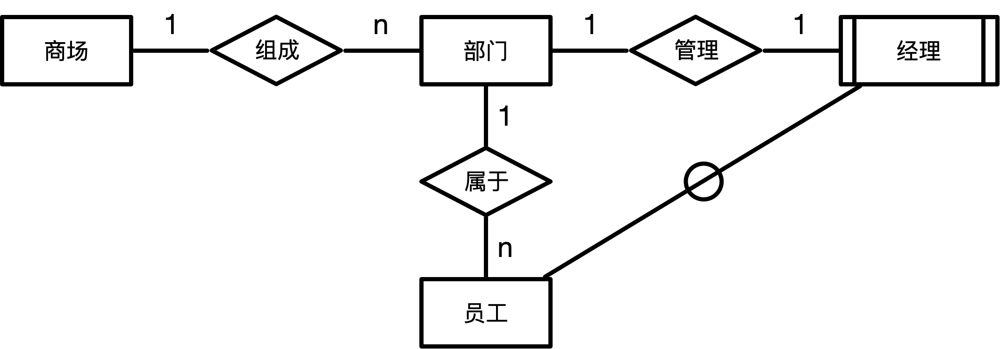

# 数据库设计
## 数据库设计过程

## ER模型
- ### 实体间联系类型
  

	上图分别是1:1联系，1:n联系和m:n联系
- ### ER图向关系模型的转换
	转换的基本原则是：实体和联系分别转换成关系，属性则转换成相应关系的属性
	- 一对一联系  
		<mark>**可以合并到任何一边**</mark>  
		

	- 一对多联系  
		<mark>**只能合并到多的一边**</mark>  
		
	- 多对多联系  
		<mark>**不能合并到任何一边**</mark>
## 案例分析
例1：  
&ensp;&ensp;&ensp;&ensp;某公司拟开发一个宾馆客房预订子系统，主要是针对客房的预订和入住等情况进行管理。  
【需求分析结果】  
&ensp;&ensp;&ensp;&ensp;(1)员工信息主要包括：员工号、姓名、出生年月、性别、部门、岗位、住址、联系电话和密码等信息。岗位有管理和服务两种。岗位为“管理”的员工可以更改（添加、删除和修改）员工表中的本部门员工的岗位和密码，要求将每一次更改前的信息保留；岗位为“服务”的员工只能修改员工表中本人的密码，且负责多个客房的清理等工作。  
&ensp;&ensp;&ensp;&ensp;(2)部门信息主要包括：部门号、部门名称、部门负责人、电话等信息；一个员工只能属于一个部门，一个部门只有一位负责人。  
&ensp;&ensp;&ensp;&ensp;(3)客房信息包括：客房号、类型、价格、状态等信息。其中类型是指单人间、三人间、普通标准间、豪华标准间等：状态是指空闲、入住和维修。  
&ensp;&ensp;&ensp;&ensp;(4)客户信息包括：身份证号、姓名、性别、单位和联系电话。  
&ensp;&ensp;&ensp;&ensp;(5)房预定情况包括：客房号、预定日期、预定入住日期、预定入住天数、身份证号等信息。一条预定信息必须仅对应一位客户，但一位客户可以有多条预定信息。  
【概念模型设计】  

【逻辑结构设计】  
逻辑结构设计阶段设计的部分关系模式（不完整）如下：  
员工（(4)，姓名，出生年月，性别，岗位，住址，联系电话，密码）  
权限（岗位，操作权限）
部门（部门号，部门名称，部门负责人，电话）
客房（(5)，类型，价格，状态，入住日期，入住时间，员工号）  
客户（(6)，姓名，性别，单位，联系电话）  
更改权限（员工号，(7)，密码，更改日期，更改时间，管理员号）  
预订情况（(8)，预订日期，预定入住日期，预定入住天数  
【问题1】  
&ensp;&ensp;&ensp;&ensp;根据问题描述，天蝎途中(1)-(3)中的联系类型，使用1:1、1:n、1:\*、m:n、\*:\*表示  
【问题2】  
&ensp;&ensp;&ensp;&ensp;补充途中联系并指明联系类型  
【问题3】  
&ensp;&ensp;&ensp;&ensp;根绝需求分析结果和上图，将逻辑结构设计阶段生成的关系模式中的空(4)~(8)补充完整，注意一个空可能需要填多个属性  
【问题4】  
&ensp;&ensp;&ensp;&ensp;若去掉权限表，并且将权限表中的操作权限属性放在员工表中（仍保持管理和服务岗位的操作规定），则与原有的设计相比有什么优缺点（从数据库设计的角度进行说明）  
**`下面为解答`**
***
解：  
【问题1】  
(1)：n:1  
(2)：m:*  
(3)：*:n  
【问题2】  
员工和权限1:n  
【问题3】  
(4)：员工号、部门号  
(5)：客房号  
(6)：身份证号  
(7)：岗位  
(8)：客房号、身份证号  
【问题4】  
如果去掉：  
缺点：造成数据冗余
优点：减少连接，加速查询

**`下面为另外一题`**
***
例2：  
【说明】  
&ensp;&ensp;&ensp;&ensp;某集团公司将有多个大型连锁商场，公司需要构建一个数据库系统以方便管理其业务运作活动。  
【需求分析结果】  
&ensp;&ensp;&ensp;&ensp;(1)商场需要记录的信息包括商场的编号（编号唯一），商场名称，地址和联系电话。商场信息如表所示  
|商场编号|商场名称|地址|联系电话|
|:-:|:-:|:-:|:-:|
|PS2101|淮海商场|淮海中路918号|021-64158818|
|PS2902|西大街商场|次大姐时代盛典大厦|029-87283220|
|PS2903|东大街商场|碑林区东大街239号|029-87450287|
|PS2901|长安商场|雁塔区长安中路38号|029-85264953|

&ensp;&ensp;&ensp;&ensp;(2)每个商场包含有不同的部门，部门需要记录的信息包括部门编号（集团公司分配），部门名称，位置分布和联系电话，某商场部门信息如下表所示  
|部门编号|部门名称|位置分布|联系电话|
|:-:|:-:|:-:|:-:|
|DT002|账务部|商场大楼六层|82504342|
|DT007|后勤部|商场地下负一层|82504347|
|DT021|安保部|商场地下负一层|82404358|
|DT005|人事部|商场大楼六层|82504446|
|DT001|管理部|商场裙楼三层|82504668|

&ensp;&ensp;&ensp;&ensp;(3)每个部门雇佣多名员工处理日常事务，每名员工只能隶属于一个部门（新进员工在培训班不隶属于任何部门）。员工需要记录的信息包括员工编号（集团公司分配），姓名，岗位，电话号码和工资。员工信息如下表所示
|员工编号|姓名|岗位|电话号码|工资|
|:-:|:-:|:-:|:-:|:-:|
|XA3310|周超|理货员|13609257638|1500.00|
|SH1075|刘飞|防损员|13477293487|1500.00|
|XA0048|江雪花|广播员|15234567893|1428.00|
|BJ3123|张正华|部门主管|13345698432|1876.00|

&ensp;&ensp;&ensp;&ensp;(4)每个部门的员工中有一名是经理，每个经理只能管理一个部门，系统需要记录每个经理的任职时间。  
【概念模型设计】  
&ensp;&ensp;&ensp;&ensp;根据需求阶段收集的信息，设计的实体联系图和关系模式（不完整）如下图

【关系模式设计】  
商场（商场编号，商场名称，地址，联系电话）  
部门（部门编号，部门名称，位置分布，联系电话，(a)）  
员工（员工编号，员工姓名，岗位，电话号码，工资，(b)）  
经理（(c)，任职时间）

【问题1】  
&ensp;&ensp;&ensp;&ensp;根据问题描述，补充四个联系，完善图中的实体联系图，联系名可以使用联系1、联系2、联系3和联系4代替，联系的类型分别为1:1、1:n、m:n。  
【问题2】  
&ensp;&ensp;&ensp;&ensp;根据实体联系图，将关系模式中的空(a)-(c)补充完整，并分别给出部门、员工和经理的关系模式的主键和外键。  
【问题3】  
&ensp;&ensp;&ensp;&ensp;为了使商场有紧急事务时能够联系到轮休的员工，要求每位员工必须且只能登记一位紧急联系人的姓名和电话，不同的员工可以登记相同的紧急联系人，则要在图中还需要添加的实体为(1)，该实体和途中员工存在什么联系（填写联系类型）。给出该实体的关系模式。

**`下面是解答`**
***
解：  
【问题1】  

【问题2】  
(a)：所属商场编号  
(b)：所属部门编号  
(c)：员工编号  
 
部门关系模式中：部门编号（主键），商场编号（外键）  
员工关系模式中：员工编号（主键），部门编号（外键）  
经理关系模式中：员工编号（主键和外键）

【问题3】  
紧急联系人关系模式（员工编号，员工姓名，电话）  
紧急联系人与员工一对多关系