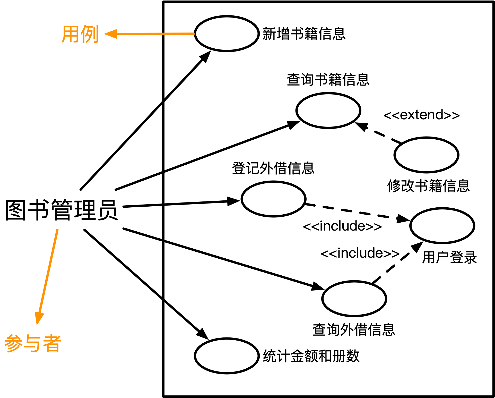
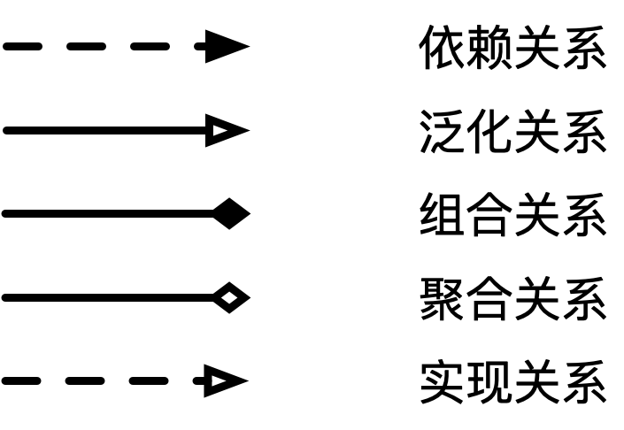
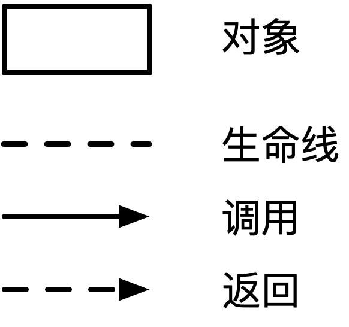
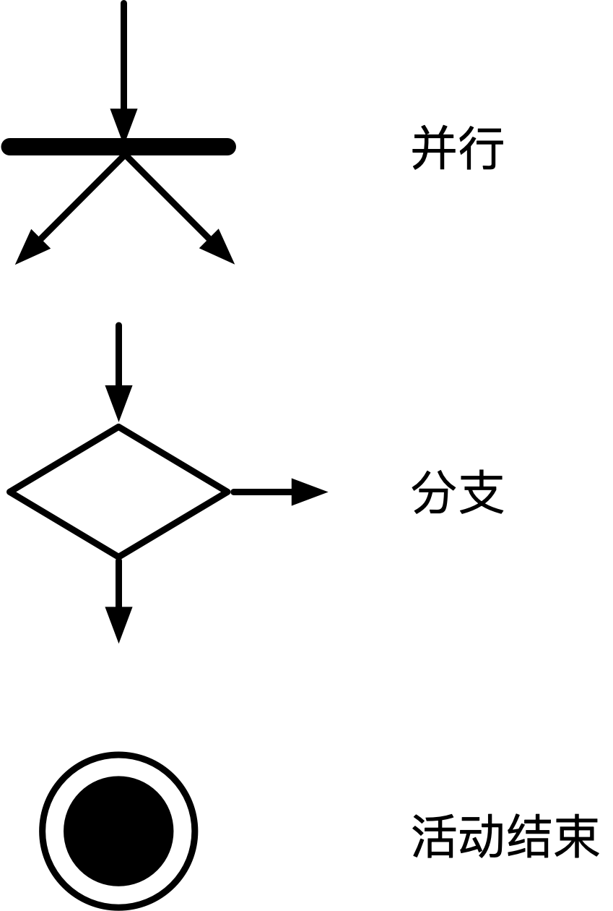
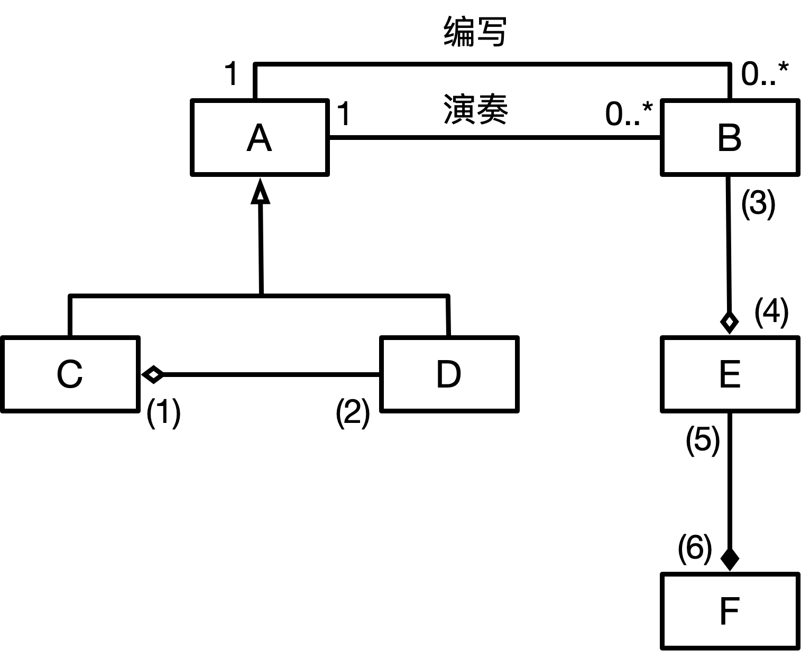
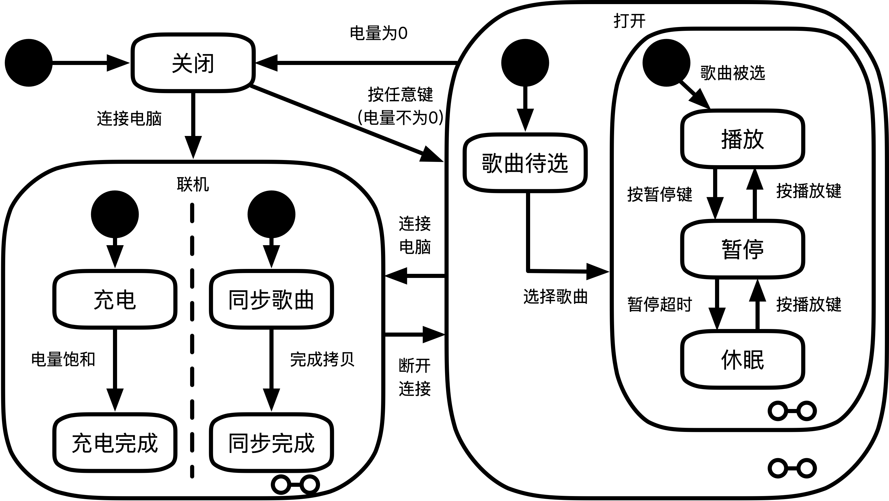

# UML建模
## 用例图

  - 包含关系(include)  
  必须先有包含的用例才能进行  
  例如图中的登记外借信息和查询外借信息都需要先登录
  - 扩展关系(extend)  
  前面的用例是扩展用例必经过程，但是扩展用例不是必要用例  
  例如图中的修改书籍信息查询书籍信息必须要先查询书籍信息
## 类图和对象图
- ### 类名
- ### 多重度
  - 数字表示(n)  
  例如“**`1`**”：表示一个集合总的一个对象对应另一个集合中 **`1`** 个对象
  - 0..*  
  **`0..*`**：表示一个集合中的一个对象对应另一个集合中的0个或多个对象（可以不对应）  
  也可以表示为 **`*`**
  - 1..*  
  **`1..*`**：表示一个集合中的一个对象对应另一个集合中的一个或多个对象（至少对应一个）
- ### 关系
  示意图  
  

  （其中头是整体的一方）

## 顺序图
示意图  

## 活动图

## 状态图
## 通信图
   

## 案例分析
例1:  
&ensp;&ensp;&ensp;&ensp;己知某唱片放器不仅可以播放唱片，而且可以连接电脑并把电脑中的歌曲刻录到唱片上（同步歌曲）。连接电脑的过程中还可自动完成充电。  
&ensp;&ensp;&ensp;&ensp;关于唱片，还有以下描述信息：  
&ensp;&ensp;&ensp;&ensp;(1)每首歌曲的描述信息包括：歌曲的名字、谱写这首歌曲的艺术家以及演奏这首歌曲的艺术家。只有两首歌曲的这三部分信息完全相同时，才认为它们是同一首歌曲。艺术家可能是一名歌手或一支由2名或2名以上的歌手所组成的乐队。一名歌手可以不属于任何乐队，也可以属于一个或多个乐队。  
&ensp;&ensp;&ensp;&ensp;(2)每张唱片由多条音轨构成；一条音轨中只包含一首歌曲或为空，一首歌曲可分布在多条音轨上；同一首歌曲在一张唱片中最多只能出现一次。  
&ensp;&ensp;&ensp;&ensp;(3)每条音轨都有一个开始位置和持续时间。一张唱片上音轨的次序是非常重要的，因此对于任意一条音轨，播放器需要准确地知道，它的下一条音轨和上一条音轨是什么（如果存在的话）。  
&ensp;&ensp;&ensp;&ensp;根据上述描述，采用面向对象方法对其进行分析与设计，得到了如表13-1所示的类列表、如图13一1所示的初始类图以及如图13-2所示的描述播放器行为的UML状态图。
  
类别表（13-1）  
|类名|说明|
|:-:|:-:|
|Artist|艺术家|
|Song|歌曲|
|Band|乐队|
|Musician|歌手|
|Track|音轨|
|Album|唱片|

 
 
图13-2

【问题1】  
&ensp;&ensp;&ensp;&ensp;根据题目中的描述，使用表13-1给出的名称，给出图13-1中的A-F所对应的类。  
【问题2】  
&ensp;&ensp;&ensp;&ensp;根据题目中的描述，给出图13-1中(1)~(6)处的多重度。  
【问题3】  
&ensp;&ensp;&ensp;&ensp;图13-1中缺少了一条关联，请指出这条关联两端所对应的类以及每一端的多重度。  
【问题4】  
&ensp;&ensp;&ensp;&ensp;根据图13-2所示的播放器行为UML状态图，给出从“关闭”状态到“播放”状态所经过的最短事件序列（假设电池一开始就是有电的）

**`下面是解答`**
***
解：  
【问题1】  
A：艺术家  
B：歌曲  
C：乐队  
D：歌手  
E：音轨  
F：唱片  
【问题2】  
(1)：0...\*(一个歌手对应0或更多的乐队)  
(2)：2...\*(一个乐队对应2名或以上的歌手)  
(3)：0...1  
(4)：1...\*  
(5)：1...\*  
(6)：1  
【问题3】  
E->E：0...1  
【问题4】  
按任意键->打开->选择歌曲->播放