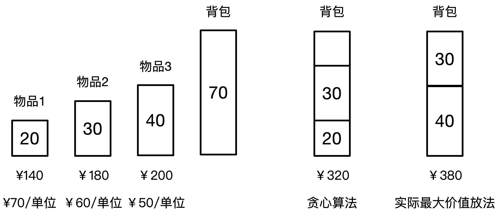

# 数据结构和算法结构
## 分治法
- ### 概念
  对于一个规模为n的问题，若该问题可以容易地解决，则可以直接解决  
  否则就将其分解为k个规模较小的子问题，这些子问题互相独立且与原问题形式相同，递归地解这些字问题，然后合并即可

- ### 要求
  - 该问题的规模缩小到一定程度就可以解决
  - 该问题可以分解为若干个规模较小的相同问题
  - 利用该问题分解出来的子问题的解可以合并为该问题的解
  - 该问题分解出的各个子问题是相互独立的

- ### 递归技术
  ```
  // 斐波拉契数列
  // 除了第0和第1项，其他项都是前两项的和
  int Fun(int n)
  {
    if(n==0) return 1;
    if(n==1) return 1;
    if(n>1) return Fun(n-1)+F(n-2);
  }
  ```
- ### 二分查找
  ```
  function Binary_Search(int L[],int a,int b,int x)
  {
    if(a>b) return (-1);
    else
    {
      int m=(a+b)/2;
      if(x==L[m])  return m;
      else if(x>L[m]) return (Binary_Search(L,m+1,b,x))
      else  return (Binary_Search(L,m-1,b,x))
    }
  }
  ```
  上述代码中，假设L数组的长度为10（0～9，并且有序），其中a的初始值为0，b的初始值为9，x为需要查找的数  
  如果a>b，那么就说明查找完毕，如果在查找完成的时候没有找到需要查找的数  
  设置一个中间值m，如果L[m]等于需要查找到的值，那么就查找到  
  如果需要查找的值x大于L[m]，说明查找的数在右边的区间，那么就查找m+1到b这个区间，小于同理  
  下图表示从0～8这个数列中查找7这个数的流程

  

## 回溯法
- ### 概念
  回溯法是一种优先搜索法，按选优条件向前搜索，以达到目标，但当搜索到某一步时，发现原先选择并不优或达不到目标，就退回一步重新选择，这种走不通就退回的技术就是回溯法（深度优先，典型案例就是迷宫求解）
## 贪心算法
- ### 概念
  总是做出在当前来说是最好的选择，而并不从整体上加以考虑，它所做出的每步选择只是当前步骤的局部最优选择，但是从整体来说并不一定就是最优选择。由于它不必为了寻找最优解而穷尽所有可能解，因此其耗费时间少，一般可以快速得到满意的解，但得不到最优解  
  下图表示通过贪心算法解决背包问题

  
## 动态规划
- ### 概念
  在求解问题中，对于每一步的决策，列出各种可能的局部解，再依据某种判定条件，舍弃那些肯定不能得到的最优解的局部睫，在每一步经过筛选，以每一步都是最优解来保证全局是最优解  
  <mark>**基本都运用到查表的方法**</mark>
<br><br><br><br>
## 案例分析
例1:  
【说明】  
&ensp;&ensp;&ensp;&ensp;设有n个货物要装入若干个容量为C的集装箱以便运输，这n个货物的体积分别为(S<sub>1</sub>,S<sub>2</sub>,...S<sub>n</sub>)，且有S<sub>i</sub>≤C (1≤i≤n)，为节省运输成本，用尽尽可能少的集装箱来装运这n个货物。  
&ensp;&ensp;&ensp;&ensp;下面分别采用最先适宜策略和最优适宜策略来求解该问题。
&ensp;&ensp;&ensp;&ensp;最先适宜策略(FirstFit)首先将所有的集装箱初始化为空，对于所有货物，按照所给的次序，每次讲一个货物装入**第一个能容纳它的集装箱中**  
&ensp;&ensp;&ensp;&ensp;最优适宜策略(BestFit)与最先适宜策略蕾丝，不同的是，总是把货物装到能容纳它且目前剩余容量最小的集装箱，使得该箱子装入货物后**闲置空间最小**  
【C代码】  
下面是这两个算法的C语言核心代码。  
- (1)变量说明  
  n：货物数量  
  C：集装箱的容量  
  s：数组，长度为n，其中每个元素表示货物体积，下标从0开始  
  b：数组，长度为n，b[i]表示第i+1个集装箱当前已经装入货物的体积，下标从0开始   
  i,j：循环变量  
  k：所需的集装箱数  
  min：当前所用的各集装箱装入了第i个货物后的最小剩余容量  
  m：当前所需要的集装箱数  
  temp：临时变量
- 函数FirstFit
  ```
  int FirstFit()
  {
    int i,j;
    k=0;
    for(i=0;i<n;i++)
    {
      b[i]=0;
    }
    for(i=0;i<n;i++)
    {
      ___(1);
      while(C-b[j]<s[i])
      {
        j++
      }
      ___(2);
      k=k>(j+1)?k:(j+1);
    }
    return k;
  }
  ```
- 函数BestFit()
  ```
  int BestFit()
  {
    int i,j,min,m,temp;
    k=0;
    for(i=0;i<n;i++)
    {
      b[i]=0;
    }
    for(i=0;i<n;i++)
    {
      min=C;
      m=k+1;
      for(j=0;j<k+1;j++)
      {
        temp=C-b[j]-s[i];
        if(temp>0&&temp<min)
        {
          ___(3);
          m=j;
        }
      }
      ___(4);
      k=k>(m+1)?k:(m+1);
    }
    return k;
  }
  ```
【问题1】  
根据【说明】和【C代码】，填充C代码中的空(1)~(4)  
【问题2】  
根据【说明】和【C代码】，分别采用了(5)和(6)算法时间复杂度分别为(7)和(8)  
【问题3】  
考虑实例n=10，C=10，各个货物的体积为(4,2,7,3,5,4,2,3,6,2)。该实例再最先适应和最优适应策略下所需的集装箱数量分别为(9)和(10)，考虑一般情况，这两种求解策略能否确保得到最优解？(11)

**`下面是解答`**
***
解：  
**`【问题1】答案`**  
(1): j=0  
(2): b[j]+=s[i]  
(3): min=temp  
(4): b[m]+=s[i]
***
**`【问题2】答案`**  
(5): 贪心算法  
(6): 贪心算法  
(7): O(n<sup>2</sup>)（双重循环）  
(8): O(n<sup>2</sup>)  
***
**`【问题3】`**  
**最先适宜策略**  
1: 4、2、3  
2: 7、2  
3: 5、4  
4: 3、6  
5: 2  
**最优适宜策略**  
1: 4、2、4  
2: 7、3  
3: 5、2、3  
4: 6、2  
**`[问题3]答案`**  
(9): 5  
(10): 4  
(11)：否