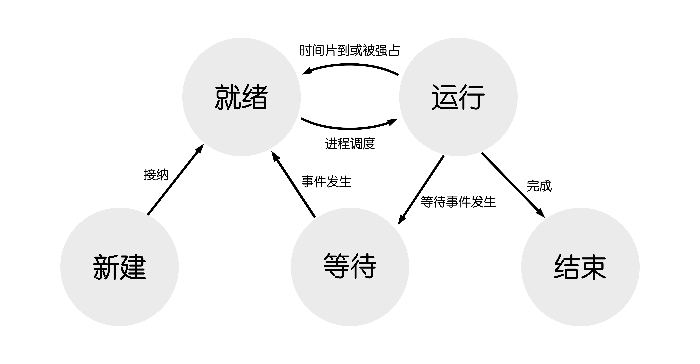
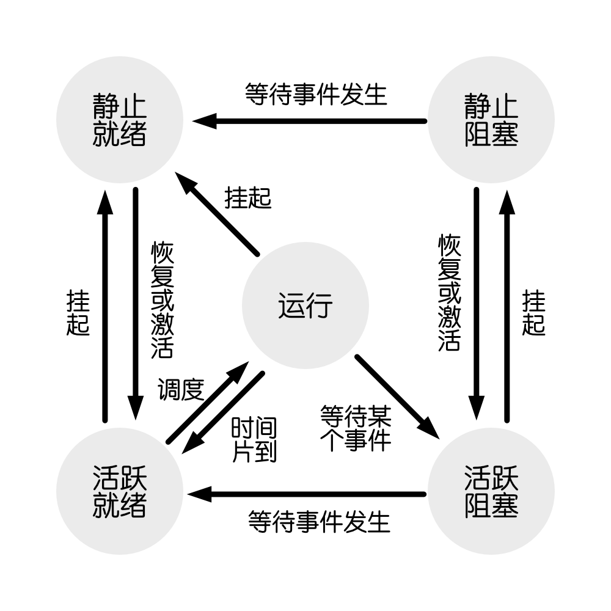
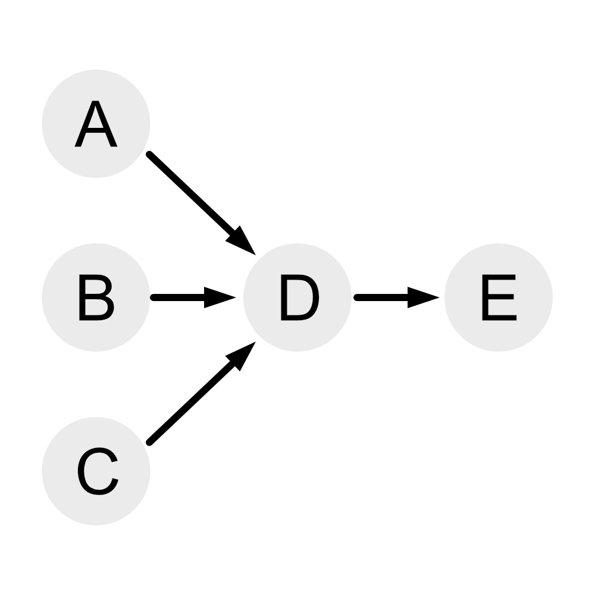
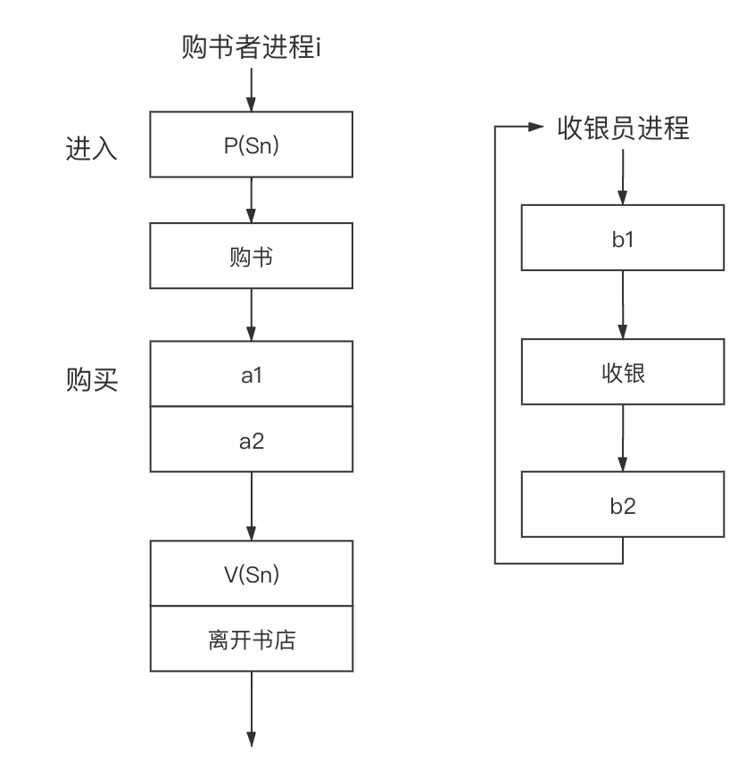
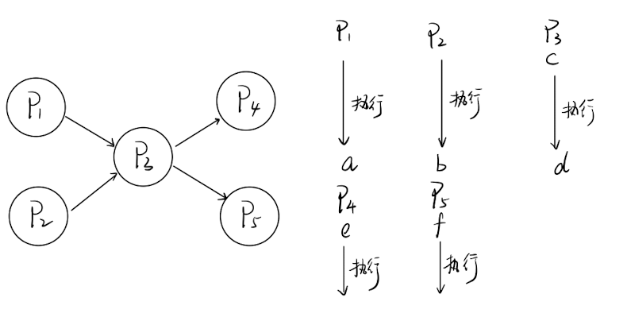
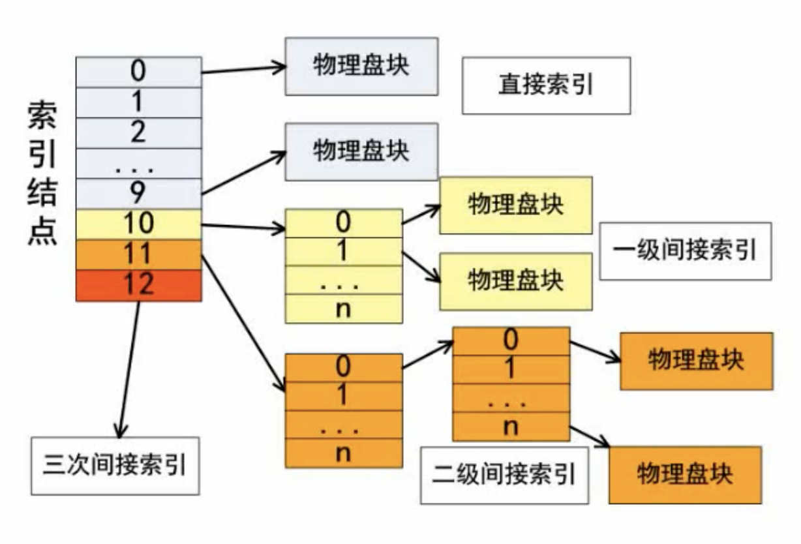
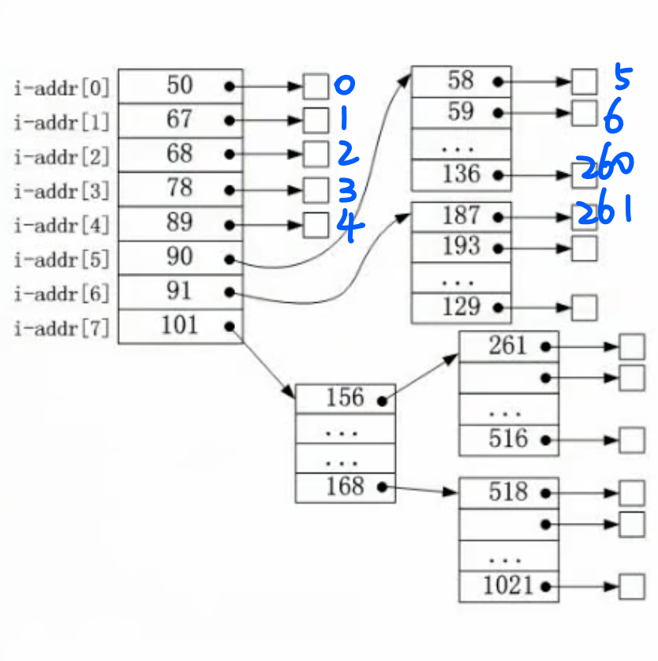
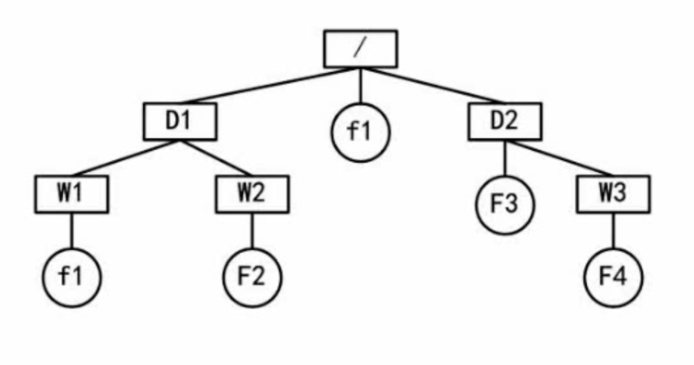

# 操作系统基本原理
## 操作系统概述
- 操作系统作用
  - 管理系统硬件、软件和数据资源
  - 控制程序运行
  - 人机之间的借口
  - 应用软件与硬件之间的接口
- 操作系统的功能
  - 进程管理
    - 进程状态
    - <mark>**前趋图**</mark>
    - <mark>**PV操作**</mark>
    - 死锁问题
  - 存储管理
    - 段页式存储
    - <mark>**页面置换算法**</mark>
  - 文件管理
    - 索引文件
    - <mark>**位视图**</mark>
  - 作业管理
  - 设备管理
## 进程管理
- ### 进程的状态
  <mark>**三态图：（三态模型）**</mark>  
  <mark>**新建和结束不包含在三态模型中**</mark>

  

  备注：  
  运行状态：进程所需的所有的资源都已经准备就绪，正在被CPU执行  
  就绪状态：其他所有资源已经准备好，等待CPU执行  
  等待（阻塞）状态：等待用户指令或者等待I/O设备做出反应等

  **等待状态又叫做阻塞状态**

  在三态图（三态模型）的基础上又可以人为增加挂起状态（静止就绪状态和静止阻塞状态  
  原本的就绪状态和阻塞状态可以变为活跃就绪和活跃等待（阻塞）

  由此可以得到下图

  <mark>**五态图（五态模型）：**</mark>

  

- ### 前趋图
  前趋图用来表示一系列活动的前后关系  
  例如下图：  
  

  通过上图可以表现出那些任务可以并行，哪些需要有先后顺序

  例如在上图中可以得到如果要完成E需要先完成D，而完成D又需要同时完成A、B、C
- ### 进程的同步与互斥
  - 互斥  
    在同一时刻只运行一个进程去使用这一个资源，一个资源无法被多个进程去使用

    例如千军万马过独木桥就是互斥
  - 同步  
    速度有差异，在一定情况下需要停下等待

    例如跑步比赛，先到的人需要停下等待后者到达
- ### PV操作
  临界资源：进程之间需要以互斥方式对其进行共享的资源，例如打印机、磁带机等  
  临界区：每个进程中访问临界资源的那段代码成为临界区
  信号量：一种特殊的变量
  
  P操作：等待（Wait）操作  
  V操作：指示（signal）操作
  - P操作  
    1. S=S-1
    2. 如果S`<`0，则阻塞
    3. 如果S`≥`0，则继续执行当前指令
  - S操作
    1. S=S+1
    2. 如果S`≤`0，则阻塞
    3. 如果S`>`0，则继续执行当前指令
   
  ```
  单缓冲区生产者-消费者问题：
  
  s1=1,s2=0;
  生产者:
    生产一个产品;
    P(s1);
    送产品到缓冲区;
    V(s2);

  消费者:
    P(s2);
    从缓冲区拿产品;
    V(s1);
    消费产品;
  ```
  ```
  上述说明：
  如果执行生产者：
  P(s1) 将s1-1=0
  V(s2) 将s2+1=1
  此时如果再执行生产者操作，那么将s1-1=-1时候会阻塞生产者进程

  如果执行消费者：
  P(s2) 将s2-1=-1会阻塞消费者进程
  ```
  ***
  **``注意下面的是另一题了``**
  ```
  例：某书店有一个收银员，概述点最多允许n个购书者进入，将收银员和购书者看作不同的进程，其工作流程如下图所示。利用PV操作实现该过程，设置信号量S1、S2和Sn，初值分别为0，0，n，则图中a1和a2应该填入___，图中b1和b2应该填入___。
  ```
  

  ```
  解：（这题答案不唯一，第二种答案以【】形式标记）
  购买时需要告诉收银员开始收银，因此a1应该是V(S1)【V(S2)】
  在收银进程中需要等待需要收银，因此b1应该是P(S1)【P(S2)】
  在收银结束后需要返回购买完成，因此b2应该是V(S2)【V(S1)】
  在购买者的进程中等待收银完成，因此a2应该是P(S2)【P(S1)】
  ```
- ### PV操作和前趋图
  例如在先前的前趋图中  
  

  可以使用PV操作来表示
  ```
  A->D:Sa
  B->D:Sb
  C->D:Sc
  D->E:Sd

  可以得到PV操作如下：

  进程A:
  V(Sa);

  进程B:
  V(Sb);

  进程C
  V(Sc);

  进程D:
  P(Sa);
  P(Sb);
  P(Sc);
  V(Sd);

  进程E:
  P(Sd);
  ```
  ***
  **``注意下面的是另一题了``**
  ```
  进程P1、P2、P3、P4、P5的前趋图如下图所示，若用PV操作控制进程并发执行过程，则需要设置4个信号量S1、S2、S3和S4，且信号量的初值都为0，图中a和b应分别填写___，c和d应填写___，e和f应填写___。
  ```
  

  ```
  解：
  P1执行之后要执行V(signal)操作，即a为V(S1)
  P2执行之后要执行V(signal)操作，即b为V(S2)
  P3执行的条件是P1和P2都执行完成，即c为P(S1),P(S2)
  P3执行之后要执行V(signal)操作，即d为V(S3),V(S4)
  P4执行的条件是S3，即e为P(S3)
  P5执行的条件是S4，即f为P(S4)
  ```
- ### 死锁问题
  死锁就是系统中有一些资源和进程，但是系统发现所有进程都无法分分配到资源

  死锁的四大条件
  1. 互斥条件
  2. 保持和等待
  3. 不剥夺
  4. 环路等待
  
  打破死锁的方法
  1. 死锁的预防
     - 打破四大条件
  2. 死锁的避免
     - 有序资源分配法
     - 银行家算法
  ***
- ### 银行家算法
  ```
  例：假设系统中有三类互斥资源R1、R2、R3，可用资源数分别为9、8、5，在T0时刻系统中有P1、P2、P3、P4和P5五个进程，这些进程对资源的最大需求量和已分配资源数如下图，安全序列为___
  ```
  <br><br>
  <table>
  <tr>
    <td>进程</td>
    <td colspan="3">最大需求量</td>
    <td> </td>
    <td colspan="3">已分配资源数</td>
    <td> </td>
    <td colspan="3">所需要资源数</td>
  </tr>
  <tr>
    <td></td>
    <td>R1</td>
    <td>R2</td>
    <td>R3</td>
    <td> </td>
    <td>R1</td>
    <td>R2</td>
    <td>R3</td>
    <td> </td>
    <td>R1</td>
    <td>R2</td>
    <td>R3</td>
  <tr>
  <tr>
    <td>P1</td>
    <td>6</td>
    <td>5</td>
    <td>2</td>
    <td></td>
    <td>1</td>
    <td>2</td>
    <td>1</td>
    <td></td>
    <td>5</td>
    <td>3</td>
    <td>1</td>
  </tr>
  <tr>
    <td>P2</td>
    <td>2</td>
    <td>2</td>
    <td>1</td>
    <td></td>
    <td>2</td>
    <td>1</td>
    <td>1</td>
    <td></td>
    <td>0</td>
    <td>1</td>
    <td>0</td>
  </tr>
  <tr>
    <td>P3</td>
    <td>8</td>
    <td>1</td>
    <td>1</td>
    <td></td>
    <td>2</td>
    <td>1</td>
    <td>0</td>
    <td></td>
    <td>6</td>
    <td>0</td>
    <td>1</td>
  </tr>
  <tr>
    <td>P4</td>
    <td>1</td>
    <td>2</td>
    <td>1</td>
    <td></td>
    <td>1</td>
    <td>2</td>
    <td>0</td>
    <td></td>
    <td>0</td>
    <td>0</td>
    <td>1</td>
  </tr>
  <tr>
    <td>P5</td>
    <td>3</td>
    <td>4</td>
    <td>4</td>
    <td></td>
    <td>1</td>
    <td>1</td>
    <td>3</td>
    <td></td>
    <td>2</td>
    <td>3</td>
    <td>1</td>
  </tr>
  </table>

  ```
  解：目前可得系统可用资源是（2，1，0）
  那么从所需要的资源数来看只有P2可以执行
  经过执行P2，系统可用（4，2，1），之后只有P4可以执行
  经过执行P4，系统可用（5，4，1），之后P5和P1都可以执行
  ……（剩下略）
  ```
## 存储管理
- ### 分区存储组织
  <mark>**不同的分配方法:**</mark>  
  - 首次适应法  
    <mark>**每次都从开始，找到可以存放得下的空间就存下**</mark>
    <table>
    <tr>
      <td>分配前</td>
      <td></td>
      <td>分配后</td>
    </tr>
    <tr>
      <td>作业1(33k)</td>
      <td></td>
      <td>作业1(33k)</td>
    </tr>
    <tr>
      <td rowspan="2">25k</td>
      <td></td>
      <td>作业4(9k)</td>
    </tr>
    <tr>
      <td></td>
      <td>16k</td>
    </tr>
    <tr>
      <td>作业2(22k)</td>
      <td></td>
      <td>作业2(22k)</td>
    </tr>
      <tr>
      <td>作业3(10k)</td>
      <td></td>
      <td>作业3(10k)</td>
    </tr>
      <tr>
      <td>28k</td>
      <td></td>
      <td>28k</td>
    </tr>
    <tr>
      <td>10k</td>
      <td></td>
      <td>10k</td>
    </tr>
    </table>
  - 最佳适应法  
    <mark>**寻找到最适合的（即大小的≥需要空间的最小空间）**</mark>  
    <mark>**系统会自动组成一个空间从小到大的链表**  </mark>
    <table>
    <tr>
      <td>分配前</td>
      <td></td>
      <td>分配后</td>
    </tr>
    <tr>
      <td>作业1(33k)</td>
      <td></td>
      <td>作业1(33k)</td>
    </tr>
    <tr>
      <td>25k</td>
      <td></td>
      <td>25k</td>
    </tr>
    <tr>
      <td>作业2(22k)</td>
      <td></td>
      <td>作业2(22k)</td>
    </tr>
      <tr>
      <td>作业3(10k)</td>
      <td></td>
      <td>作业3(10k)</td>
    </tr>
    <tr>
      <td>28k</td>
      <td></td>
      <td>28k</td>
    </tr>
    <tr>
      <td rowspan="2">10k</td>
      <td></td>
      <td>作业4(9k)</td>
    </tr>
    <tr>
      <td></td>
      <td>1k</td>
    </tr>
    </table>
  - 最差适应法  
     <mark>**寻找到空间最大的存放**</mark>  
     <mark>**注意每次重新计算最大空间**</mark>
     <table>
    <tr>
      <td>分配前</td>
      <td></td>
      <td>分配后</td>
    </tr>
    <tr>
      <td>作业1(33k)</td>
      <td></td>
      <td>作业1(33k)</td>
    </tr>
    <tr>
      <td>25k</td>
      <td></td>
      <td>25k</td>
    </tr>
    <tr>
      <td>作业2(22k)</td>
      <td></td>
      <td>作业2(22k)</td>
    </tr>
      <tr>
      <td>作业3(10k)</td>
      <td></td>
      <td>作业3(10k)</td>
    </tr>
    <tr>
      <td rowspan="2">28k</td>
      <td></td>
      <td>作业4(9k)</td>
    </tr>
    <tr>
      <td></td>
      <td>19k</td>
    </tr>
    <tr>
      <td>10k</td>
      <td></td>
      <td>10k</td>
    </tr>
    </table>
 <br><br>
  - 循环首次适应  
    <mark>**从上次查找到的空间开始搜寻，寻找下一个能存放的空间**</mark>
    <table>
    <tr>
      <td>分配前</td>
      <td></td>
      <td>分配后</td>
    </tr>
    <tr>
      <td>作业1(33k)</td>
      <td></td>
      <td>作业1(33k)</td>
    </tr>
    <tr>
      <td>25k</td>
      <td></td>
      <td>25k</td>
    </tr>
    <tr>
      <td>作业2(22k)</td>
      <td></td>
      <td>作业2(22k)</td>
    </tr>
      <tr>
      <td>作业3(10k)</td>
      <td></td>
      <td>作业3(10k)</td>
    </tr>
    <tr>
      <td rowspan="2">28k</td>
      <td></td>
      <td>作业4(9k)</td>
    </tr>
    <tr>
      <td></td>
      <td>19k</td>
    </tr>
    <tr>
      <td>10k</td>
      <td></td>
      <td>10k</td>
    </tr>
    </table>
- ### 页式存储/段式存储/段页式存储
  - 页式存储
    <table>
    <tr>
      <td align="center"><b>用户程序</b></td>
      <td align="center"><b>  </b></td>
      <td align="center" colspan="2"><b>页表</b></td>
    </tr>
    <tr>
      <td align="center"></td>
      <td align="center"><b>  </b></td>
      <td align="center"><b>页号</b></td>
      <td align="center"><b>块号(又叫做页帧号)</b></td>
    </tr>
    <tr>
      <td align="center">0页</td>
      <td align="center"><b>  </b></td>
      <td align="center">0</td>
      <td align="center">1</td>
    </tr>
    <tr>
      <td align="center">1页</td>
      <td align="center"><b>  </b></td>
      <td align="center">1</td>
      <td align="center">3</td>
    </tr>
    <tr>
      <td align="center">2页</td>
      <td align="center"><b>  </b></td>
      <td align="center">2</td>
      <td align="center">6</td>
    </tr>
    <tr>
      <td align="center">……</td>
      <td align="center"><b>  </b></td>
      <td align="center" colspan="2">……</td>
    </tr>
    <tr>
      <td align="center">n页</td>
      <td align="center"><b>  </b></td>
      <td align="center" colspan="2">……</td>
    </tr>
    </table>

    不再将用户程序整个调到内存，需要运行的块（页）调入内存即可  
    <mark>**存在内碎片，但是没有外碎片**</mark>

    优点：利用率高，碎片小，分配管理简单  
    缺点：增加了系统开销（转换过程），可能发生抖动现象

    通过逻辑地址转换成物理地址：  
    逻辑地址的页内地址就是物理地址的页内地址
    通过页表查找页号对应的块号地址就是物理地址
    |页号|页内地址|
    |:-:|:-:|

    转换为
    |块号|页内地址|
    |:-:|:-:|
    ```
    例：进程P有6个页面，页号分别为0～5，页面大小为4K，页面变换表如下所示，表中状态位等于1和0分别表示页面在内存和不在内存。假设系统给进程P分配了4个存储块，进程P要访问的逻辑地址为十六进制5A29H，那么该地址经过变换后，其物理地址应为十六进制___；如果进程P要访问的页面4不在内存，那么应该淘汰页号为___的页面
    ```
    |页号|页帧号|状态位|访问位|修改位|
    |:-:|:-:|:-:|:-:|:-:|
    |0|2|1|1|0|
    |1|3|1|0|1|
    |2|5|1|1|0|
    |3|——|0|0|0|
    |4|——|0|0|0|
    |5|6|1|1|1|
    ```
    解：
    1.4K对应的二进制是2的12次方，换算成16进制就是3位，即5A29的后三位是页内地址，第一位是页号，为5，则在表中对应的页帧号为6，即物理地址应为十六进制6A29H
    2.只有访问位是0的才能淘汰（没有被访问），因此淘汰页号为1
    ```
  - 段式存储   
    <mark>**段式存储的大小不一定一样，而页式存储每个页号的大小都相同**</mark>
    |段号|段内地址|
    |:-:|:-:|

    相比页式存储，需要多一个段长
    |段号|段长|基址|
    |:-:|:-:|:-:|
    |0|1k|6k|
    |1|600|4k
    |2|500|8k
    |3|200|9k

    <mark>**存在外碎片，但是没有内碎片**</mark>

    优点：多道程序共享内存，各段程序修改互不影响
    缺点：内存利用率低，内存碎片浪费大
  - 段页式存储  
    结合段式存储和页式存储
    优点：空间浪费少，存储共享容易，存储保护也很容易，能动态连接
    缺点：由于管理软件的增加，复杂性和开销页随之增大，需要的硬件以及占用的内容也有所增加，使得执行速度大大降低
  - 快表  
    快表（存放在Cache）是一块小容量的相联存储器（按内容存储），由高速缓存器组成，速度快，并且可以从硬件上保证按内容并行查找，通常用来存放访问频率最高的少数活动页面。  
    **<mark>没有使用快表表示每读一次内存，需要现在内存上查表，因此需要有两次访问内存的操作</mark>**
- ### 页面置换算法
    常见的页面置换算法：最优算法(OPT)，随机算法(RAND)，先进先出算法(FIFO，**可能会产生抖动**)，最近最少使用(LRU)算法(**不会产生抖动**)
    - 抖动(缺页率)  
      如果分配更多的资源，反而会出现替换频率上升的情况
      ***
    - 最优算法  
      淘汰掉后面最远出现或者永远不会出现的  
      理论上的最优，但是实际上并不可能发生的算法，通常用于对比
    - 随机算法  
      随机的方式的替换算法
    - 先进先出(FIFO)  
      <mark>**哪个先进入内存，先替换哪个**</mark>
    - 最近最少使用(LRU)  
      **分配的资源越多，表现的性能越好(没有抖动)**  
      <mark>**哪个距离上次使用间隔最长就替换掉哪个**</mark>
    ```
    例:1.先进先出（FIFO）
    ```
    ||4|3|2|1|4|3|5|4|3|2|1|5|
    |:-:|:-:|:-:|:-:|:-:|:-:|:-:|:-:|:-:|:-:|:-:|:-:|:-:|
    |1|`4`|4|4|`1`|1|1|`5`|5|5|5|5|5
    |2||`3`|3|3|`4`|4|4|4|4|`2`|2|2
    |3|||`2`|2|2|`3`|3|3|3|3|`1`|1
    |缺页|*|*|*|*|*|*|*|||*|*||
    ```
    2.最近最少使用（LRU）
    ```
    ||4|3|2|1|4|3|5|4|3|2|1|5|
    |:-:|:-:|:-:|:-:|:-:|:-:|:-:|:-:|:-:|:-:|:-:|:-:|:-:|
    |1|`4`|4|4|`1`|1|1|`5`|5|5|`2`|2|2
    |2||`3`|3|3|`4`|4|4|**4**|4|4|`1`|1
    |3|||`2`|2|2|`3`|3|3|**3**|3|3|`5`
    |缺页|*|*|*|*|*|*|*|||*|*|*|
    ***
    **``注意下面是另外一题了``**
    ```
    例：在一台按字节编址的8位计算机系统中，采用虚拟页式存储管理方案，页面的大小为1KB，且系统中没有使用快表，图所示的是划分6个页面的用户程序
    图中swap A, B是16为的指令，A和B表示该指令的两个16位操作数，swap指令存放在1023单元中，操作数A存放在内存的3071单元中，操作数B存放在内存5119单元中，执行swap指令需要访问____次内存，将产生___次缺页中断。
    ```
    <table width="300">
    <tr>
      <td  align="center"><b>页号</b></td>
      <td  align="center"><b>用户程序</b></td>
    </tr>
    <tr>
      <td  align="center">0</td>
      <td rowspan="2"  align="center">Swap A, B</td>
    </tr>
    <tr>
      <td  align="center">1</td>
    </tr>
    <tr>
      <td  align="center">2</td>
      <td rowspan="2" align="center">A</td>
    </tr>
    <tr>
      <td  align="center">3</td>
    </tr>
    <tr>
      <td  align="center">4</td>
      <td rowspan="2" align="center">B</td>
    </tr>
    <tr>
      <td  align="center">5</td>
    </tr>
    </table>

    <mark>**指令只会产生一次缺页中断，但是操作数**</mark>
    ```
    解：1.(没有使用快表表示每读一次内存，需要现在内存上查表)
    没有使用快表，那么一次操作需要的流程为：
    查询页表->查询页块（即需要两次访问内存）
    图示中页号有6个单元，那么需要访问6 x 2 = 12 次访问
    2.指令只会产生一次缺页中断，但是操作数（例如图中的AB）只会产生一次缺页中断，因此产生了5次缺页中断
    ```
## 文件管理
- ### 索引文件结构
  通常一共有13个索引节点，**如果不是13个节点在考试中会有说明**  
  其中：  
  <mark>**0～9(10个)：直接索引（直接存放索引文件的内容），直接对应物理盘块**  
  **10号节点(第11个)：一级间接索引，存放索引文件的地址**  
  **11号节点(第12个)：二级间接索引，存放地址，这些地址指向的又是索引文件的地址**  
  **12号节点(第13个）：以此类推**  
  **越往后的索引运行效率越低**</mark>  
  
  ```
  例：假设文件系统采用索引节点管理，且索引节点有8个地址项iaddr[0]~iaddr[7]，每个地址项大小为4字节，iaddr[0]~iaddr[4]采用直接地址索引，iaddr[5]和iaddr[6]采用一级间接地址索引，iaddr[7]采用二级间接地址索引。假设磁盘索引块和磁盘数据块大小均为1KB字节，文件File1的索引节点如下图所示，若用户访问文件File1中逻辑块号为5和261的信息，则对应的物理块号分别为___，101号物理块存放的是___
  ```
  

  ```
  解：
  1.逻辑块号通常从0开始（如图所示）
  由题得，一个地址项大小为4字节，那么iaddr[5]对应有1KB/4=256个逻辑地址，那么逻辑地址如图
  那么第261个逻辑地址正好是187物理块号，5对应的是58物理块号
  2.二级间接地址索引
  ```
- ### 文件和树形目录结构
  - 文件属性  
    R：只读文件
    A：存档属性
    S：系统文件
    H：隐藏文件
  - 树形目录结构
    <mark>**绝对路径：从盘符开始的路径**  
    **相对路径：从当前路径开始的路径**</mark>  
    ```
    例如下图的树状文件路径图
    ```
    

    ```
    那么f1的绝对路径就是/D1/W1/f1
    如果当前目录为D1，那么f1的相对路径为W1/f1
    ```
- ### 空闲存储空间的管理
  空闲存储空间管理的四个方法：空闲区表法（空闲文件目录）、空闲链表法（空闲区链表）、<mark>**位视图法**</mark>、成组链接法
  - 位视图法  
    例如如下的位视图:
    ||0|1|2|3|4|5|6|7|8|9|10|11|12|13|14|15|
    |:-:|:-:|:-:|:-:|:-:|:-:|:-:|:-:|:-:|:-:|:-:|:-:|:-:|:-:|:-:|:-:|:-:|
    |**0**|`1`|`1`|0|0|0|`1`|`1`|`1`|0|0|`1`|0|`1`|`1`|`1`|0
    |**1**|0|0|0|`1`|`1`|`1`|`1`|`1`|`1`|0|0|0|0|`1`|`1`|`1`
    |**2**|`1`|`1`|`1`|0|0|0|`1`|`1`|`1`|`1`|`1`|`1`|0|0|0|0
    ***
    其中1表示被占，0表示没有被占
    ```
    例：某文件管理系统在磁盘上建立了位视图，记录磁盘的使用情况。若磁盘上的物理块依次编号为：0、1、2、……，系统中字长为32位，每一位对应文件存储器上的一个物理块，取值为0和1分别表示空闲和占用，如下图所示
    假设将4195号物理块分配给某文件，那么该物理块的使用情况在位视图中的第___个字中描述，系统应该将该字的位置第___位置___
    ```
    <mark>**注意各种地址从0开始，物理块编号从0开始，并且第一个字为0，所以注意计算**</mark>
    ```
    解：1.4195号物理块对应的是第4196个物理块
    4196/32=131.125，即应该在第131字节中描述，是第132个字节
    2.第131个位置为131 x 32 = 4192（0～4191）
    即在第132字节中
    第1位是4192，那么第5位是4195
    ```
    <br><br>
## 设备管理
- ### 数据传输控制方式
  数据传输的几种方式：<mark>**程序控制方式（程序查询方式）、程序中断方式、DMA方式**</mark>、通道、输入输出处理机
  - 程序控制（程序查询）方式  
    <mark>**外设无法告诉CPU完成情况，需要CPU自行查询是否传输完毕**</mark>

    <mark>**CPU会反复查询，效率低下**</mark>

  - 程序中断方式  
    <mark>**如果外设完成（或者开始）传输，会向CPU发送中断请求，效率比程序控制（查询）方式高很多**</mark>
  - DMA方式  
    **又叫做直接存取控制方式**

    <mark>**有专门的DMA控制器负责内存和外设的数据交换，CPU只需要在开始的时候进行一定程度的介入即可，效率又比程序查询高很多**</mark>
- ### 虚设备和Spooling技术
  Spooling技术即<mark>**在多个设备对单个输入输出设备的情况，通过缓冲区将需要输入或者输出的内容缓存起来，解决外设低速的瓶颈问题**</mark>，按照队列依次输出或者输入
## 微内核技术
<table>
<tr>
  <td width="55"></td>
  <td width="160"><b>实质</b></td>
  <td width="160"><b>优点</b></td>
  <td width="160"><b>缺点</b></td>
</tr>
<tr>
  <td>单体内核</td>
  <td>将图形、设备驱动以及文件系统等功能都在内核中实现，运行在内核状态和同一地址空间</td>
  <td>减少进程之间的通信和状态切换带来的系统开销，获得较高的运行效率</td>
  <td>内核庞大，占用资源较多且不易剪裁<br>系统的稳定性和安全性不好</td>
</tr>
<tr>
  <td>微内核</td>
  <td>只实现基本功能，将图形系统、文件系统、设备驱动及通信功能放在内核之外</td>
  <td>内核精炼，便于剪裁和移植。<br>系统服务程序运行在用户地址空间，系统的可靠性、稳定性和安全性较高。<br>可用于分布系统</td>
  <td><b><mark>用户状态</mark></b>和<b><mark>内核状态</b></mark>需要频繁切换，从而导致系统效率不如单体内核</td>
</tr>
</table>