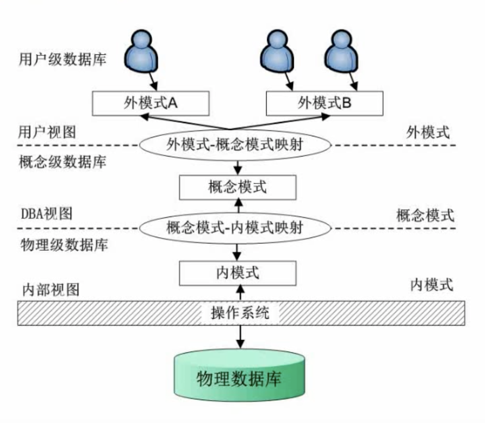
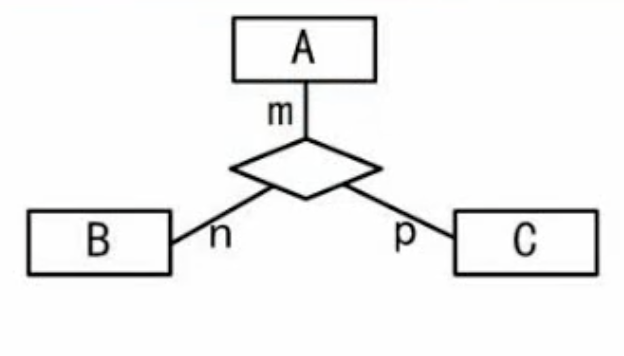
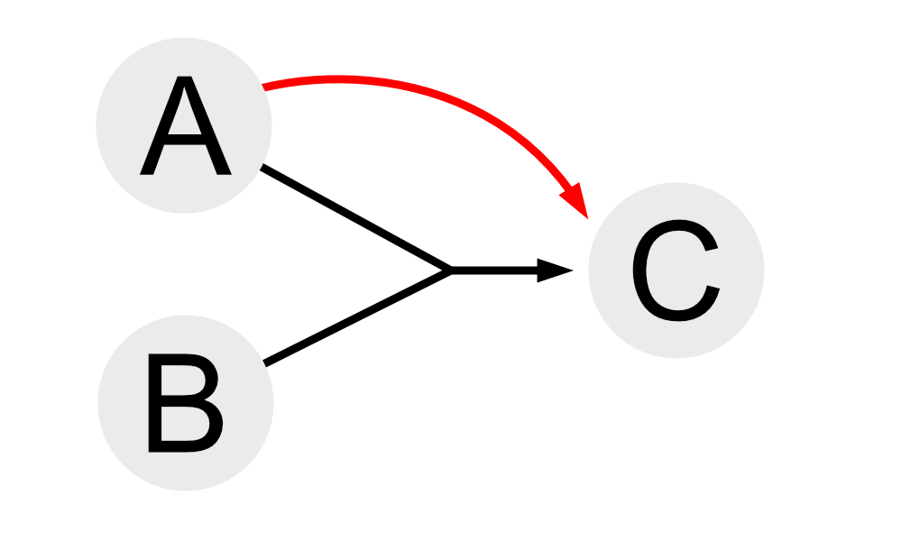
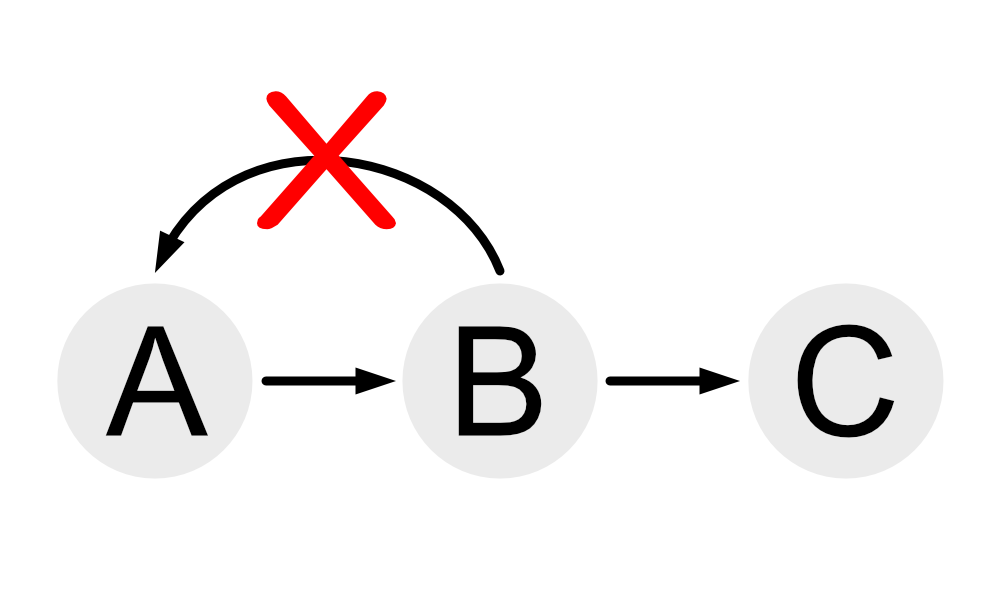

# 数据库系统
## 数据库的三级模式-两级映射
- ### 数据库的三级模式
  三级模式包括：  
  <mark>**内模式：和物理数据库联系，用于管理如何存储数据  
  概念模式：对应数据库的表，将数据库划分为若干个表  
  外模式：对应数据库的视图，对数据更加灵活的方式**</mark>
- ### 数据库的两级映射
  两级映射（用于表示两两模式的关系）：  
  <mark>**概念模式-内模式映射：内部存储形式和表的形式的映射关系  
  外模式-概念模式映射：表和视图的映射关系**</mark>



## 数据库的设计
- ### 数据库设计流程
  <mark>**1.需求分析**  
  **2. 概念结构设计**（`主要做ER模型`）  
  **3. 逻辑结构设计**（`转换成关系模式`)  
  **4. 物理设计（加入DBMS特性）**</mark>

  
- ### ER模型
  - 各种表示：
    - <mark>**方框：实体**<mark>
    - <mark>**椭圆：属性**</mark>
    - <mark>**菱形：联系/关系**</mark>
  
  - 集成方法：
    - 逐步集成：用累加的方法一次集成两个局部E-R图
    - 多个局部E-R图一次集成

  - 一个实体转换为一个关系模式：  
    - 1:1联系  
      对于1:1的模型，可以将联系放在任何一个实体中  
      <mark>**即最少需要2个关系模型**</mark>
    - 1:n联系  
      对于1:n的模型，可以将联系放在<mark>**对应多个的实体中  
      即最少需要2个关系模型**</mark>
    - m:n联系  
      对于m:n的模型，<mark>**两边都需要转换成各自的实体，并且联系也需要单独创建一个实体  
      即最少需要3个关系模型**</mark>

  ```
  例：在数据库逻辑结构的设计中，将E-R模型转换成关系模型应遵循相关原则。对于三个不同的实体集和它们之间的多对多联系m:n:p，最少可转换成___个关系模型
  ```
  

  ```
  解：由题可知，这是一个多对多的模型，因此需要(1+1+1)+1=4个关系模式
  注意前面三个1是三个实体，最后一个1是联系需要转换的关系模式
  ```
- ### 关系代数
  关系代数的几种形式：<mark><b>并、交、差、笛卡尔积、投影、选择、联接</b></mark>
  例如下述两个关系表S1和S2  
  <table>
  <tr>
    <td colspan="3" align="center">关系S1</td>
    <td></td>
    <td colspan="3" align="center">关系S2</td>
  </tr>
  <tr>
    <td><b>Sno</b></td>
    <td><b>Sname</b></td>
    <td><b>Sdept</b></td>
    <td></td>
    <td><b>Sno</b></td>
    <td><b>Sname</b></td>
    <td><b>Sdept</b></td>
  </tr>
  <tr>
    <td>No0001</td>
    <td>Marry</td>
    <td>IS</td>
    <td></td>
    <td>No0001</td>
    <td>Marry</td>
    <td>IS</td>
  </tr>
  <tr>
    <td>No0003</td>
    <td>Candy</td>
    <td>IS</td>
    <td></td>
    <td>No0008</td>
    <td>Katter</td>
    <td>IS</td>
  </tr>
  <tr>
    <td>No0004</td>
    <td>Jam</td>
    <td>IS</td>
    <td></td>
    <td>No0021</td>
    <td>Tom</td>
    <td>IS</td>
  </tr>
  </table>

  - 并集  
    那么S1∪S2（S1并S2）：<mark>**合并相同项，并组合两个表**</mark>
    <table>
    <tr>
      <td colspan="3" align="center">S1∪S2</td>
    </tr>
    <tr>
      <td><b>Sno</b></td>
      <td><b>Sname</b></td>
      <td><b>Sdept</b></td>
    </tr>
    <tr>
      <td>No0001</td>
      <td>Marry</td>
      <td>IS</td>
    </tr>
    <tr>
      <td>No0003</td>
      <td>Candy</td>
      <td>IS</td>
    </tr>
    <tr>
      <td>No0004</td>
      <td>Jam</td>
      <td>IS</td>
    </tr>
    <tr>
      <td>No0008</td>
      <td>Katter</td>
      <td>IS</td>
    </tr>
    <tr>
      <td>No0021</td>
      <td>Tom</td>
      <td>IS</td>
    </tr>
    </table>

  - 交集  
    S1∩S2（S1交S2）：<mark>**只显示两个表中相同部分**</mark>
    <table>
    <tr>
      <td colspan="3" align="center">S1∩S2</td>
    </tr>
    <tr>
      <td><b>Sno</b></td>
      <td><b>Sname</b></td>
      <td><b>Sdept</b></td>
    </tr>
    <tr>
      <td>No0001</td>
      <td>Marry</td>
      <td>IS</td>
    </tr>
    </table>

  - 差集  
    S1-S2（S1与S2的差集）：S1有，但是S2没有的（<mark>**被减数有但是减数没有的**</mark>）
    <table>
    <tr>
      <td colspan="3" align="center">S1-S2</td>
    </tr>
    <tr>
      <td><b>Sno</b></td>
      <td><b>Sname</b></td>
      <td><b>Sdept</b></td>
    </tr>
    <tr>
      <td>No0003</td>
      <td>Candy</td>
      <td>IS</td>
    </tr>
    <tr>
      <td>No0004</td>
      <td>Jam</td>
      <td>IS</td>
    </tr>
    </table>

  - 笛卡尔积  
    每一个S1对应S2，因此如果是3x3的S1和3x3的S2做笛卡尔积的运算，那么结果为9x9的表，<mark>**即表A每一条数据分别对应表B的每一条数据**</mark>
    <table>
    <tr>
      <td colspan="6" align="center">S1 x S2（笛卡尔积）</td>
    </tr>
    <tr>
      <td><b>Sno</b></td>
      <td><b>Sname</b></td>
      <td><b>Sdept</b></td>
      <td><b>Sno</b></td>
      <td><b>Sname</b></td>
      <td><b>Sdept</b></td>
    </tr>
    <tr>
      <td>No0001</td>
      <td>Marry</td>
      <td>IS</td>
      <td>No0001</td>
      <td>Marry</td>
      <td>IS</td>
    </tr>
    <tr>
      <td>No0001</td>
      <td>Marry</td>
      <td>IS</td>
      <td>No0008</td>
      <td>Katter</td>
      <td>IS</td>
    </tr>
    <tr>
      <td>No0001</td>
      <td>Marry</td>
      <td>IS</td>
      <td>No0021</td>
      <td>Tom</td>
      <td>IS</td>
    </tr>
    <tr>
      <td>No0003</td>
      <td>Candy</td>
      <td>IS</td>
      <td>No0001</td>
      <td>Marry</td>
      <td>IS</td>
    </tr>
    <tr>
      <td>No0003</td>
      <td>Candy</td>
      <td>IS</td>
      <td>No0008</td>
      <td>Katter</td>
      <td>IS</td>
    </tr>
    <tr>
      <td>No0003</td>
      <td>Candy</td>
      <td>IS</td>
      <td>No0021</td>
      <td>Tom</td>
      <td>IS</td>
    </tr>
    <tr>
      <td>No0004</td>
      <td>Jam</td>
      <td>IS</td>
      <td>No0001</td>
      <td>Marry</td>
      <td>IS</td>
    </tr>
    <tr>
      <td>No0004</td>
      <td>Jam</td>
      <td>IS</td>
      <td>No0008</td>
      <td>Katter</td>
      <td>IS</td>
    </tr>
    <tr>
      <td>No0004</td>
      <td>Jam</td>
      <td>IS</td>
      <td>No0021</td>
      <td>Tom</td>
      <td>IS</td>
    </tr>
    </table>
  - 投影  
    投影需要选择对什么进行投影  
    类似于筛选操作，<mark>**需要投影的内容进行现实，不需要投影的内容则不予显示（投影的内容是筛选列）**</mark>  
    下表以对Sno和Sname做投影
    <table>
    <tr>
      <td colspan="2" align="center">对S1中的Sno和Sname进行的投影</td>
    </tr>
    <tr>
      <td><b>Sno</b></td>
      <td><b>Sname</b></td>
    </tr>
    <tr>
      <td>No0001</td>
      <td>Marry</td>
    </tr>
    <tr>
      <td>No0003</td>
      <td>Candy</td>
    </tr>
    <tr>
      <td>No0004</td>
      <td>Jam</td>
    </tr>
    </table>

    <mark>**p.s.上表记作π<sub>1,2</sub>(S1)**</mark>
    <br><br>
  - 选择  
    <mark>**选择相当于对行进行筛选，不需要的记录则不予显示**</mark>  
    下表对S1中Sno=No0003的内容进行选择  
    <table>
      <tr>
      <td colspan="3" align="center">对S1中Sno=No0003的内容进行选择</td>
      </tr>
      <tr>
        <td><b>Sno</b></td>
        <td><b>Sname</b></td>
        <td><b>Sdept</b></td>
      </tr>
      <tr>
        <td>No0003</td>
        <td>Candy</td>
        <td>IS</td>
      </tr>
    <table>

    <mark>**p.s.上表记作σ<sub>1=No0003</sub>(S1)或者σ<sub>Sno=No0003</sub>(S1)**</mark>
  - 连接  
    <mark>**将两个表中相同实体的不同属性进行连接，如果无法连接的数据不予显示**</mark>  
    例如下述两表
  
    <table>
    <tr>
      <td colspan="3" align="center">关系S1</td>
      <td></td>
      <td colspan="2" align="center">关系S1</td>
    </tr>
    <tr>
      <td><b>Sno</b></td>
      <td><b>Sname</b></td>
      <td><b>Sdept</b></td>
      <td></td>
      <td><b>Sno</b></td>
      <td><b>Age</b></td>
    </tr>
    <tr>
      <td>No0001</td>
      <td>Marry</td>
      <td>IS</td>
      <td></td>
      <td>No0001</td>
      <td>23</td>
    </tr>
    <tr>
      <td>No0003</td>
      <td>Candy</td>
      <td>IS</td>
      <td></td>
      <td>No0008</td>
      <td>21</td>
    </tr>
    <tr>
      <td>No0004</td>
      <td>Jam</td>
      <td>IS</td>
      <td></td>
      <td>No0021</td>
      <td>22</td>
    </tr>
    <table>

    连接两个表:
    
    <table>
    <tr>
      <td align="center" colspan="4">将S1与S2连接</td>
    </tr>
    <tr>
      <td><b>Sno</b></td>
      <td><b>Sname</b></td>
      <td><b>Sdept</b></td>
      <td><b>Age</b></td>
    </tr>
    <tr>
      <td>No0001</td>
      <td>Marry</td>
      <td>IS</td>
      <td>23</td>
    </tr>
    </table>
    
    <mark>**p.s.上表记作S1▷◁S2(S1·Sno=S2·Sno)**</mark>
## 规范化理论
- ### 函数依赖
  - 部分函数依赖  
    

    其中A能直接确定C，因此A和B联合即可以确定C  
    **<mark>即组件的一个部分就可以确定属性</mark>**
  - 传递函数依赖  
    
    
    其中A可以确定B，B可以确定C，因此A可以确定C  
    **<mark>即确定的关系可以传递</mark>**  
    **<mark>但是不能反向确定（如果可以反向，那么两者便可以等价）</mark>**
- ### 键
  - 超键  
    **<mark>唯一标示元祖  
    可能存在冗余属性</mark>**
  - 候选键  
    **<mark>同样也唯一标示元祖  
    但是不可能存在冗余属性</mark>**  
    **超键去除冗余的属性之后便可以得到候选键**
    ```
    备注：例如(学号)和(学号,姓名)可以都可以称之为超键，但是(学号,姓名)只能作为超键，不能当作是候选键，因为有姓名这样的冗余属性
    ```
  - 主键  
    <mark>**主键相较于候选键只能有一个**</mark>
  - 外键  
    <mark>**其他关系的主键**</mark>

  超键->（去除冗余信息）候选键->（选择一个）主键
  - 求候选键  
    解法：  
    <mark>**1. 画图关系图，A->B，A可以确定B  
    2. 找出入度为0的结点  
    3. 如果通过这个结点可以遍历整个图，那么这个结点就是候选键**</mark>
    
    ```
    例1：给定关系R（A1，A2，A3，A4）上的函数依赖集P={A1->A2，A3->A2，A3->A2，A2->A3，A2->A4}，R的候选关键字为___
    ```
    
    
    ```
    解：候选关键字为A1
    ```
    ```
    例2：关系模型P如图依赖关系，求候选键？
    ```
    

    ```
    解：左下角小图可得候选键为C
    图中央的大图候选键为A、B、D
    ```

    ```
    例3：关系模型P如图依赖关系，求候选键？
    ```
    

    ```
    解：候选关键字为A和B
    ```
- ### 范式
  范式：级别最低的是第一范式(1NF)，其次是第二范式(2NF)、第三范式(3NF)……最高级是BCNF  
  其中需要达到第二范式必须达到第一范式，以此类推  
  **<mark>即如果达到级别高的范式，必须要先达到级别低的范式</mark>**  
  其中第一范式<mark>**属性值都是不可分的原子值**</mark>

  **<mark>级别越高，规范程度越高，更有可能解决插入异常、删除异常、数据冗余的问题</mark>**

  - 第一范式（1NF）  
    **<mark>在关系模式R中，当且仅当所有域只包含原子值，即每个分量都是不可再分的数据项，则称R是第一范式</mark>**  
    例如下述表:
    <table>
    <tr>
      <td rowspan="2"><b>系名称</b></td>
      <td colspan="2"><b>高级职称人数</b></td>
    </tr>
    <tr>
      <td>教授</td>
      <td>副教授</td>
    </tr>
    <tr>
      <td>计算机系</td>
      <td>6</td>
      <td>10</td>
    </tr>
    <tr>
      <td>电子系</td>
      <td>3</td>
      <td>5</td>
    </tr>
    </table>

    上表不满足1NF，因为高级职称人数还可以继续拆分：  
    |系名称|教授|副教授|
    |:-:|:-:|:-:|
    |计算机系|6|10|
    |电子系|3|5|

  - 第二范式（2NF）  
    <mark>**第二范式的前提必须要是第一范式，并且每一个非主属性完全依赖主键（不存在部分依赖）时，则称R是第二范式（2NF）**</mark>  
    例如下述表中（红色加粗字体为候选键）

    |`Sno`|`Cno`|Grade|Credit|
    |:-:|:-:|:-:|:-:|
    |S01|C01|75|4
    |S02|C01|92|4
    |S03|C01|87|4
    |S04|C01|55|4
    |S01|C02|87|2
    |S02|C02|95|2
    |S01|C03|94|5
    |……|……|……|……
    
    **`(上表属于1NF)`**  
    **`(上表存在数据冗余)`**  
    **<mark>上述表中Sno和Cno为候选键，但是Credit只依赖于Cno而不依赖于Sno，则上表不是第二范式，正确做法应该将其拆分</mark>**  
    上述表需要将Cno和Credit提取出来建立新的关系表，原表中去除Credit这一列  
    **<mark>主键只有一个的时候一定是第二范式</mark>**

  - 第三范式（3NF）  
    **<mark>第三范式的前提必须是第二范式（2NF），且没有非主属性传递依赖于码时，则称其为第三范式</mark>**  
    |**`Sno`**|Sname|Dno|Dname|Loca|
    |:-:|:-:|:-:|:-:|:-:|
    |S01|张三|D01|CS|1|
    |S02|李四|D01|CS|1|
    |S03|王五|D01|CS|1|
    |S04|赵六|D02|IS|2|
    
    **`(上述表为2NF)`**  
    **`(上表存在数据冗余)`**  
    上述表中Sno是主键，因此这个表肯定属于第二范式(2NF)，但是存在大量的重复信息，因此需要将Dno、Dname和Loca提取出来单独列表。

  - BC范式（BCNF）  
    **<mark>BC范式的前提是第三范式，每个非主属性既不部分依赖于码也不传递依赖于码</mark>**
  ```
  例：某公司的部门（部门号，部门名，负责人，电话）、商品（商品号，商品名称，单价，库存量）和职工（职工号，姓名，住址）三个实体之间的关系如表1、表2和表3所示，假设每个部门有一位负责人和一部电话，但有若干名员工；每种商品只能由一个部门负责销售。部门关系不属于第三方范式的原因是___。如果用户要求得到表4所示的结构，需要___，并增加关系模式___。
  第二空选项：
  A.修改表1，增加职工号
  B.修改表2，增加职工号
  C.修改表2，增加部门号
  D.修改表3，增加部门号
  第三空选项：
  A.销售（职工号，商品号，日期，数量）
  B.销售（职工号，商品名称，商品号，数量）
  C.销售（职工号，部门号，日期，数量）
  D.销售（职工号，部门号，商品号，日期）
  ```
  **`表1:`**
  |部门号|部门名|负责人|电话|
  |:-:|:-:|:-:|:-:|
  |001|家电部|E002|1001|
  |002|百货部|E026|1002|
  |003|食品部|E030|1003|

  <br>

  **`表2:`**
  |商品号|商品名称|单价|库存量|
  |:-:|:-:|:-:|:-:|
  |30023|微机|4800|26|
  |30034|打印机|1650|7|
  |30101|毛巾|10|106|
  |30102|牙刷|10|106|

  **`表3:`**

  |职工号|姓名|住址|
  |:-:|:-:|:-:|
  |E001|王军|南京路|
  |E002|李晓斌|淮海路|
  |E021|余飞|江西路|
  |E026|田晓菲|江西路|
  |……|……|……|

  **`表4:`**
  |职工号|姓名|部门号|月销售额|
  |:-:|:-:|:-:|:-:|
  |E001|王军|家电部|528900|
  |E002|李晓斌|家电部|360000|
  |E021|余飞|百货部|12500|
  |E026|田晓菲|食品部|15000|

  ```
  解：1.只消除了非主属性部分函数依赖而没有消除传递函数依赖，而没有消除传递函数依赖
  备注：在表1中，部门号只对应一个部门名称，但是部门号可以对应部门名的同时，部门名有对应负责人，负责人又对应电话（传递依赖）
  2.选择C:修改表2，增加部门号
  备注：从修改复杂程度来说选择修改表2
  3.选择A:销售（职工号，商品号，日期，数量）
  B选项中商品名称和商品号互相依赖
  C职工号和部门号互相依赖
  D同上
  ```
  <br><br><br><br><br><br>

- ### 模式分解
  两种函数分解：<mark>**保持函数依赖分解**</mark>和<mark>**无损分解**</mark>  
  - 保持函数分解  
    **<mark>在分解的同时也能表现出原有各个模式中的依赖关系</mark>**  
    例如A->B->C关系的R(A,B,C)分解为R1(A,B)，R2(B,C)，那么可以说R1，R2是保留函数依赖分解  
    但是如果R拆分为R1(A,B)和R3(A,C)，其中B->C的关系未说明，那么这种拆分不是保持函数分解
  - 无损分解  
    **<mark>无损表示可以还原的分解方法</mark>**
    ```
    例：有关系模式：成绩（学号，姓名，课程号，课程名，分数）
    函数依赖：学号->姓名，课程号->课程名，（学号，课程号）->分数
    若将其分解为：
      成绩（学号，课程号，分数）
      学生（学号，姓名）
      课程（课程号，课程名）
    这种方式是否是无损分解？
    ```
    **`方法一（还原法）：`**
    ```
    解：这是一种无损分解
    因为通过学生（学号，姓名）可以与成绩（学号，可称号，分数）做连接
    通过课程（课程号，课程名）可以与成绩（学号，课程号，分数）做连接
    ```
    **`方法二（画表法）：`**
    
    ||学号|姓名|课程号|课程名|分数|
    |:-:|:-:|:-:|:-:|:-:|:-:|
    |成绩|`a1`|b12|`a3`|b14|`a5`|
    |学生|`a1`|`a2`|b23|b23|b25|
    |课程|b31|b32|`a3`|`a4`|b35|
    
    其中横排的是原表，包含学号、姓名、课程号、课程名和分数  
    左栏是拆分的表名称：成绩、学生和课程
    用an表示拆分表中有该参数，n表示第n列，那么成绩行，学号列是a1，其余用bmn（表示第m行，第n列）表示  
    如果某一行中a1，a2有关系，另一行只有a1，那么这一行a1和a2皆为已知，例如上表可以修改为：
    ||学号|姓名|课程号|课程名|分数|
    |:-:|:-:|:-:|:-:|:-:|:-:|
    |成绩|`a1`|**`a2`**|`a3`|b14|`a5`|
    |学生|`a1`|`a2`|b23|b23|b25|
    |课程|b31|b32|`a3`|`a4`|b35|

    注意上述第2行第2列值修改为已知值  
    以此类推，这个表可以逐步修改为：
    ||学号|姓名|课程号|课程名|分数|
    |:-:|:-:|:-:|:-:|:-:|:-:|
    |成绩|`a1`|**`a2`**|`a3`|**`b4`**|`a5`|
    |学生|`a1`|`a2`|b23|b23|b25|
    |课程|b31|b32|`a3`|`a4`|b35|

    **<mark>其中有一行全都变成a，因此可以证明本次分解为无损分解</mark>**  
    **`方法三（公式法）：`**  
    <mark>**`此方法仅限于一分二`**</mark>  
    例如R分解为R1和R2，那么那么求解出：  
    R1∩R2=A  
    R1-R2=B  
    R2-R1=C  
    如果A->B或者A->C有一个成立那么就是无损分解
    ***
    注意下题另为一题：
    ```
    设R=ABC，F{A->B}，ρ1={R1(AB),R2(AC)}和ρ2={R1(AB),R3(BC)}是否是无损分解？
    ```
    ```
    解：1.
    R1∩R2=A
    R1-R2=B
    R2-R1=C
    A->B为题意，那么这是一个无损分解
    2.
    R1∩R2=B
    R1-R2=A
    R2-R1=C
    B->A和B->C都没有出现
    则这不是无损分解
    ```
<br><br><br>

## 并发控制
- ### 基本概念
  事务：保证操作只有全都做和全不做两种状态  
  事务特性：原子性（不能拆分）、一致性（执行前和执行后的一致性）、隔离性（事务之前互不影响）、持续性（结果具有持续性）  
  - 并发的问题  
    <mark>**1. 丢失更新**</mark>  
    <mark>**2. 不可重复读**</mark>  
    <mark>**3. 读“脏”数据**</mark>
    <br>
    ```
    例子：
    1.丢失更新：
      T1        T2
    ①读取A=10
    ②          读A=10
    ③A=A-5写回
    ④          A=A-8写回
    上述会导致A-8覆盖掉A-5，导致结果A=2

    2.不可重复读
      T1       T2
    ①读A=20
      读B-30
      求和=50
    ②         读A=20
               A=A+50
               A=70
    ③演算出错

    3.读“脏”数据
      T1       T2
    ①读A=20
      A=A+50
      写回70
    ②         读A=70
    ③ROLLBACK
      A恢复为20
    A+50只是一个临时值
    ```
- ### 封锁协议
  - 一级封锁协议  
    <mark>**事务T在修改数据R之前必须对其加X锁，直到事务结束才释放，`可以防止丢失修改`**</mark>
  - 二级封锁协议  
    <mark>**一级封锁协议加上事务T在读取数据R之前对其加S锁，`读完`后可释放S锁，`可以防止丢失修改，还可以防止读“脏”数据`**
  - 三级封锁协议  
    <mark>**一级封锁协议加上事务T在读取数据R之前对其加S锁，`直到事务结束才释放`，`可防止丢失修改、防止防止丢失修改，还可以防止读“脏”数据`**</mark>
  - 两段锁协议  
    <mark>**可串行化的**</mark>，<mark>**可能发生死锁**</mark>

<br><br><br>

## 数据库完整性约束
- ### 实体完整性约束
    利用主键对输入内容的约束
- ### 参照完整性约束
    利用外键对输入内容的参照
- ### 用户自定义完整性约束
    对输入的内容值的规定范围

  数据库完整性约束用于提高数据库中数据的可靠性和完整性  
- ### 触发器
    对于一些复杂的情况，需要利用触发器通过脚本的形式对数据库进行约束
## 数据库安全
<table>
<tr>
  <td width="100px"><b>措施</b></td>
  <td><b>说明</b></td>
</tr>
<tr>
  <td>用户标识和鉴定</td>
  <td>最外层的安全保护措施，可以使用用户账户、口令及随机数检验等方式
</tr>
<tr>
  <td>存取控制</td>
  <td>对用户进行授权，包括操作类型（如查找、插入、删除、修改等动作）和数据对象（主要是数据范围）的权限
</tr>
<tr>
  <td>密码存储和传输</td>
  <td>对远程终端信息用密码传输</td>
</tr>
<tr>
  <td>视图的保护</td>
  <td>对视图进行授权</td>
</tr>
<tr>
  <td>审计</td>
  <td>使用一个专用文件或数据库，自动将用户对数据库的所有操作记录下来
</tr>
</table>


## 数据的备份
- ### 热备份和冷备份
  <table>
  <tr>
    <td width="70"><b>备份方式</b></td>
    <td width="200"><b>优点</b></td>
    <td width="200"><b>缺点</b></td>
  </tr>
  <tr>
    <td>冷备份</td>
    <td>非常快速的备份方法（需要备份文件），容易归档（简单复制即可），容易恢复到某个时间点上（只需要复制回去），能与归档方法结合，做数据库“最佳状态”的恢复；<mark><b>低度维护，高度安全</mark></b>
    <td>单独使用时，只能提供到某一时间点上的恢复；<mark><b>在实施备份的全过程中，数据库必须要做备份而不能做其他工作；</mark></b>若磁盘空间有限只能复制到磁盘等外部设备上，<mark><b>速度缓慢，不能按表或者用户恢复</mark></b>
  </tr>
  <tr>
    <td>热备份</td>
    <td>可在表空间或数据库文件级备份，备份的时间段；<mark><b>备份时数据库仍可以使用，可达到秒级恢复（恢复到某一时间点上）</mark></b>；可对几乎所有的数据库实体做恢复；恢复速度快速</td>
    <td>不能出错，否则后果很严重，若热备份不成功所得到的结果不可用于时间点的恢复；困难于维护，所以要特别小心，<mark><b>不允许失败</b></mark></td>
  </tr>
  </table>

- ### 完全备份、差量备份和增量备份
  - 完全备份：<mark>**备份所有数据**</mark>  
  - 差量备份：<mark>**仅备份上一次`完全备份`之后变化的数据**</mark>  
  - 增量备份：<mark>**仅备份上一次`备份`之后变化的数据**</mark>
- ### 各种转储
  海量一般表示全部存储，增量一般表示针对上一次的备份后备份变化的数据  
  静态一般表示在系统中无运行事务时进行，动态一般表示每次只转储上次转储后更新的数据
  - 静态`海量`转储：**在系统中无运行事务时进行，每次转储全部数据库**
  - 静态`增量`转储：**在系统中无运行事务时进行，每次只转储上次转储后更新的数据**
  - 动态`海量`转储：**转储期间允许对数据库进行存取或修改，每次转储全部数据库**
  - 动态`增量`转储：**转储期间允许对数据库进行存取或修改，每次只转储上次转储后更新的数据**
- ### 日志文件
    日志文件是针对数据库改变所做的记录，它可以记录针对数据库的任何擦欧总，并将记录结果保存在独立的文件中
- ### 数据库的故障与恢复
  |故障关系|故障原因|解决方法|
  |:-:|:-:|:-:|
  |事务本身的可预期故障|本身逻辑|在程序中预先设置Rollback语句|
  |事务本身不可预期故障|算数溢出、违反存储保护|由于DBMS恢复通过日志，撤销事务对数据库的修改，回到事务最初状态|
  |系统故障|系统停止运转|通常使用检查点法|
  |介质故障|外存被破坏|一般使用日志重做业务|
## 数据仓库与数据挖掘
- ### 数据仓库
  - 数据仓库特点:  
    1.面向主题  
    2.数据仓库存储集成数据  
    3.数据仓库一般不做修改，具有相对稳定性  
    4.反应时间的变化
   
  - 数据仓库的建立  
      

    备注：  
    清理：对数据进行格式化
    OLAP：联机分析处理器，用于分析处理  
- ### 数据挖掘方法分类
    --
## 反规范化
规范化会使得表不断拆分，导致拆分的表过多，减少数据冗余但是会增加查询的工作量
- 技术手段  
  1.增加派生性冗余列  
  2.增加冗余列  
  3.重新组表  
  4.分割表
## 大数据基本概念
- 用4V表示大数据的特点：  
1.Volume（数据量大）  
2.Velocity（速度快）  
3.Variety（多样性丰富）  
4.Value（价值大）

- 大数据的重要特征  
1.高度可扩展性  
2.高性能  
3.高度容错  
4.支持异构环境  
5.较短的分析延迟  
6.易用且开放的接口  
7.较低成本  
8.向下兼容性