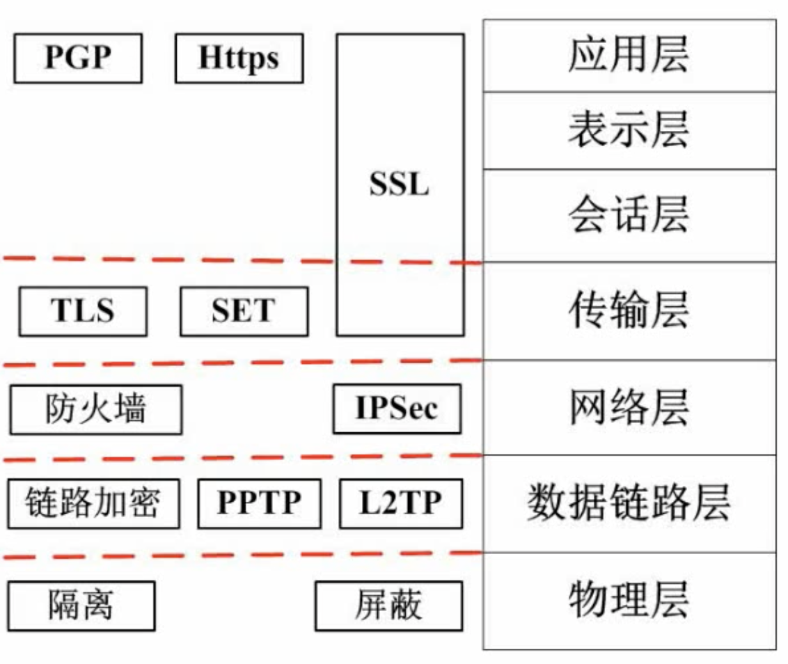

# 系统安全分析与设计
## 信息系统安全属性
安全属性包括：  
- 保密性：最小授权原则、防暴露、信息加密、物理加密
- 完整性：安全协议、校验码、密码校验、数字签名、公证
- 可用性：综合保障（IP过滤、业务流控制、路由选择控制、审计跟踪）
- 不可依赖性：数字签名
## 对称加密和非对称加密
- ### 对称加密
  对称加密指的是加密和解密使用完全一样的密钥

  常见的对称密钥加密算法：
  - DES  
    替换+移位的方法，速度快，密钥容易产生
  - 3DES  
    加密：K1加密->K2解密->K1加密  
    解密：K1解密->K2加密->K1解密
  - AES
  - RC-5
  - IDEA
  <br><br>

  对称加密优点：  
  加密和解密速度快，效率高

  对称加密缺点：  
  1.加密强度不高  
  2.密钥分发困难
- ### 非对称加密
  非对称密钥指的是加密的密钥和解密的密钥不一样（公钥加密，私钥解密，或者私钥加密，公钥解密）

  发送方和接收方都有各自的私钥和公钥，其中公钥公开  
  <mark>**如果A发送给B，那么A首先用B的公钥加密，发送给B，B用B的私钥解密**</mark>

  常见的非对称密钥加密法  
  - RSA  
    512位（或1024位）密钥，计算量极大，难破解
  - Elgamal
  - ECC
  - 背包算法
  - Rabin
  - D-H
  <br><br>

  非对称加密优点：  
  极不容易破解

  非对称加密缺点：  
  加密和解密速度都很慢
## 信息摘要
单向散列函数（单向哈希函数）（只能由明文转换成摘要，不能将摘要转换为明文）、固定长度的散列值  
信息摘要是一段信息的特征值，原始信息发生变化，那么特征值将会随之改变  
<mark>**常用的信息摘要算法有MD5、SHA等**</mark>，市场上广泛使用的MD5，SHA算法的散列值分别为128位和160位

## 数字签名
数据从A发往B，如果通过A的私钥加密（数字签名的过程），B收到后用A的公钥解密（数字签名的验证）成功，相当于A在数据上进行签名

<mark>**具体步骤：  
1.产生信息摘要，对`摘要`用`发送方`的私钥加密  
2.发送给对方后对方用A的公钥进行解密  
3.接收方核验收到的明文摘要和解密之后的明文一致，说明签名验证成功**</mark>

## 数字信封与PGP
- ### 数字信封
  <mark>**发送方将通过对称加密的原文发送给对方，同时也将对称密钥用接收方的公钥加密发送给对方</mark>**

- ### PGP
  PGP可以用于电子邮件，也可以用于文件存储。采用了杂合算法，包括IDEA、RSA、MD5和ZIP数据压缩算法  

  数字证书就是将证书持有者的个人信息和证书的公钥等信息  
  PGP承认两种证书：GPG证书和X.509证书
## 设计邮件加密系统
```
例：要求邮件以加密方式传输，邮件最大附件内容可达500MB，发送者不可抵赖，若邮件被第三方截获，第三方无法篡改
```
```
解：
加密传输：需要加密解密技术
邮件内容可达500MB：需要使用对称加密技术
发送者不可抵赖：需要用到数字签名技术
第三方无法篡改：信息摘要技术
详细如下：
邮件正文使用对称加密方式发送给对方
对称加密的密钥用对方的公钥加密发送给对方
邮件摘要用发送方的私钥发送给对方
```
## 网络安全
- ### 各个网络层次的安全保障
  

  - 物理层  
    屏蔽（无线电信号等）  
    隔离（物理隔离）
  - 数据链路层  
    PPTP（点对点隧道协议）、L2TP（多隧道协议）
  - 网络层  
    防火墙技术（分为软件层面和硬件层面）  
    IPSec针对IP包进行加密传输（一种将IP包拆开加密，另外一种是整体加密，附加头）
  - 传输层  
    TLS：标准安全协议  
    SET：面向电子商务协议，通信过程保密  
    SSL：注意<mark>**跨越传输层到应用层**</mark>
  - 应用层  
    Https，即http+SSL

<br><br><br><br><br><br>

- ### 网络威胁与攻击
  <table>
  <tr>
    <td width="120"><b>威胁名称</td></td>
    <td><b>描述</td></td>
  </tr>
  <tr>
    <td>重放攻击(ARP)</td>
    <td>所截获的某次合法的通信数据拷贝，出于非法的目的而被重新发送</td>
  </tr>
  <tr>
    <td>拒绝服务(DOS)</td>
    <td>对信息或其它资源的合法访问被无条件阻止</td>
  </tr>
  <tr>
    <td>窃听</td>
    <td>用各种可能的合法或非法的手段窃取系统中的信息资源和敏感信息。<br>例如对通信线路中传输的信号进行搭线窃听，或者利用通信设备在工作过程中产生的电磁泄露截取有用信息等</td>
  </tr>
  <tr>
    <td>业务流分析</td>
    <td>通过对系统进行<mark><b>长期监听</b></mark>，利用统计分析方法对诸如通信频度、通信的信息流向、通信总量的变化等参数进行研究，从而发现有用价值的信息和规律</td>
  </tr>
  <tr>
    <td>信息泄露</td>
    <td>信息被泄露或透露给某个非授权的实体</td>
  </tr>
  <tr>
    <td>破坏信息的完整性</td>
    <td>数据被非授权地进行增删、修改或破坏收到损失</td>
  </tr>
  <tr>
    <td>非授权访问</td>
    <td>某一资源被某个非授权的人、或以非授权的方式使用</td>
  </tr>
  <tr>
    <td>假冒</td>
    <td>通过欺骗通信系统（或用户）达到非法用户冒充成为合法用户，或者特权小的用户冒充成为特权大的用户的目的。黑客大多是采用假冒进行攻击</td>
  </tr>
  <tr>
    <td>旁路控制</td>
    <td>攻击者利用系统的安全缺陷或安全性上的脆弱之处获得非授权的权利或特权。<br>
    例如，攻击者通过各种攻击手段发现原本应保密，但是却又暴露出来的一些系统“特征”，通过此可以绕过防守卫者侵入系统内部</tr>
  </tr>
  <tr>
    <td>授权侵犯</td>
    <td>被授权以某一目的使用某一系统或资源的某个人，却将此权限用于其它非授权的目的，也叫做“内部攻击”
  </tr>
  <tr>
    <td>特洛伊木马</td>
    <td>软件中含有一个察觉不出的或者无害的程序段，当它被执行时，会破坏用户的安全</td>
  </tr>
  <tr>
    <td>陷进门</td>
    <td>在某个系统或某个部件中设置了“机关”，使得当提供特定的输入程序时允许反安全策略</td>
  </tr>
  <tr>
    <td>抵赖</td>
    <td>来自用户的攻击<br>例如否认自己发布过某条消息，伪造一份对方来信等</td>
  </tr>
  </table>

- ### 防火墙
  防火墙分类：
  - 网络级
    - 包过滤
    - 状态检测
  - 应用级
    - 双穴主机
    - 屏蔽主机
    - **屏蔽子网**


  网络级防火墙层级比较低但是效率高，而应用级防火墙层级高，但是效率低  
  应用级的防火墙比网络级更彻底

  - 屏蔽子网防火墙（安全度最高）  
    在外网和内网之间建立隔离区（DMZ，又叫做非军事区），在隔离区部署堡垒主机，这样增加外部网络对内网的攻击