# 数据结构与算法基础
## 数组
<table>
<tr>
  <td><b>数组类型</b></td>
  <td><b>存储地址计算</b></td>
</tr>
<tr>
  <td>一维数组a[n]</td>
  <td>a[i]的存储地址为：a + i x len</td>
</tr>
<tr>
  <td>二维数组a[m][n]</td>
  <td>a[i][j]的存储地址（按行存储）为：a + (i x n + j) x len<br>a[i][j]的存储地址（按列存储）为：a + (j x m + i) x len
</tr>
</table>

```
已知5行5列的二维数组a中的各个元素站两个字节，求a[2][3]按行优先存储的存储地址
```
```
解:a+(2*2*5+3*2)=a+26
```
## 稀疏矩阵
- ### 上三角矩阵
  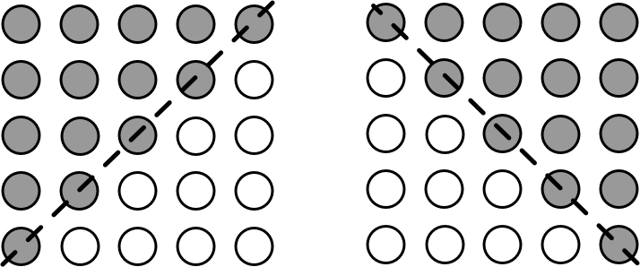<br>
  <mark>**要点：在矩阵中下标分为别i和j的元素，对应的一维数组的下标计算公式为:<br>(2n - i + 1) x i / 2 + j**</mark>
- ### 下三角矩阵
  <br>
  <mark>**要点：在矩阵中下标分别为i和j的元素，对应的一维数组的下标计算公式为：<br>(i + 1) x i / 2 + j**</mark>
<br><br><br><br><br><br><br><br><br><br><br>
```
例：设有如下所示的下三角矩阵A[0...8,0...8]，将该三角形矩阵的非零元素（即行下标不小于列下标的所有元素）按行优先压缩存储在数组M[1...M]中，则元素A[i,j]存储在数组M的___中
```
||||||||||
|:-:|:-:|:-:|:-:|:-:|:-:|:-:|:-:|:-:|
|A<sub>0,0</sub>|0|0|0|0|0|0|0|0|
|A<sub>1,0</sub>|A<sub>1,1</sub>|0|0|0|0|0|0|0|
|A<sub>2,0</sub>|A<sub>2,1</sub>|A<sub>2,2</sub>|0|0|0|0|0|0|
|A<sub>3,0</sub>|A<sub>3,1</sub>|A<sub>3,2</sub>|A<sub>3,3</sub>|0|0|0|0|0|
|A<sub>4,0</sub>|A<sub>4,1</sub>|A<sub>4,2</sub>|A<sub>4,3</sub>|A<sub>4,4</sub>|0|0|0|0|
|A<sub>5,0</sub>|A<sub>5,1</sub>|A<sub>5,2</sub>|A<sub>5,3</sub>|A<sub>5,4</sub>|A<sub>5,5</sub>|0|0|0|
|A<sub>6,0</sub>|A<sub>6,1</sub>|A<sub>6,2</sub>|A<sub>6,3</sub>|A<sub>6,4</sub>|A<sub>6,5</sub>|A<sub>6,6</sub>|0|0|
|A<sub>7,0</sub>|A<sub>7,1</sub>|A<sub>7,2</sub>|A<sub>7,3</sub>|A<sub>7,4</sub>|A<sub>7,5</sub>|A<sub>7,6</sub>|A<sub>7,7</sub>|0|
|A<sub>8,0</sub>|A<sub>8,1</sub>|A<sub>8,2</sub>|A<sub>8,3</sub>|A<sub>8,4</sub>|A<sub>8,5</sub>|A<sub>8,6</sub>|A<sub>8,7</sub>|A<sub>8,8</sub>|
```
解：A[i][j]位于第i行第j列
那么前面完整的三角形个数为i x (i + 1) / 2
第j列就是+j+1（从0开始）
那么答案为：i x (i + 1) / 2 + j + 1
```
## 数据结构的定义
- ### 数据结构的概念
  数据在计算机中组织和存储的方式
- ### 数据逻辑结构
  两种结构：  
  线性结构和非线性结构
    

  其中非线性结构又可以分为树和图

## 线性表
线性表分为顺序表和链表
- ### 顺序表
  
- ### 链表
  链表由数据和指针组成，分为以下三种链表
  - 单链表  
    
  - 循环链表  
    
  - 双向链表  
    
  - ### 链表的操作
    - 单链表的删除  
    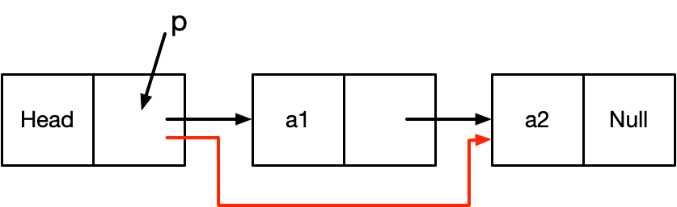  
    删除a1  
    其中p指向头结点（Head），那么步骤如下：  
    <mark>**p->next=p->next->next**</mark>
    - 单链表的插入  
    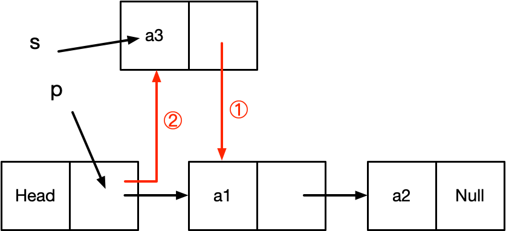  
    增加a3  
    其中p指向头结点（Head），s指向插入的a3结点，那么步骤如下  
    <mark>**1.s->next=p->next  
    2.p->next=s**</mark>
- ### 顺序存储与链式存储
  <table>
  <tr>
    <td>性能类别</td>
    <td>具体项目</td>
    <td><b>顺序存储</b></td>
    <td><b>链式存储</b></td>
  </tr>
  <tr>
    <td rowspan="2">空间性能</td>
    <td>存储密度</td>
    <td><mark>=1</mark></td>
    <td><1（需要存储链表）</td>
  </tr>
  <tr>
    <td>容量分配</td>
    <td>事先确定</td>
    <td><mark>动态改变</mark></td>
  </tr>
  <tr>
    <td rowspan="4">时间性能</td>
    <td>查找运算</td>
    <td>O(n/2)</td>
    <td>O(n/2)</td>
  </tr>
  <tr>
    <td>读运算</td>
    <td><mark>O(1)</mark></td>
    <td>O([n-1]/2)<br>最好情况1，最坏n
  </tr>
  <tr>
    <td>插入运算</td>
    <td>O(n/2)<br>最好情况0，最坏n</td>
    <td><mark>O(1)</mark></td>
  </tr>
  <tr>
    <td>删除运算</td>
    <td>O([n-1]/2)</td>
    <td><mark>O(1)</mark></td>
  </tr>
  </table>

  （更优情况使用标记）
- ### 队列与栈
  - 队列  
    

    <mark>**从队尾进，队首出**</mark>
  - 栈  
    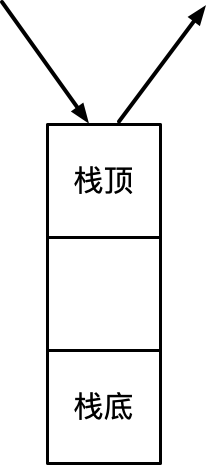
    
    <mark>**从栈顶进，栈顶出**</mark>
    ```
    例：元素按照a、b、c的顺序入栈，那么可能出栈的序列有哪些（一开始为空栈）
    ```
    ```
    解：
    c-b-a,b-c-a,a-b-c,b-a-c
    ```
  - 循环队列  
    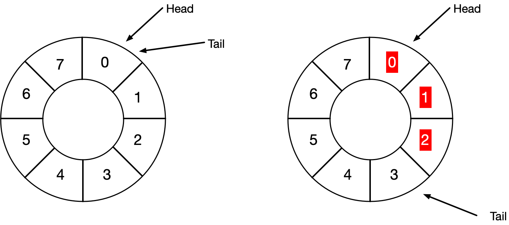

    一开始都指向head位置，当head内存储信息，则Tail往后移动一位，直到Tail移动到Head的`前一个位置`为止  
    <mark>**队空的条件：head=tail**</mark>  
    <mark>**队满的条件：`(tail+1)%size=head`**</mark>  
  ```
  例：输出受限的双端队列是指元素可以从队列的两段输入，但只能从队列的一端输出，如下图所示，若有e1,e2,e3,e4依次进入受限的两端队列，则得不到输出序列___
  A.e4,e3,e2,e1     B.e4,e2,e1,e3
  C.e4,e3,e1,e2     D.e4,e2,e3,e1
  ```
  

  ```
  解：
  A.
  从左侧进入e1,e2,e3,e4，左侧出即可得到e4,e3,e2,e1
  B.
  从左侧进入e1,e2从右侧进入e3，再从左侧进入e4,左侧出即可得到e4,e2,e1,e3
  C.
  从右侧进入e1,e2，再从左侧进入e3,e4，左侧出即可得到e4,e3,e1,e2
  D.
  无法得到
  ```
## 广义表
广义表是由n个表元素组成的有限序列，是线性表的推广  
例如：LS1=(a,(b,c),(d,e))  
<mark>**长度：最外层的表由多少个元素（LS1中长度是3）  
深度：括号的嵌套数（LS1中深度为2）**</mark>
- 基本运算
  - head(Ls)  
  <mark>**取表头，取整个广义表中第一个元素**</mark>  
  例如LS1中取表头就是元素a
  - tail(Ls)  
  <mark>**取表尾，取整个广义表除了第一个元素之外其它所有的元素**</mark>  
  例如LS1中取表为就是元素(b,c),(d,e)
```
例：有广义表LS1=(a,(b,c),(d,e))，要将其中的b字母取出，操作为？
```
```
解：head(tail(LS1))
```
## 树和二叉树

- ### 概念
  

  （图例）  
  - 结点的度  
  指的是一个结点下面有多少个子结点  
  例如图例中1结点的度为2；7结点度为0
  - 树的度  
  树的度指的是结点度最高的度  
  例如图例的度为2
  - 叶子结点  
  没有子结点的结点叫做叶子结点  
  例如图例中4、5、7、8结点是叶子结点
  - 内部结点
  既非叶子结点，也非根结点的结点  
  例如图例中的2、3、6结点就是内部结点
  - 父结点  
  例如图例中1结点是2和3结点的父结点
  - 子节点  
  例如图例中2和3结点是1结点的子节点
  - 兄弟结点  
  属于同一个父结点的结点  
  例如图例中2结点和3结点是兄弟结点
  - 层次  
  图例中已标注
  <br><br><br>
- ### 树与二叉树
  - 满二叉树  
  整棵树每一层的结点数量满足x=2<sup>n-1</sup>  
  

  - 完全二叉树  
  整棵树所有的结点度只能缺右边边的结点，除了最底层以外其它层不可缺结点  
  
    
  （上图所示两者均为完全二叉树）
  - 二叉树的特性  
  1. <mark>**二叉树的第i层最多有2<sup>i-1</sup>个结点**  
  2. <mark>**深度为k的二叉树最多有2<sup>k</sup>-1个结点**  
  3. <mark>**对任意一棵二叉树，如果其叶子结点数为n<sub>0</sub>，度为2的结点数为n<sub>2</sub>那么n<sub>0</sub>=n<sub>2</sub>+1**  
  4. <mark>**如果对一棵有n个结点的完全二叉树的结点按层序编号（从上到下，从左到右），则对任何一结点i（1≤i≤n），有：**</mark>  
     - <mark>**如果i=1，则结点i无父结点，是二叉树的根；如果i>1，则父结点是⌊i/2⌋（i/2向下取整）**</mark>
     - <mark>**如果2i>n，则结点i为叶子结点，无左子结点来；如果2i≤n其左子结点为2i**</mark>
     - <mark>**如果2i+1>n，则结点i无右子叶结点；2i+1≤n，其右子结点是2i+1**</mark>
  <br><br>
- ### 二叉树的遍历
  
  
  （图例）
  - 层次遍历  
  <mark>**每一层次从左到遍历**</mark>  
  例如图例中**层次遍历**的顺序为：1-2-3-4-5-6-7-8
  - 前序遍历  
  表示先访问根结点，再访问左子树结点、右子树结点  
  <mark>**顺序为：根->左->右**</mark>  
  例如图例**中前序遍**历的顺序为：1-2-4-5-7-8-3-6
  - 中序遍历  
  表示先访问左子树，再访问根结点、右子树  
  <mark>**顺序为左->根->右**</mark>  
  例如图例中**中序遍历**的顺序为：4-2-7-8-5-1-3-6
  - 后序遍历  
  表示先访问左子树结点，再访问右子树结点、根结点  
  <mark>**顺序为左->右->根**</mark>  
  例如图例中**后序遍历**的顺序为：4-8-7-5-2-3-6-1
  <br><br>
- ### 反向构造二叉树
  由先序遍历、中序遍历、后序遍历、层次遍历中其中几个，反向地构建二叉树
  ```
  例：由前序遍历：ABHFDECG，中序遍历：HBEDFAGC构造二叉树
  ```
  ```
  解：如下图
  ```
  
- ### 树转二叉树
  <mark>**只保留最右侧的连接线，每层从左往右连接**</mark>  
  

  <mark>**注意上图中红色连接线全部变成右侧连接线**</mark>
- ### 查找二叉树（排序二叉树）
  <mark>**对于所有的结点，其左子结点<该结点<右子结点**</mark>  
  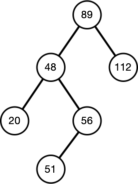

  - 插入结点  
  1. 如果已经存在该结点，则不再插入（如图例中结点48）  
  2. 若查找二叉树为空树，那么以新结点为查找二叉树  
  3. 将要插入的结点值与插入后父结点的值比较，确定是左结点还是右结点
  <br><br>
  - 删除结点  
  1. 如果待删除的结点是叶子结点，那么直接删除即可  
  2. 如果待删除的结点只有一个子结点，则将这个子结点与待删除的父结点直接删除即可（例如删除结点56，只需要将51与48相连即可）  
  3. 如果待删除的结点p有两个结点，则在其左子树上，用中序遍历寻找值最大的结点s，用结点s代替结点p的值，然后删除结点s，结点s必须属于上述1、2情况之一（例如删除结点89，寻找左子树中最大值56，然后用结点56替代89，然后再通过情况2，将结点48与结点51相连，删除原本的结点56）
- ### 最优二叉树（哈夫曼树）
  - 概念  
    
  （图例）
    - 树的路径长度  
    从根结点开始所有路径的长度  
    例如图例中树的路径长度为6
    - 权  
    结点的数值  
    例如图例中结点2的权是2
    - 带权路径长度  
    用路径乘以权值的结果  
    例如图例中结点2的带权路径长度就是2 x 2 = 4
    - 树的带权路径长度  
    树的带权路径长度就是所有<mark>**叶子结点**</mark>的带权路径长度之和  
    例如图例中的带权路径长度为:  
    1 x 1 + 2 x 2 + (4 + 8) x 3 = 41
  - 构建最优二叉树（哈夫曼树）  
  ```
  例：假设有一组权值5,29,7,8,14,23,3,11，请尝试构造哈夫曼树
  ```
  ```
  解：首先从小到大排列，然后合并最小的权值重新排序，以此类推
  排序：3，5，7，8，11，14，23，29
  ```
  
<br><br><br><br><br><br><br><br><br><br><br><br>

- ### 线索二叉树
  将空闲的指针运用于遍历（例如叶子结点）  
  - 前序线索二叉树  
  左指针指向该结点的前序遍历中前一个结点，右指针指向前序遍历中后一个结点  
  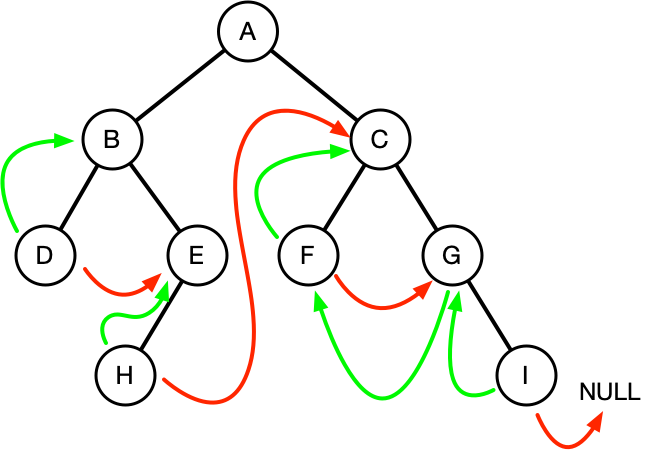
  - 中序线索二叉树  
  左指针指向该结点的中序遍历中前一个结点，右指针指向中序遍历中后一个结点  
  
  - 后序线索二叉树  
  左指针指向该结点的后序遍历中前一个结点，右指针指向后序遍历中后一个结点  
  
- ### 平衡二叉树
  - 平衡度  
  用左子树的深度-右子树的深度
  - 平衡二叉树的定义  
  左右子树的深度差距不超过1  
  每个结点的平衡度只能为-1、0、1  
  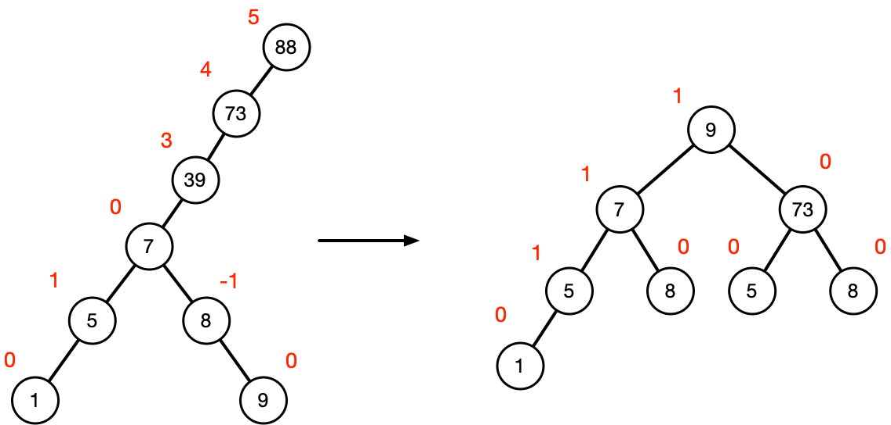  
  备注：上图中红色标识为平衡度
## 图
- ### 图的概念
  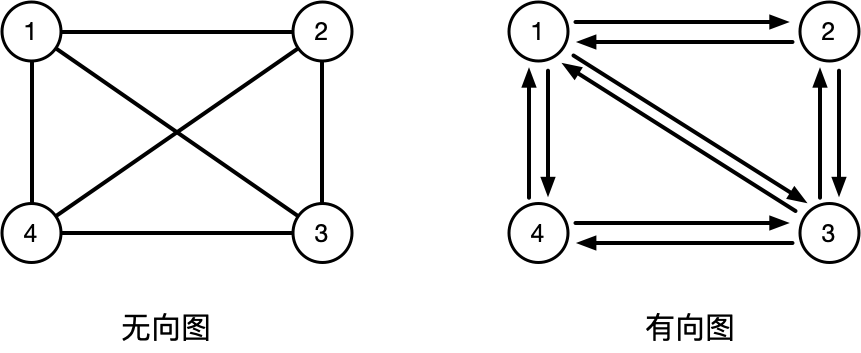

  在无向图中如果每两个结点都连接上，那么这个无向图便是完全图  
  在有向图中如果每两个结点都有两条连接线，方向相反，那么这个有向图便是完全图
- ### 图的存储
  - 邻接矩阵  
  
  其中R<sub>ij</sub>=1时，表示从i到j有邻接边，R<sub>ij</sub>=0时表示没有从i到j有邻接边。  
  对于无向图而言其01分布对称（如图所示）
  - 邻接表  
  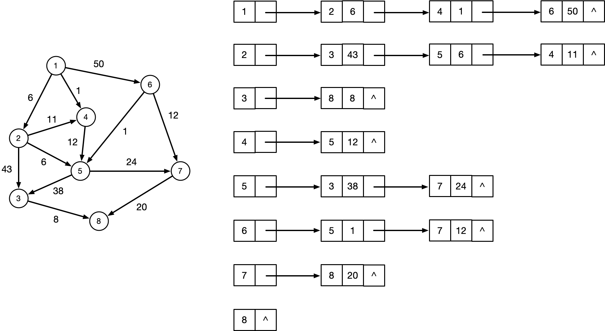
- ### 图的遍历
  

  （图例）
  <table>
  <tr>
    <td width="60"><b>遍历方法</b></td>
    <td><b>说明</b></td>
    <td><b>示例</b></td>
  </tr>
  <tr>
    <td>深度优先</td>
    <td>1.首先访问出发顶点V<br>2.一次从V出发搜索V的任意一个邻接点W<br>3.若W未访问过，则从该点出发继续深度优先遍历<br>类似于树的前序遍历
    <td>V1,V2,<br>V4,V8,<br>V5,V3,<br>V6,V7</td>
  </tr>
    <td>广度优先</td>
    <td>1.首先访问出发顶点V<br>2.然后访问与顶点V邻接的全部未访问顶点W、X、Y...<br>3.然后再依次访问W、X、Y...邻接的未访问的顶点</td>
    <td>V1,V2,<br>V3,V4,<br>V5,V6,<br>V7,V8</td>
  </table>

  - 通过邻接表遍历  
    
  （图例）  
  
  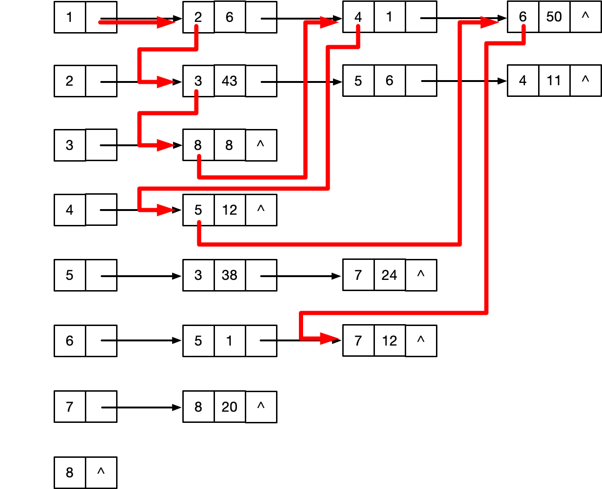  
  （左为广度优先，右为深度优先）
- ### 拓扑序列
  把有有向边表示活动之间开始的先后关系。这种有向图称为用顶点表示活动网络，简称AOV网络  
    
  （图例）  
  <mark>**需要从没有箭头指向自己的结点出发**</mark>  
  因此上图的拓扑序列有：  
  0-2-1-4-3-5-6-7  
  0-1-2-4-3-6-5-7  
  0-2-1-4-3-6-5-7  
  0-1-2-4-3-5-6-7
- ### 图的最小生成树
  - 普里姆算法
  1. <mark>**首先选择一个结点**</mark>
  2. <mark>**选择从这个点出发距离最短的结点**</mark>
  3. <mark>**依次类推，找到已经连接的结点出发距离最短的结点**</mark>  
  
  - 克鲁斯卡尔算法  
  <mark>**从长到短来选择边，`注意不能产生回路`**</mark>  
  
## 算法基础
- ### 算法的特性
  1. 有穷性：**执行有穷步之后结束**
  2. 确定性：**算法中每一条指令必须有确切的含义，不能含糊不清**
  3. 输入（输入个数≥0个）
  4. 输出（输出个数≥1个）
  5. 有效性：算法的每个步骤都能有效执行并能够得到确定的结果（例如a/0无效）
- ### 算法的时间复杂度与空间复杂度
  - 时间复杂度  
  衡量运算的时间量级  
  <mark>**O(1)<O(long<sub>2</sub>n)<O(nlog<sub>2</sub>n)<O(n<sup>2</sup>)<O(n<sup>3</sup>)<O(2<sup>n</sup>)**</mark>
    - O(1)  
    执行单独条指令的语句  
      ```
      例如：
      int i=1;
      ```
    - O(n)  
    多运用于循环中
      ```
      例如：
      for(int i=0;i<3;i++)
      {...}
      ```
      （上述代码复杂度为O(3)）
    - O(nlog<sub>2</sub>n)  
    多用于查找二叉树中查找的时间复杂度
    - O(n<sup>2</sup>)  
    多运用于嵌套循环中
      ```
      例如：
      for(int i=0;i<3;i++)
      {
        for(int i=0;i<3;i++)
        {...}
      }
      ```
      （上述代码复杂度为O(3<sup>2</sup>)

    <mark>**时间复杂度取最大**</mark>
  - 空间复杂度  
  运算中需要临时占用的存储空间的大小
- ### 查找
  - 顺序查找  
  顺次比较配对  
  平均查找长度为：O($\frac{n+1}{2}$)  
  时间复杂度：O(n)（与$\frac{n}{2}$同一级）
  - 二分查找法（需要排序）
    1. 确定该区间的中点位置<mark>**`（如果有小数取整）`**
    2. 将待查的k值与其中间值小/大的比较<mark>**`mid值不到最后不参与比较`**</mark>
    3. 如果比中间值小，那么确定最小值～中间值的中间值
    4. 以此类推，直到查找的那个需要找到的值

    例如查找17  
    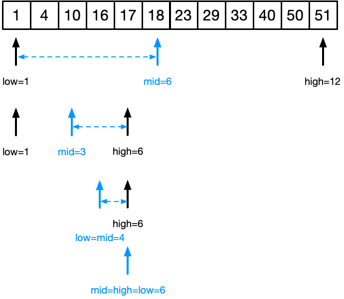  
    至多需要查找⌊log<sub>2</sub>n⌋+1次  
    时间复杂度为O(log<sub>2</sub>n)
  - 散列表  
  例如：记录关键码为(3,8,12,17)，取m=10(存储空间为10)，p=5，散列函数h=key%p  
  那么:  
  key=3时，h=key%p=3%5=3，因此key=3存储在3的位置  
    
  key=8时，h=key%p=8%5=3，但是3位置被占，放到下一个位置  
  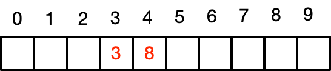  
  key=12时，h=key%p=12%5=2，因此key=12存储在2的位置  
  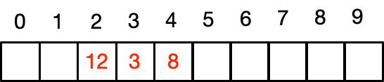  
  key=17时，h=key%p=17%5=2，但是2位置被占，放到后面的空位  
  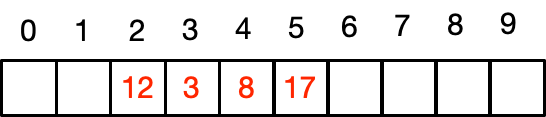  
## 排序
- ### 排序概念
  - 稳定排序和不稳定排序  
  稳定排序指的是在排序过后相同的两个数位置没有发生改变
  不稳定排指的是在排序过后相同的两个数位置不一定保持一致
- ### 插入类排序
  - 直接插入排序  
  
  - 希尔排序  
  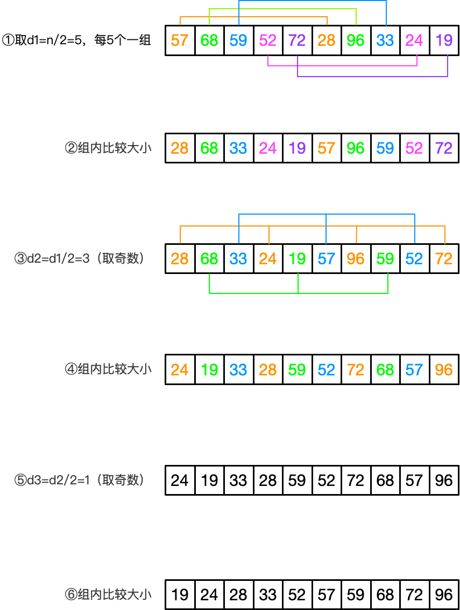
<br><br><br><br><br><br><br><br><br><br><br><br><br>
- ### 交换类排序
  - 冒泡排序  
  每次与后面的数比较大小，如果后者比前者小，则交换  
  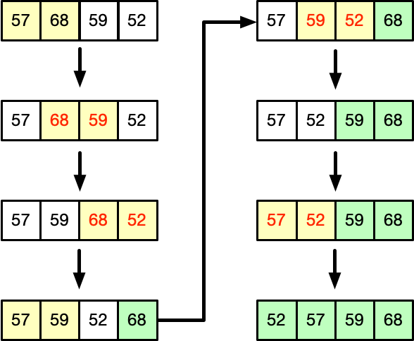
  - 快速排序  
  步骤如下：  
  1.设定两个指针，一个先指向第一位，另一个指向最后一位  
  2.将第一个指针指向的数和第二个做比较，如果后者大则交换  
  3.第一个指针往后移动一位，继续比较两个指针  
  4.最后得到的第一个指针的位置确定，循环前面的序列和后面的序列  
  

- ### 选择类排序
  - 直接选择排序  
  每次选择待排序中最小的元素  
  
<br><br><br>
  - 堆排序
    - 堆的概念
    设有n个元素的序列{K<sub>1</sub>,K<sub>2</sub>,...,K<sub>n</sub>}，当且仅当满足下属关系之一时，成为堆:  
    1.K<sub>i</sub>≤k<sub>2i</sub>且K<sub>i</sub>≤K<sub>2i+1</sub>，对应二叉树子树结点永远比本结点大  
    2.K<sub>i</sub>≥K<sub>2i</sub>且K<sub>i</sub>≥K<sub>2i+1</sub>，对应二叉树子树结点永远比本结点小  
    其中情况1指的是小顶堆，情况二指的是大顶堆  
    
      
    （左图小顶堆，右图大顶堆）
  
  堆排序即将序列建立堆，然后输出堆顶元素，再将剩下的序列建立堆，直到所有元素输出  
  步骤：  
  1.初始时将顺序表R[1..n]中元素建立为一个大顶堆，堆顶位于R[1]，待序区为R[1..n]  
  2.循环执行步骤3～步骤4，一共n-1次  
  3.假设为第i次运行，则待序区为R[1..n-i+1]，将堆顶元素R[1]与待序区尾元素R[n-i+1]交换，此时顶点元素被输出，新的待序区为R[1..n-i]  
  4.待序区对应的堆已经被破坏，将其重新调整为大顶堆  
  下图将{1,3,4,5,7,2,6,8,0}建立一个大顶堆的过程示意图  
  （只调整非叶子结点）  
  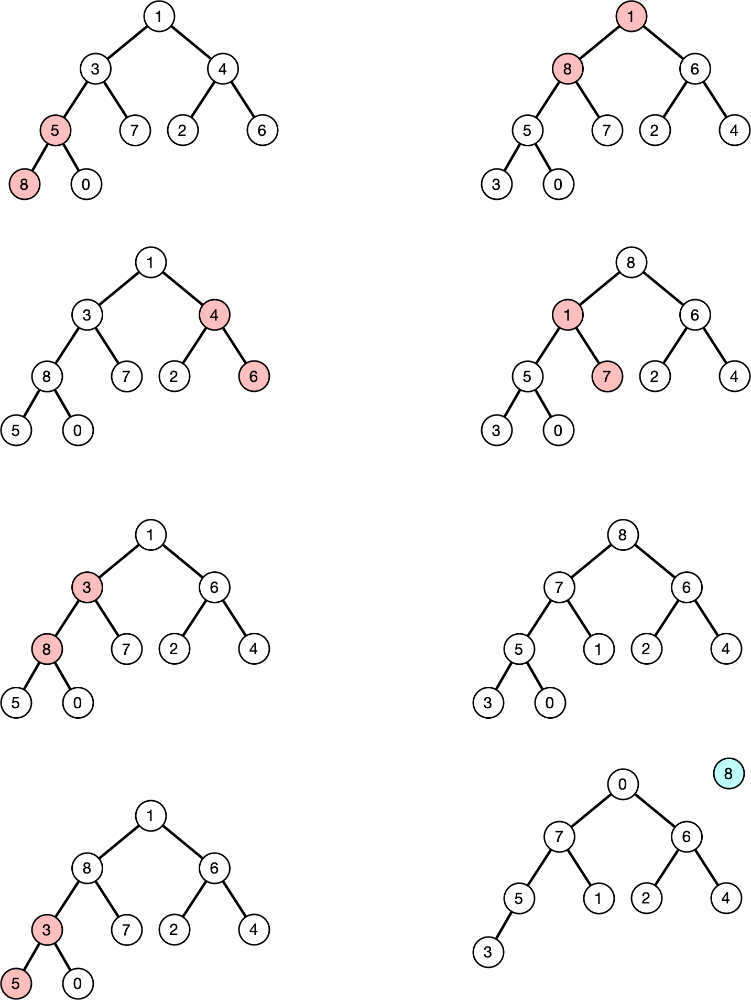  
  其中8为最大数，剩下的结点将最后一个放置到最顶层，重新开始调节

- ### 归并排序
  归并也称为合并，将两个或两个以上的有序子表合并成一个新的有序表。  
    
  注意两个有序序列合并成一个有序序列的方法:  
  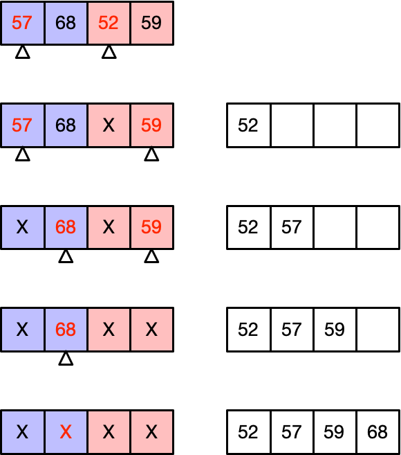
<br><br><br><br><br><br><br><br><br><br><br><br><br><br><br><br><br><br><br>

- ### 基数排序
  （唯一不需要比较大小的排序方法）  
    

|排序方法|平均时间复杂度|最坏情况|辅助存储|稳定性|
|:-|:-|:-|:-|:-|
|直接插入|O(n<sup>2</sup>)|O(n<sup>2</sup>)|O(1)|**`稳定`**|
|Shell排序|O(n<sup>1.3</sup>)|O(n<sup>2</sup>)|O(1)|**`不稳定`**|
|直接选择|O(n<sup>2</sup>)|O(n<sup>2</sup>)|O(1)|**`不稳定`**|
|堆排序|O(nlog<sub>2</sub>n)|O(nlog<sub>2</sub>n)|O(1)|**`不稳定`**|
|冒泡排序|O(n<sup>2</sup>)|O(n<sup>2</sup>)|O(1)|**`稳定`**|
|快速排序|O(nlog<sub>2</sub>n)|O(n<sup>2</sup>)|O(log<sub>2</sub>n)|**`不稳定`**|
|归并排序|O(nlog<sub>2</sub>n)|O(nlog<sub>2</sub>n)|O(n)|**`稳定`**|
|基数排序|O(d(r+n))|O(d(r+n))|O(r+n)|**`稳定`**