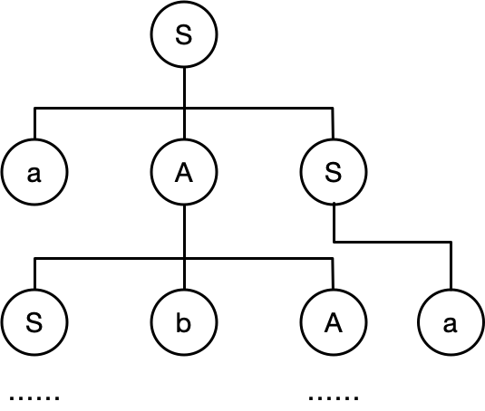
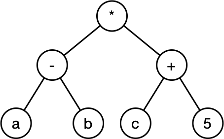

# 程序设计语言与语言处理程序基础
## 内容梗概：
- 编译与解释
- 文法
- <mark>**正规式**</mark>
- 有限自动机
- <mark>**表达式**</mark>
- <mark>**传值与传址**</mark>
- 多种程序语言的特点
## 编译过程


（上图中的过程是以编译型为例的流程图）

说明：
- 解释和编译的区别：  
  解释：在编写代码的同时提出代码错误或执行  
  编译：在编写代码完成之后需要通过编译(compile)使其成为可执行程序
- 词法分析：  
  检查关键字是否书写错误  
  例如单词错误
- 语法分析：  
  在词法正确的基础上各种词法连接在一起有问题  
  例如do后面没有while
- 语义分析：  
  是否出现语义上的错误  
  例如除以0等，这种分析通常无法通过机器完全杜绝
- 中间代码生成和代码优化：  
  通过匹配系统，使得代码的执行效率更高
## 文法
- ### 文法的定义
  一个形式文法是一个有序四元祖G={V, T, S, P}，其中：  
  <mark>**1. V：非终结符  
  2. T：终结符  
  3. S：起始符  
  4. P：产生式**</mark>

  <mark>**通常来说小写字母的`集合`代表终结符，大写字母的`集合`代表非终结符**  </mark>

- ### 文法类型
  <table>
  <tr>
    <td width="30"><b>类型</b></td>
    <td width="100"><b>别称</b></td>
    <td><b>说明</b></td>
    <td width="70"><b>对应自动机</b></td>
  </tr>
  <tr>
    <td>0型</td>
    <td>短语文法</td>
    <td>G的每条产生式α→β满足α属于V的正则闭包且至少含有一个非终结符，而β属于V的闭包</td>
    <td>图灵机</td>
  </tr>
  <tr>
    <td>1型</td>
    <td>上下文有关文法</td>
    <td>G的任何产生式α→β满足|α|≤|β|，仅仅S→ε例外，但S不得出现在任何产生式右侧</td>
    <td>线性界限自动机</td>
  </tr>
  <tr>
    <td>2型</td>
    <td>上下文无关文法</td>
    <td>G的任何产生式为A→β，A为非终结符，β为V的闭包</td>
    <td>非确定的下推自动机</td>
  </tr>
  <tr>
    <td>3型</td>
    <td>正规文法</td>
    <td>G的任何产生式为A→αB或者A→α，α属于非终结符的闭包，A、B都属于非终结符</td>
    <td>有限自动机</td>
  </tr>
  </table>
- ### 语法的推导树
  ```
  例1：文法G=({a,b},{S,A},S,P)，其中：
  S→aAS|a;  
  A→SbA|SS|ba
  请构造句型aabAa的推导树
  ```
  ```
  解：S→aAS|a意为：
  1.S→aAS
  2.S→a

  A→SbA|SS|ba意为：
  1.A→SbA
  2.A→SS
  3.A→ba
  因此推导树如下（部分）
  ```
  

**`注意！下面是另外一题！`**
***
```
例2:文法G=({A,B,S},{a,b,c},P,S)，其中P为：
S→Ac|aB
A→ab
B→bc
写出L(G[s])的全部元素
```
```
解：由题可知：
S→Ac，S→aB，A→ab，B→bc
S可以推导出c和A，A可以推导出a和b
那么可以得到L(G[s])={abc}
```
## 有限自动机和正规式
- ### 有限自动机
  M=(S,∑,δ,S0,Z)，其中：  
  - S是一个有限集，每个元素为一个状态  
  - ∑是一个有穷字母表，每个元素为一个输入字符  
  - δ是转换函数，单值对照  
  - S0属于S，是其唯一初态  
  - Z是一个终态集

  <br><br><br><br><br><br><br><br><br><br><br><br>
  如下图所示，表示为:  
  δ(S,0)=B, δ(S,1)=A, δ(A,0)=f, δ(A,1)=C, δ(B,0)=C, δ(B,1)=f, δ(C,0)=f, δ(C,1)=f  
  
  ```
  例：如上图所示，在下列选项中，输入的内容无法得到结果的是：
  A. 10
  B. 01
  C. 110
  D. 101
  ```
  ```
  解：D
  ```
- ### 正规式
  正规式是描述程序语言单词的表达式，对于字母∑，其上的正规式以及其表达的正规集可以递归定义如下：
  1. ε是一个正规式，它表示集合L(ε)={ε}
  2. 若a是∑上的字符，则a是一个正则式，它所表示的正规L(a)={a}
  3. 若正规式r和s分别表示正规集L(r)=L(s)，则  
    (a) r|s是正规式，表示集合L(r)∪L(s)  
    (b) r·s是正规式，表示集合L(r)L(s)  
    (c) r*是正规式，表示集合(L(r))*  
    (d) (r)是正规式，表示集合L(r)
  ```
  例：下面文法G[S]它无法识别_(1)_，此文法对应的正规式为_(2)_
  G[S]:
    S→aA|bB
    A→bS|b
    B→aS|a
  (1)
  A. ababab     B. bababa
  C. abbaab     D.babba
  (2)
  A. (a|b)*     B. (ab)*
  C. (ab|ba)*   D. (ab)*(ba)*
  ```
  <br>
  
  ```
  解：
  (1) 
  A: S→aA→abS→abaA……因此可以推出A
  B: S→bB→baS→babB……因此可以推出B
  C: S→aA→abS→abbB→abbaS→abbaab，因此可以推出C
  D: S→bB→baS→babB→x，因此无法推出D

  (2)
  将ABCD带入第一问
  A: 第一问中D选项也可以表示为(a|b)*（即a和b随意组合）
  B: 第一问中B选项就不是(ab)*（即ababab……）
  C: 正确
  D: 第一问中C选项就不是(ab)*(ba)*(即有限个ab和有限个ba的组合)
  ```
***
**`注意下面是另外一题！`**
```
例：下图所示是一个有限自动机（其中，A是初态，C是终态），该自动机可识别___
A. 0000     B. 1111
C. 0101     D. 1010
```


```
解：C 
```
## 程序语言基础
- ### 表达式
  例如a+b：
  - 前缀表达式  
  +ab
  - 中缀表达式  
  a+b
  - 后缀表达式  
  ab+
  <br><br><br><br>

  ```
  例：表达式(a-b)*(c+5)的后缀表达式为___
  ```
  ```
  解：ab-c5+*
  可以使用树的后序遍历来表示，如下图所示
  ```
  
  
  （上图后序遍历同样可以得到ab-c5+*）
## 函数调用
- ### 传值和传址
  <table>
  <tr>
    <td width="100"><b>传递方式</b></td>
    <td><b>主要特点</b></td>
  </tr>
  <tr>
    <td>传递调用</td>
    <td>形参取的是实参的值，形参的改变不会导致调用点所传的实参的值发生改变（C++普通函数传递）</td>
  </tr>
  <tr>
    <td>引用(传址)调用</td>
    <td>形参取的是实参的地址，即相当于实参存储单元的地址引用因此其值的改变同时就改变了实参的值（C++函数的引用符）</td>
  </tr>
  </table>

  例如下面的函数
  ```
  void Swap(int x,int y)
  {
    int t;
    t=x;x=y;y=t;
    printf("%d %d",x,y);
  }
  int main()
  {
    int a=3,b=4;
    Swap(a,b);
  }
  ```
  上述中Swap函数内的x和y是形参，主函数的a和b是实参，其中a和b在程序执行完之后的结果保持不变，x和y的值进行了交换  
  因此上述程序的结果为:4,3 3,4
  <br><br>

  ```
  void Swap(int *x,int *y)
  {
    int *t;
    *t=*x;
    *x=*y;
    *y=*t;
    printf("%d %d",*x,*y);
  }
  int main()
  {
    int a=3,b=4;
    Swap(&a,&b);
    printf("%d %d",a,b);
  }
  ```
  上述中Swap函数中的x和y是调用a和b的地址  
  则上述程序的结果:4,3 4,3
## 各种程序语言的特点
<table>
<tr>
  <td><b>语言</b></td>
  <td><b>特点</b></td>
</tr>
<tr>
  <td>Fortran</td>
  <td>科学计算，执行效率高</td>
</tr>
<tr>
  <td>Pascal</td>
  <td>为教学而开发，表达能力强，Delphi</td>
</tr>
<tr>
  <td>C</td>
  <td>指针操作能力强，高效</td>
</tr>
<tr>
  <td>Lisp</td>
  <td>函数式程序语言，符号处理，人工智能</td>
</tr>
<tr>
  <td>C++</td>
  <td>面向对象，高效</td>
</tr>
<tr>
  <td>Java</td>
  <td>面向对象，中间代码，跨平台</td>
</tr>
<tr>
  <td>C#</td>
  <td>面向对象，中间代，.NET</td>
</tr>
<tr>
  <td>Prolog</td>
  <td>逻辑推理，简洁性，表达能力，数据库和专家系统</td>
</tr>
</table>