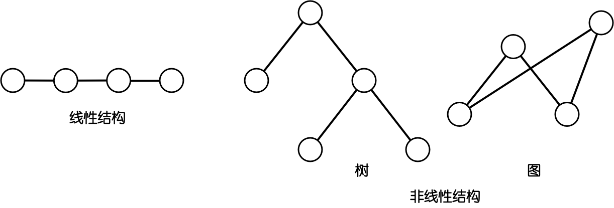
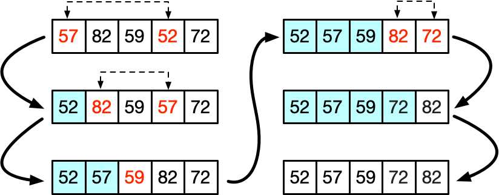
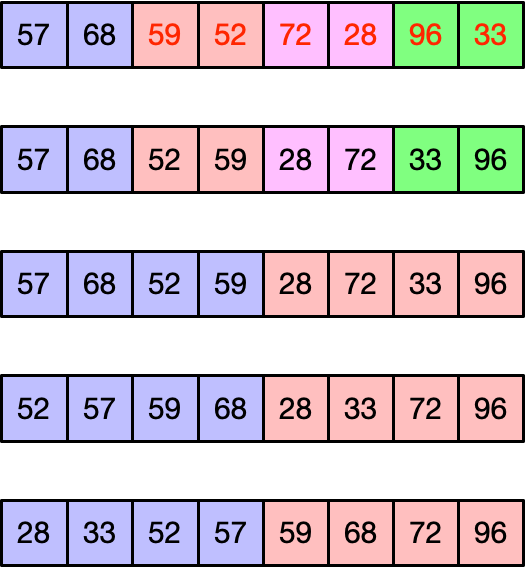
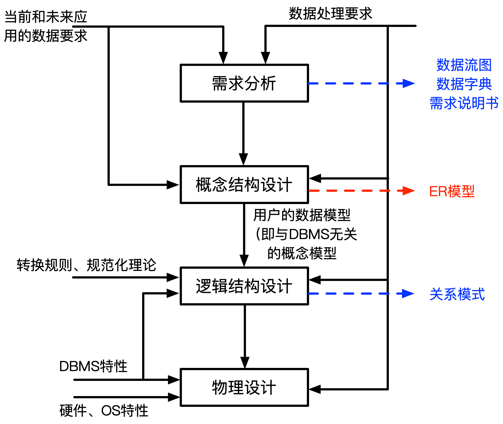
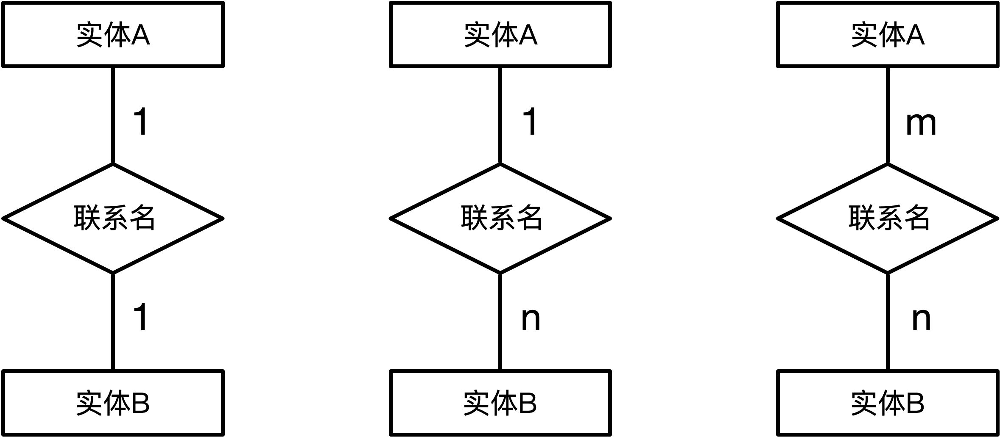
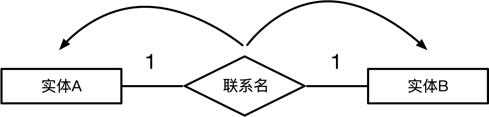
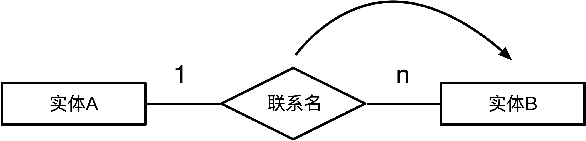
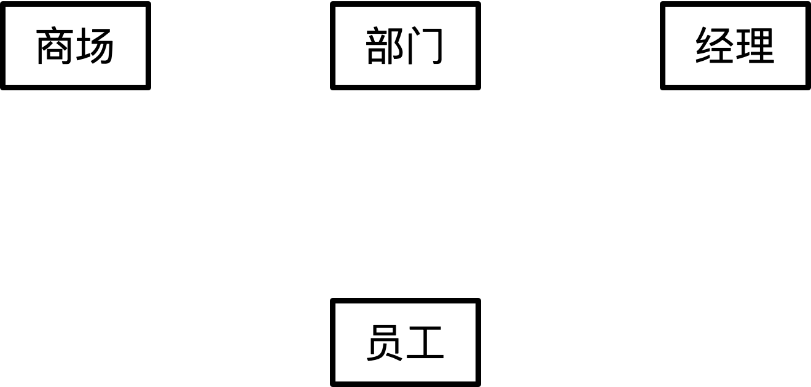

# 考试概况
### 上午

  - ### **计算机与软件工程基础**
    75个选择题（75分），45个过关（45分），150分钟笔试

### 下午

  - ### **软件设计**
    全都是问答题，75分，45分过关，150分钟笔试

# 计算机组成与体系结构

## 数据的表示
- ### 进制转换
  - 其他进制转换成十进制（<mark>**按权展开**</mark>）  
    例如二进制10100.01=1x2<sup>4</sup>+1x2<sup>2</sup>+1x2<sup>-2</sup>  
    同理八进制、十六进制

  - 十进制转换成其他进制（<mark>**短除法**</mark>）  
      除以进制并且记录余数  
      **注意从下往上**

  - 十进制转换八进制  
      如果是10进制转换为8进制，则从右到左分段，每三个一段

  - 十进制转十六进制  
      如果是10进制转换为16进制，则从右到左分段，每四个一段
- ### 编码问题
  - 原码  
    最高位用于符号位，正数0，负数1

  - 反码  
    正数同原码一样  
    负数的符号位不变，后面的所有位都取反

  - 补码  
    正数同原码一样  
    负数在反码的基础上+1

  - 移码  
    补码的基础上首位（符号位）取反
- ### 编码表示范围
  原码：-(2<sup>n-1</sup>-1)~2<sup>n-1</sup>-1  
  反码：-(2<sup>n-1</sup>-1)~2<sup>n-1</sup>-1  
  补码：-2<sup>n-1</sup>~2<sup>n-1</sup>-1  
    <mark>**原码和反码有+0和-0分区分，而补码没有**</mark>
- ### 浮点数运算
  <mark>**通常表示为N=MxR<sup>e</sup>**</mark>  
  <mark>**其中R为进制，M为尾数，e为阶码）**</mark>
  - **步骤:**  
  <mark>**1. 对阶**</mark>  
  <mark>**2. 位数计算**</mark>  
  <mark>**3. 结构格式化**</mark>

  注意对阶应该对大的部分对阶，例如1x10<sup>3</sup>和1.19x10<sup>2</sup>，应该化为0.119x10<sup>3</sup>和1x10<sup>3</sup>
## 计算机结构
主机基本组成：
  - CPU
    - 运算器
      - 算数逻辑单元(A)
      - 累加寄存器(AC)
      - 数据缓冲寄存器(DR)
      - 状态条件寄存器(PSW)
    - 控制器
      - 程序计数器(PC)
      - 指令寄存器(IR)
      - 指令译码器
      - 时序部件
  - 主存储器
## Flynn分类法
| 体系结构类型 | 控制部分 | 关键特性 | 代表 |
| :-:| :-: | :-: |:-:|
| 单指令流数据流(SISD) | 控制部分:一个<br>处理器：一个<br>主存模块:一个 | —— | 单处理器系统|
| 单指令流多数据流(SIMD) | 控制部分:一个<br>处理器：多个<br>主存模块:多个 |各个处理器以异步<br>的形式执行同一条指令 |并行处理机<br>**阵列处理机**<br>超级向量处理机|
|多指令流单数据流(MISD)|控制部分:多个<br>处理器：一个<br>主存模块:多个|被证明不可能|目前没有|
|多指令多数据流(MIMD)|控制部分:多个<br>处理器：多个<br>主存模块:多个|能实现作业、任务、<br>指令等各级全面并行|多处理机系统<br>多计算机

<mark>**注意代表的类型(重点)**</mark>  
<mark>**注意多个核心处理器的电脑不属于单指令流单数据流，属于单指令流多数据流**</mark>
<br><br><br><br><br><br>
## CISC（复杂指令集）和RISC（精简指令集）
| 指令集 | 指令 | 寻址方式 | 实现方式 | 其他 |
|:-:|:-:|:-:|:-:|:-:|
|CISC|数量多，使用频率<br>差别大，可变长格式|支持多种|微程序控制技术<br>（微码）|研制周期长|
|RISC|数量少，使用频率<br>接近，定长格式，大<br>部分为单周期指令，<br>操作寄存器，只有<br>Load/Store操作内存|支持方式少|增加了通用寄存器，<br>硬布线逻辑控制为主，<br>适合采用流水线|优化编译，有<br>效支持高级语言|

**目前绝大多数的计算机都使用CISC（复杂指令集）而移动设备，尤其是手机，Pad基本上都是用RISC（精简指令集）**
## 流水线
- ### 流水线的概念
  **流水线的通常流程:取值、分析、执行**
  <table>
  <tr>
      <td>取值</td>
      <td>1</td>
      <td></td>
      <td></td>
      <td>2</td>
      <td> </td>
      <td> </td>
      <td>3</td>
      <td> </td>
      <td> </td>
  </tr>
  <tr>
      <td>分析</td>
      <td> </td>
      <td>1</td>
      <td> </td>
      <td> </td>
      <td>2</td>
      <td> </td>
      <td> </td>
      <td>3</td>
      <td> </td>
  </tr>
  <tr>
      <td>执行</td>
      <td> </td>
      <td></td>
      <td>1</td>
      <td> </td>
      <td></td>
      <td>2</td>
      <td> </td>
      <td></td>
      <td>3</td>
  </tr>
  </table>
  （上图）没有使用流水线执行指令情况
  <table>
  <tr>
      <td>取值</td>
      <td>1</td>
      <td>2</td>
      <td>3</td>
      <td></td>
      <td> </td>
      <td> </td>
      <td></td>
      <td> </td>
      <td> </td>
  </tr>
  <tr>
      <td>分析</td>
      <td> </td>
      <td>1</td>
      <td>2</td>
      <td>3</td>
      <td></td>
      <td> </td>
      <td> </td>
      <td></td>
      <td> </td>
  </tr>
  <tr>
      <td>执行</td>
      <td> </td>
      <td></td>
      <td>1</td>
      <td>2</td>
      <td>3</td>
      <td></td>
      <td> </td>
      <td></td>
      <td></td>
  </tr>
  </table>
  （上图）使用流水线执行指令情况

- ### 流水线的时间计算

  - 流水线周期  
    <mark>**流水线周期指的是执行时间最长的一段，步骤中最耗时的流程**</mark>
  - 流水线计算公式  
  <mark>**一条指令执行时间+(执行条数-1)x流水线周期**</mark>  
        1. <mark>**理论公式：(t<sub>1</sub>+t<sub>2</sub>+…+t<sub>n</sub>)+(n-1)x△t**</mark>  
        2. <mark>**实践：(k+n-1)x△t**</mark>
  
    备注：△t为一个流水线周期时间
<br><br><br><br>   
```
例题：若指令流水线把一条指令氛围取值、分析和执行三个部分，且三个部分的时间分别为取值：2ns，分析2ns，执行1ns，那么流水线周期是多少？100条指令全部执行完毕需要时间是多少？
```
<table>
<tr>
    <td>取值</td>
    <td>1</td>
    <td>2</td>
    <td>3</td>
    <td>…</td>
    <td>n</td>
    <td> </td>
    <td></td>
    <td> </td>
    <td> </td>
</tr>
<tr>
    <td>分析</td>
    <td> </td>
    <td>1</td>
    <td>2</td>
    <td>3</td>
    <td>…</td>
    <td>n</td>
    <td> </td>
    <td></td>
    <td> </td>
</tr>
<tr>
    <td>执行</td>
    <td> </td>
    <td></td>
    <td>1</td>
    <td>2</td>
    <td>3</td>
    <td>…</td>
    <td>n</td>
    <td></td>
    <td></td>
</tr>
</table>

**根据图表可得，1:2只有取值，因此需要1ns2:3和3:4需要照应到1的取分析和执行过程，因此需要2ns**

```
解：
1.流水线周期是 2 ns
2.(2+2+1)+99x2=203 ns
```

- ### 流水线的吞吐率计算
   - <mark>**流水线的吞吐率(TP)=指令条数/流水线执行时间**</mark>

      以上述例题为例，则TP=100/203
  - <mark>**流水最大吞吐率=1/△t**</mark>
- ### 流水线加速比计算
  - <mark>**流水线加速比S=不使用流水线执行时间/使用流水线执行时间**</mark>

      以上述例题为例，如果不使用流水线，则执行时间为500，则S=500/203
- ### 流水线的效率
  流水线的效率是指流水下设备利用率，在时空图上，流水线的效率定义为n个任务占用的时空去与k个流水段总的时空去之比

  <mark>**即流水线中所占用的时空÷所有时空**</mark>
  
  例如这样的任务流程:  
  周期取最大值3△t：
  <table>
  <tr>
    <td>s1</td>
    <td>s2</td>
    <td>s3</td>
    <td>s4</td>
  </tr>
  <tr>
    <td>△t</td>
    <td>△t</td>
    <td>△t</td>
    <td>3△t</td>
  </tr>
  </table>
  则将这样的任务用时空图表示为：
  <table>
  <tr>
    <td>s1</td>
    <td>1</td>
    <td></td>
    <td></td>
    <td>2</td>
    <td></td>
    <td></td>
    <td>3</td>
    <td></td>
    <td></td>
    <td>4</td>
    <td></td>
    <td></td>
    <td></td>
    <td></td>
    <td></td>
  </tr>
  <tr>
    <td>s2</td>
    <td></td>
    <td>1</td>
    <td></td>
    <td></td>
    <td>2</td>
    <td></td>
    <td></td>
    <td>3</td>
    <td></td>
    <td></td>
    <td>4</td>
    <td></td>
    <td></td>
    <td></td>
    <td></td>
  </tr>
  <tr>
    <td>s3</td>
    <td></td>
    <td></td>
    <td>1</td>
    <td></td>
    <td></td>
    <td>2</td>
    <td></td>
    <td></td>
    <td>3</td>
    <td></td>
    <td></td>
    <td>4</td>
    <td></td>
    <td></td>
    <td></td>
  </tr>
  <tr>
    <td>s4</td>
    <td></td>
    <td></td>
    <td></td>
    <td>1</td>
    <td>1</td>
    <td>1</td>
    <td>2</td>
    <td>2</td>
    <td>2</td>
    <td>3</td>
    <td>3</td>
    <td>3</td>
    <td>4</td>
    <td>4</td>
    <td>4</td>
  </tr>
  </table>

  - <mark>**计算流水线效率公式为E=n个任务占用的时空区/k个流水段的时空区**</mark>

  例如上述内容占用的时空区为(△t + △t + △t + 3△t) x 4=24△t  
  总共有15△t x 4 = 60△t  
  则流水线效率为24△t / 60△t = 2/5
## 层次化存储结构
<table>
<tr>
  <td>很快</td>
  <td>CPU(的寄存器)</td>
  <td></td>
  <td>容量很小</td>
</tr>
<tr>
  <td>快</td>
  <td>Cache(缓存)</td>
  <td>按内容存取</td>
  <td>容量小</td>
  <td>KB或者MB为单位</td>
</tr>
<tr>
  <td>慢</td>
  <td>主存(内存)</td>
  <td></td>
  <td>容量大</td>
  <td>以GB为单位</td>
</tr>
  <tr>
  <td>很慢</td>
  <td>辅存(外存)</td>
  <td>硬盘、光盘、U盘等</td>
  <td>容量很大</td>
  <td></td>
</tr>
</table>

**注意：按内容存取的存储器又叫做相联存储器**

- ### Cache
  - Cache的概念
  
    Cache工作于处理器和主存之间，<mark>**用于提高CPU输入输出的速率**</mark>，突破CPU与存储系统之间传送宽带限制。

    在整个计算机存储体系中，除了CPU的寄存器，Cache的访问速度是最快的。

    Cache改善系统性能的依据就是 <mark>**程序的局部性原理**</mark>
    
    如果以h代表Cache的访问命中率，t<sub>1</sub>表示Cache的周期时间，t<sub>2</sub>表示主存储器周期时间，以读操作为例，使用"Cache+主存储器"的系统的平均周期是t<sub>3</sub>，则：

    <mark>**t<sub>3</sub> = h x t<sub>1</sub> +(1-h) x t<sub>2</sub>**</mark>

    其中(1-h)又称为失效率(未命中率)
    ```
    例题：假设Cache的命中率为95%，Cache周期是1ns，主存储器的周期是1ms（注：1ms=1000ns)，那么使用“Cache+主存储器“的系统平均周期是多少？
    ```
    ```
    解：t=95% x 1ns + (1-95%) x 1000ns
     上式=50.95ns
    ```

  - 局部性原理
  
    局部性原理分为 <mark>**时间局部性**</mark> 和 <mark>**空间局部性**</mark>
    
    时间局部性：刚刚访问结束的指令再次访问  
    空间局部性：访问刚刚访问的邻近的地址

    <br>
- ### 主存
  - 主存的分类
    <table>
    <tr>
      <td rowspan="2">随机存储器</td>
      <td>DRAM(动态RAM)</td>
    </tr>
    <tr>
      <td>SRAM(静态RAM)</td>
    </tr>
    <tr>
      <td rowspan="4">只读存储器</td>
      <td>MROM(掩模式ROM)</td>
    </tr>
    <tr>
      <td>PROM(一次性可编程ROM)</td>
    </tr>
    <tr>
      <td>EPROM(可擦除的PROM)</td>
    </tr>
    <tr>
      <td>Flash(闪存)</td>
    </tr>
    </table>
  - 主存的编址
    
    8x4位的存储器如下图

    | | | | | |
    |:-:|:-:|:-:|:-:|:-:|
    |000|*|*|*|*|
    |001|*|*|*|*|
    |010|*|*|*|*|
    |011|*|*|*|*|
    |100|*|*|*|*|
    |101|*|*|*|*|
    |110|*|*|*|*|
    |111|*|*|*|*|

    **8个地址空间每个，每个地址空间存储了4bit空间**

    使用两块这样的存储器可以组成8x8位存储器  
    也可以组成16x4位的存储器
    ```
    例：内存地址从AC000H到C7FFFH，共有____K个地址单元，如果该内存地址按字(16bit)编址，由28片存储芯片构成。已知构成此内存的芯片每片由16K个存储单元，则该芯片每个存储单元存储___位
    ```
    ```
    解：
    1.大的地址-小的地址，即
    C7FFF-AC000+1=1C000=1C000
    1C000的10进制为114688
    114688÷1024=112 K
    2.112K÷16K=7个
    也就是至少需要7个就可以满足容量，总共用了28片
    即(28÷7)*?=16 bit
    可以得出每个芯片是4位
    ```
- ### 磁盘
    - 磁盘结构与参数

      磁盘主要分为磁道、扇区和磁头  
      <mark>**存取时间=寻道时间+等待时间(平均定位时间+转动延迟)**</mark>
    - 相关计算
      ```
      例：假设某磁盘的每个磁道划分为11个物理块，每块存放1个逻辑记录。逻辑记录R0,R1……R10存放在同一个磁道上，记录存放顺序如下表所示
      ```
      |物理块|1|2|3|4|5|6|7|8|9|10|11|
      |:-:|:-:|:-:|:-:|:-:|:-:|:-:|:-:|:-:|:-:|:-:|:-:|
      |逻辑记录|R0|R1|R2|R3|R4|R5|R6|R7|R8|R9|R10|
      ```
      如果磁盘旋转周期为33ms，当磁头当前处在R0的开始处，若系统使用单缓冲区顺序处理这些记录，每个记录处理时间为3ms，则处理这11个记录的最长时间为___；若对信息存储进行优化分布后，处理11个记录的最少时间为___。
      ```
       

      ```
      1.解：
      转一圈周期是33ms，则每转到相邻的扇页区需要33÷11=3ms
      转到R0末尾的时候开始处理R0的数据(3ms)，略过R1
      因此如果需要处理完R1数据，就需要再转一圈(33ms)，总共需要36ms
      针对R0，只需要6ms即可，但是对于R1~R10一共需要33x10ms
      因此这一问答案为33x10+6=336ms
      ```
      

      ```
      2.解：
      如上图所示，可以依次读取R0，处理R0，读取R1，处理R1……
      这样便不需要重新再转一圈读取和处理，没有时间浪费
      这样只需要转2圈，66ms
      ```
## 总线
- ### 总线分类
  - 内部总线
  - 系统总线
    - 数据总线
    - 地址总线(计算机系统的位数)
    - 控制总线
  - 外部总线
## 系统可靠性分析与设计
- ### 串联系统和并联系统
  - 串联  
    串联模型中如果输入经由n个系统输出，其可靠性分别为R<sub>1</sub>、R<sub>2</sub>、R<sub>3</sub>……R<sub>n</sub>  
    那么系统的可靠性R为：  
    <mark>**R=R<sub>1</sub> x R<sub>2</sub> x R<sub>3</sub> x …… R<sub>n</sub>**</mark>

    失效率(<mark>**仅适用于少量**</mark>)为：  
    <mark>**S=(1 - R<sub>1</sub>) + (1 - R<sub>2</sub>) + (1 - R<sub>3</sub>) + …… + (1 - R<sub>n</sub>)**</mark>
  - 并联  
    并联系统中只有所有的系统失效才能失效  
    因此如果在并联模型中输入经由n个系统输出，其可靠性分别为R<sub>1</sub>、R<sub>2</sub>、R<sub>3</sub>……R<sub>n</sub>  
    那么系统的可靠性R为：  
    <mark>**R=1 - (1 - R<sub>1</sub>) x (1 - R<sub>2</sub>) x (1 - R<sub>3</sub> x …… x(1 - R<sub>n</sub>)**</mark>
    ```
    由下图所示，求系统的可靠性
    ```
    

    ```
    解:R x (1 - (1 - R)^3) x (1 - (1 - R)^2)
    ```
  - 模冗余系统与混合系统  
      
    R<sub>1</sub>～R<sub>m</sub>的作用相同，最终系统通过表决器来选择其中之一（通常少数服从多数，相当于屏蔽错误）

    模冗余系统与混合系统几乎不考察
## 校验码
- ### 码距
  通常通过增大码距的方式（增加冗余信息）来进行差错控制

  码距就是指从A->B需要改变多少位

  1. 例如1位长度的二进制编码，A=0，B=1，那么A和B之间的最小码距为1  
  2. 例如2位长度的二进制编码，A=11，B=00，那么A和B之间的最小码距为2  
  3. 例如3为长度的二进制编码，A=111，B=000，那么A和B之间的最小码距为3

  在上述的情况中，使用一位的二进制无法检查错误与否，使用两位二进制可以知道有错与否，但是无法知道其原本的内容，而使用三位二进制的编码，不仅可以知道错误与否，还可以知道其原本的编码
- ### 循环校验码(CRC)
  **循环校验码可以用于检查是否有错但是无法用于纠正错误**  
  其原理是使用模二方法相除检测是否有余数
  ```
  例：原始报文为11001010101，其生成的多项式为：x^4+x^3+x+1。对其进行CRC编码后的结果为多少？
  ```

<br>

  ```
  解：将生成的二项式转换为二进制形式
  x^4+x^3+x+1
  =>11011
  然后将原始报文后面加上这个二进制位数-1个0
  也就是说将11001010101=>110010101010000
        _________________
  11011 )110010101010000
         11011
         ——————————
            10010
            11011
            ————————
             10000
             11011
             ————————
              10111
              11011
              ————————
               11000
               11011
               ————————
                  11000
                  11011
                  ————————
                   0011
  因此末尾的四个位为0011，则CRC编码后的结果为110010101010011

  ```
- ### 海明校验码
  <mark>**公式2<sup>k</sup>-1≥n+k以确定k,n为原始数据,k即为校验位数**</mark>  
  ```
  例:求信息1011的海明码
  ```
  |位数|7|6|5|4|3|2|1|
  |:-:|:-:|:-:|:-:|:-:|:-:|:-:|:-:|
  |二进制|111|110|101|100|011|010|001|
  |信息位|1|0|1||1|||
  |校验位||||p2||p1|p0|
  ```
  解：1011一共4位，因此第一步求2^k-1≥4+k
  求得k最小是3，因此需要3位校验位，设为p0,p1,p2
  校验位分别为2^0、2^1和2^2位置上，即第一位，第二位和第四位上
  p0 位是第一位，即001位，查找xx1的位置异或运算：
  第3、5、7位异或（不同为1，相同为0）
  p1 位是第二位，即010位，查找x1x的位置异或运算
  第3、6、7位异或
  p2 位是第四位，即100位，查找1xx的位置异或运算
  第5、6、7位异或
  ```
  ||公式|结果|
  |:-:|:-:|:-:|
  |p0|1⊕1⊕1|1|
  |p1|1⊕0⊕1|0|
  |p2|1⊕0⊕1|0|
  ```
  将结果填入表中，则最终得到：
  1010101
  即：
  ```
  |位数|7|6|5|4|3|2|1|
  |:-:|:-:|:-:|:-:|:-:|:-:|:-:|:-:|
  |二进制|111|110|101|100|011|010|001|
  |结果|1|0|1|**`0`**|1|**`0`**|**`1`**|
  ***
  **``注意下面的是另一题了``**
  ```
  例:若收到的信息为1011101，那么是否有错，错在哪一位？
  ```
  |位数|7|6|5|4|3|2|1|
  |:-:|:-:|:-:|:-:|:-:|:-:|:-:|:-:|
  |二进制|111|110|101|100|011|010|001|
  |结果|1|0|0|**`1`**|1|**`0`**|**`1`**|
  ```
  解：一共7位可得校验位是1,2,4，分别设为p0,p1,p2则:
  p0=1⊕0⊕1=0
  p1=1⊕0⊕1=0
  p2=0⊕0⊕1=0
  其中p0、p2有错
  p0鉴别的是3、5、7
  p1鉴别的是3、6、7
  p2鉴别的是5、6、7
  由此可得有错的是第五位
  ```

# 数据库系统
## 数据库的三级模式-两级映射
- ### 数据库的三级模式
  三级模式包括：  
  <mark>**内模式：和物理数据库联系，用于管理如何存储数据  
  概念模式：对应数据库的表，将数据库划分为若干个表  
  外模式：对应数据库的视图，对数据更加灵活的方式**</mark>
- ### 数据库的两级映射
  两级映射（用于表示两两模式的关系）：  
  <mark>**概念模式-内模式映射：内部存储形式和表的形式的映射关系  
  外模式-概念模式映射：表和视图的映射关系**</mark>


## 数据库的设计
- ### 数据库设计流程
  <mark>**1.需求分析**  
  **2. 概念结构设计**（`主要做ER模型`）  
  **3. 逻辑结构设计**（`转换成关系模式`)  
  **4. 物理设计（加入DBMS特性）**</mark>

  
- ### ER模型
  - 各种表示：
    - <mark>**方框：实体**<mark>
    - <mark>**椭圆：属性**</mark>
    - <mark>**菱形：联系/关系**</mark>
  
  - 集成方法：
    - 逐步集成：用累加的方法一次集成两个局部E-R图
    - 多个局部E-R图一次集成

  - 一个实体转换为一个关系模式：  
    - 1:1联系  
      对于1:1的模型，可以将联系放在任何一个实体中  
      <mark>**即最少需要2个关系模型**</mark>
    - 1:n联系  
      对于1:n的模型，可以将联系放在<mark>**对应多个的实体中  
      即最少需要2个关系模型**</mark>
    - m:n联系  
      对于m:n的模型，<mark>**两边都需要转换成各自的实体，并且联系也需要单独创建一个实体  
      即最少需要3个关系模型**</mark>

  ```
  例：在数据库逻辑结构的设计中，将E-R模型转换成关系模型应遵循相关原则。对于三个不同的实体集和它们之间的多对多联系m:n:p，最少可转换成___个关系模型
  ```
  

  ```
  解：由题可知，这是一个多对多的模型，因此需要(1+1+1)+1=4个关系模式
  注意前面三个1是三个实体，最后一个1是联系需要转换的关系模式
  ```
- ### 关系代数
  关系代数的几种形式：<mark><b>并、交、差、笛卡尔积、投影、选择、联接</b></mark>
  例如下述两个关系表S1和S2  
  <table>
  <tr>
    <td colspan="3" align="center">关系S1</td>
    <td></td>
    <td colspan="3" align="center">关系S2</td>
  </tr>
  <tr>
    <td><b>Sno</b></td>
    <td><b>Sname</b></td>
    <td><b>Sdept</b></td>
    <td></td>
    <td><b>Sno</b></td>
    <td><b>Sname</b></td>
    <td><b>Sdept</b></td>
  </tr>
  <tr>
    <td>No0001</td>
    <td>Marry</td>
    <td>IS</td>
    <td></td>
    <td>No0001</td>
    <td>Marry</td>
    <td>IS</td>
  </tr>
  <tr>
    <td>No0003</td>
    <td>Candy</td>
    <td>IS</td>
    <td></td>
    <td>No0008</td>
    <td>Katter</td>
    <td>IS</td>
  </tr>
  <tr>
    <td>No0004</td>
    <td>Jam</td>
    <td>IS</td>
    <td></td>
    <td>No0021</td>
    <td>Tom</td>
    <td>IS</td>
  </tr>
  </table>

  - 并集  
    那么S1∪S2（S1并S2）：<mark>**合并相同项，并组合两个表**</mark>
    <table>
    <tr>
      <td colspan="3" align="center">S1∪S2</td>
    </tr>
    <tr>
      <td><b>Sno</b></td>
      <td><b>Sname</b></td>
      <td><b>Sdept</b></td>
    </tr>
    <tr>
      <td>No0001</td>
      <td>Marry</td>
      <td>IS</td>
    </tr>
    <tr>
      <td>No0003</td>
      <td>Candy</td>
      <td>IS</td>
    </tr>
    <tr>
      <td>No0004</td>
      <td>Jam</td>
      <td>IS</td>
    </tr>
    <tr>
      <td>No0008</td>
      <td>Katter</td>
      <td>IS</td>
    </tr>
    <tr>
      <td>No0021</td>
      <td>Tom</td>
      <td>IS</td>
    </tr>
    </table>

  - 交集  
    S1∩S2（S1交S2）：<mark>**只显示两个表中相同部分**</mark>
    <table>
    <tr>
      <td colspan="3" align="center">S1∩S2</td>
    </tr>
    <tr>
      <td><b>Sno</b></td>
      <td><b>Sname</b></td>
      <td><b>Sdept</b></td>
    </tr>
    <tr>
      <td>No0001</td>
      <td>Marry</td>
      <td>IS</td>
    </tr>
    </table>

  - 差集  
    S1-S2（S1与S2的差集）：S1有，但是S2没有的（<mark>**被减数有但是减数没有的**</mark>）
    <table>
    <tr>
      <td colspan="3" align="center">S1-S2</td>
    </tr>
    <tr>
      <td><b>Sno</b></td>
      <td><b>Sname</b></td>
      <td><b>Sdept</b></td>
    </tr>
    <tr>
      <td>No0003</td>
      <td>Candy</td>
      <td>IS</td>
    </tr>
    <tr>
      <td>No0004</td>
      <td>Jam</td>
      <td>IS</td>
    </tr>
    </table>

  - 笛卡尔积  
    每一个S1对应S2，因此如果是3x3的S1和3x3的S2做笛卡尔积的运算，那么结果为9x9的表，<mark>**即表A每一条数据分别对应表B的每一条数据**</mark>
    <table>
    <tr>
      <td colspan="6" align="center">S1 x S2（笛卡尔积）</td>
    </tr>
    <tr>
      <td><b>Sno</b></td>
      <td><b>Sname</b></td>
      <td><b>Sdept</b></td>
      <td><b>Sno</b></td>
      <td><b>Sname</b></td>
      <td><b>Sdept</b></td>
    </tr>
    <tr>
      <td>No0001</td>
      <td>Marry</td>
      <td>IS</td>
      <td>No0001</td>
      <td>Marry</td>
      <td>IS</td>
    </tr>
    <tr>
      <td>No0001</td>
      <td>Marry</td>
      <td>IS</td>
      <td>No0008</td>
      <td>Katter</td>
      <td>IS</td>
    </tr>
    <tr>
      <td>No0001</td>
      <td>Marry</td>
      <td>IS</td>
      <td>No0021</td>
      <td>Tom</td>
      <td>IS</td>
    </tr>
    <tr>
      <td>No0003</td>
      <td>Candy</td>
      <td>IS</td>
      <td>No0001</td>
      <td>Marry</td>
      <td>IS</td>
    </tr>
    <tr>
      <td>No0003</td>
      <td>Candy</td>
      <td>IS</td>
      <td>No0008</td>
      <td>Katter</td>
      <td>IS</td>
    </tr>
    <tr>
      <td>No0003</td>
      <td>Candy</td>
      <td>IS</td>
      <td>No0021</td>
      <td>Tom</td>
      <td>IS</td>
    </tr>
    <tr>
      <td>No0004</td>
      <td>Jam</td>
      <td>IS</td>
      <td>No0001</td>
      <td>Marry</td>
      <td>IS</td>
    </tr>
    <tr>
      <td>No0004</td>
      <td>Jam</td>
      <td>IS</td>
      <td>No0008</td>
      <td>Katter</td>
      <td>IS</td>
    </tr>
    <tr>
      <td>No0004</td>
      <td>Jam</td>
      <td>IS</td>
      <td>No0021</td>
      <td>Tom</td>
      <td>IS</td>
    </tr>
    </table>
  - 投影  
    投影需要选择对什么进行投影  
    类似于筛选操作，<mark>**需要投影的内容进行现实，不需要投影的内容则不予显示（投影的内容是筛选列）**</mark>  
    下表以对Sno和Sname做投影
    <table>
    <tr>
      <td colspan="2" align="center">对S1中的Sno和Sname进行的投影</td>
    </tr>
    <tr>
      <td><b>Sno</b></td>
      <td><b>Sname</b></td>
    </tr>
    <tr>
      <td>No0001</td>
      <td>Marry</td>
    </tr>
    <tr>
      <td>No0003</td>
      <td>Candy</td>
    </tr>
    <tr>
      <td>No0004</td>
      <td>Jam</td>
    </tr>
    </table>

    <mark>**p.s.上表记作π<sub>1,2</sub>(S1)**</mark>
    <br><br>
  - 选择  
    <mark>**选择相当于对行进行筛选，不需要的记录则不予显示**</mark>  
    下表对S1中Sno=No0003的内容进行选择  
    <table>
      <tr>
      <td colspan="3" align="center">对S1中Sno=No0003的内容进行选择</td>
      </tr>
      <tr>
        <td><b>Sno</b></td>
        <td><b>Sname</b></td>
        <td><b>Sdept</b></td>
      </tr>
      <tr>
        <td>No0003</td>
        <td>Candy</td>
        <td>IS</td>
      </tr>
    <table>

    <mark>**p.s.上表记作σ<sub>1=No0003</sub>(S1)或者σ<sub>Sno=No0003</sub>(S1)**</mark>
  - 连接  
    <mark>**将两个表中相同实体的不同属性进行连接，如果无法连接的数据不予显示**</mark>  
    例如下述两表
  
    <table>
    <tr>
      <td colspan="3" align="center">关系S1</td>
      <td></td>
      <td colspan="2" align="center">关系S1</td>
    </tr>
    <tr>
      <td><b>Sno</b></td>
      <td><b>Sname</b></td>
      <td><b>Sdept</b></td>
      <td></td>
      <td><b>Sno</b></td>
      <td><b>Age</b></td>
    </tr>
    <tr>
      <td>No0001</td>
      <td>Marry</td>
      <td>IS</td>
      <td></td>
      <td>No0001</td>
      <td>23</td>
    </tr>
    <tr>
      <td>No0003</td>
      <td>Candy</td>
      <td>IS</td>
      <td></td>
      <td>No0008</td>
      <td>21</td>
    </tr>
    <tr>
      <td>No0004</td>
      <td>Jam</td>
      <td>IS</td>
      <td></td>
      <td>No0021</td>
      <td>22</td>
    </tr>
    <table>

    连接两个表:
    
    <table>
    <tr>
      <td align="center" colspan="4">将S1与S2连接</td>
    </tr>
    <tr>
      <td><b>Sno</b></td>
      <td><b>Sname</b></td>
      <td><b>Sdept</b></td>
      <td><b>Age</b></td>
    </tr>
    <tr>
      <td>No0001</td>
      <td>Marry</td>
      <td>IS</td>
      <td>23</td>
    </tr>
    </table>
    
    <mark>**p.s.上表记作S1▷◁S2(S1·Sno=S2·Sno)**</mark>
## 规范化理论
- ### 函数依赖
  - 部分函数依赖  
    

    其中A能直接确定C，因此A和B联合即可以确定C  
    **<mark>即组件的一个部分就可以确定属性</mark>**
  - 传递函数依赖  
    
    
    其中A可以确定B，B可以确定C，因此A可以确定C  
    **<mark>即确定的关系可以传递</mark>**  
    **<mark>但是不能反向确定（如果可以反向，那么两者便可以等价）</mark>**
- ### 键
  - 超键  
    **<mark>唯一标示元祖  
    可能存在冗余属性</mark>**
  - 候选键  
    **<mark>同样也唯一标示元祖  
    但是不可能存在冗余属性</mark>**  
    **超键去除冗余的属性之后便可以得到候选键**
    ```
    备注：例如(学号)和(学号,姓名)可以都可以称之为超键，但是(学号,姓名)只能作为超键，不能当作是候选键，因为有姓名这样的冗余属性
    ```
  - 主键  
    <mark>**主键相较于候选键只能有一个**</mark>
  - 外键  
    <mark>**其他关系的主键**</mark>

  超键->（去除冗余信息）候选键->（选择一个）主键
  - 求候选键  
    解法：  
    <mark>**1. 画图关系图，A->B，A可以确定B  
    2. 找出入度为0的结点  
    3. 如果通过这个结点可以遍历整个图，那么这个结点就是候选键**</mark>
    
    ```
    例1：给定关系R（A1，A2，A3，A4）上的函数依赖集P={A1->A2，A3->A2，A3->A2，A2->A3，A2->A4}，R的候选关键字为___
    ```
    
    
    ```
    解：候选关键字为A1
    ```
    ```
    例2：关系模型P如图依赖关系，求候选键？
    ```
    

    ```
    解：左下角小图可得候选键为C
    图中央的大图候选键为A、B、D
    ```

    ```
    例3：关系模型P如图依赖关系，求候选键？
    ```
    

    ```
    解：候选关键字为A和B
    ```
- ### 范式
  范式：级别最低的是第一范式(1NF)，其次是第二范式(2NF)、第三范式(3NF)……最高级是BCNF  
  其中需要达到第二范式必须达到第一范式，以此类推  
  **<mark>即如果达到级别高的范式，必须要先达到级别低的范式</mark>**  
  其中第一范式<mark>**属性值都是不可分的原子值**</mark>

  **<mark>级别越高，规范程度越高，更有可能解决插入异常、删除异常、数据冗余的问题</mark>**

  - 第一范式（1NF）  
    **<mark>在关系模式R中，当且仅当所有域只包含原子值，即每个分量都是不可再分的数据项，则称R是第一范式</mark>**  
    例如下述表:
    <table>
    <tr>
      <td rowspan="2"><b>系名称</b></td>
      <td colspan="2"><b>高级职称人数</b></td>
    </tr>
    <tr>
      <td>教授</td>
      <td>副教授</td>
    </tr>
    <tr>
      <td>计算机系</td>
      <td>6</td>
      <td>10</td>
    </tr>
    <tr>
      <td>电子系</td>
      <td>3</td>
      <td>5</td>
    </tr>
    </table>

    上表不满足1NF，因为高级职称人数还可以继续拆分：  
    |系名称|教授|副教授|
    |:-:|:-:|:-:|
    |计算机系|6|10|
    |电子系|3|5|

  - 第二范式（2NF）  
    <mark>**第二范式的前提必须要是第一范式，并且每一个非主属性完全依赖主键（不存在部分依赖）时，则称R是第二范式（2NF）**</mark>  
    例如下述表中（红色加粗字体为候选键）

    |`Sno`|`Cno`|Grade|Credit|
    |:-:|:-:|:-:|:-:|
    |S01|C01|75|4
    |S02|C01|92|4
    |S03|C01|87|4
    |S04|C01|55|4
    |S01|C02|87|2
    |S02|C02|95|2
    |S01|C03|94|5
    |……|……|……|……
    
    **`(上表属于1NF)`**  
    **`(上表存在数据冗余)`**  
    **<mark>上述表中Sno和Cno为候选键，但是Credit只依赖于Cno而不依赖于Sno，则上表不是第二范式，正确做法应该将其拆分</mark>**  
    上述表需要将Cno和Credit提取出来建立新的关系表，原表中去除Credit这一列  
    **<mark>主键只有一个的时候一定是第二范式</mark>**

  - 第三范式（3NF）  
    **<mark>第三范式的前提必须是第二范式（2NF），且没有非主属性传递依赖于码时，则称其为第三范式</mark>**  
    |**`Sno`**|Sname|Dno|Dname|Loca|
    |:-:|:-:|:-:|:-:|:-:|
    |S01|张三|D01|CS|1|
    |S02|李四|D01|CS|1|
    |S03|王五|D01|CS|1|
    |S04|赵六|D02|IS|2|
    
    **`(上述表为2NF)`**  
    **`(上表存在数据冗余)`**  
    上述表中Sno是主键，因此这个表肯定属于第二范式(2NF)，但是存在大量的重复信息，因此需要将Dno、Dname和Loca提取出来单独列表。

  - BC范式（BCNF）  
    **<mark>BC范式的前提是第三范式，每个非主属性既不部分依赖于码也不传递依赖于码</mark>**
  ```
  例：某公司的部门（部门号，部门名，负责人，电话）、商品（商品号，商品名称，单价，库存量）和职工（职工号，姓名，住址）三个实体之间的关系如表1、表2和表3所示，假设每个部门有一位负责人和一部电话，但有若干名员工；每种商品只能由一个部门负责销售。部门关系不属于第三方范式的原因是___。如果用户要求得到表4所示的结构，需要___，并增加关系模式___。
  第二空选项：
  A.修改表1，增加职工号
  B.修改表2，增加职工号
  C.修改表2，增加部门号
  D.修改表3，增加部门号
  第三空选项：
  A.销售（职工号，商品号，日期，数量）
  B.销售（职工号，商品名称，商品号，数量）
  C.销售（职工号，部门号，日期，数量）
  D.销售（职工号，部门号，商品号，日期）
  ```
  **`表1:`**
  |部门号|部门名|负责人|电话|
  |:-:|:-:|:-:|:-:|
  |001|家电部|E002|1001|
  |002|百货部|E026|1002|
  |003|食品部|E030|1003|

  <br>

  **`表2:`**
  |商品号|商品名称|单价|库存量|
  |:-:|:-:|:-:|:-:|
  |30023|微机|4800|26|
  |30034|打印机|1650|7|
  |30101|毛巾|10|106|
  |30102|牙刷|10|106|

  **`表3:`**

  |职工号|姓名|住址|
  |:-:|:-:|:-:|
  |E001|王军|南京路|
  |E002|李晓斌|淮海路|
  |E021|余飞|江西路|
  |E026|田晓菲|江西路|
  |……|……|……|

  **`表4:`**
  |职工号|姓名|部门号|月销售额|
  |:-:|:-:|:-:|:-:|
  |E001|王军|家电部|528900|
  |E002|李晓斌|家电部|360000|
  |E021|余飞|百货部|12500|
  |E026|田晓菲|食品部|15000|

  ```
  解：1.只消除了非主属性部分函数依赖而没有消除传递函数依赖，而没有消除传递函数依赖
  备注：在表1中，部门号只对应一个部门名称，但是部门号可以对应部门名的同时，部门名有对应负责人，负责人又对应电话（传递依赖）
  2.选择C:修改表2，增加部门号
  备注：从修改复杂程度来说选择修改表2
  3.选择A:销售（职工号，商品号，日期，数量）
  B选项中商品名称和商品号互相依赖
  C职工号和部门号互相依赖
  D同上
  ```
  <br><br><br><br><br><br>

- ### 模式分解
  两种函数分解：<mark>**保持函数依赖分解**</mark>和<mark>**无损分解**</mark>  
  - 保持函数分解  
    **<mark>在分解的同时也能表现出原有各个模式中的依赖关系</mark>**  
    例如A->B->C关系的R(A,B,C)分解为R1(A,B)，R2(B,C)，那么可以说R1，R2是保留函数依赖分解  
    但是如果R拆分为R1(A,B)和R3(A,C)，其中B->C的关系未说明，那么这种拆分不是保持函数分解
  - 无损分解  
    **<mark>无损表示可以还原的分解方法</mark>**
    ```
    例：有关系模式：成绩（学号，姓名，课程号，课程名，分数）
    函数依赖：学号->姓名，课程号->课程名，（学号，课程号）->分数
    若将其分解为：
      成绩（学号，课程号，分数）
      学生（学号，姓名）
      课程（课程号，课程名）
    这种方式是否是无损分解？
    ```
    **`方法一（还原法）：`**
    ```
    解：这是一种无损分解
    因为通过学生（学号，姓名）可以与成绩（学号，可称号，分数）做连接
    通过课程（课程号，课程名）可以与成绩（学号，课程号，分数）做连接
    ```
    **`方法二（画表法）：`**
    
    ||学号|姓名|课程号|课程名|分数|
    |:-:|:-:|:-:|:-:|:-:|:-:|
    |成绩|`a1`|b12|`a3`|b14|`a5`|
    |学生|`a1`|`a2`|b23|b23|b25|
    |课程|b31|b32|`a3`|`a4`|b35|
    
    其中横排的是原表，包含学号、姓名、课程号、课程名和分数  
    左栏是拆分的表名称：成绩、学生和课程
    用an表示拆分表中有该参数，n表示第n列，那么成绩行，学号列是a1，其余用bmn（表示第m行，第n列）表示  
    如果某一行中a1，a2有关系，另一行只有a1，那么这一行a1和a2皆为已知，例如上表可以修改为：
    ||学号|姓名|课程号|课程名|分数|
    |:-:|:-:|:-:|:-:|:-:|:-:|
    |成绩|`a1`|**`a2`**|`a3`|b14|`a5`|
    |学生|`a1`|`a2`|b23|b23|b25|
    |课程|b31|b32|`a3`|`a4`|b35|

    注意上述第2行第2列值修改为已知值  
    以此类推，这个表可以逐步修改为：
    ||学号|姓名|课程号|课程名|分数|
    |:-:|:-:|:-:|:-:|:-:|:-:|
    |成绩|`a1`|**`a2`**|`a3`|**`b4`**|`a5`|
    |学生|`a1`|`a2`|b23|b23|b25|
    |课程|b31|b32|`a3`|`a4`|b35|

    **<mark>其中有一行全都变成a，因此可以证明本次分解为无损分解</mark>**  
    **`方法三（公式法）：`**  
    <mark>**`此方法仅限于一分二`**</mark>  
    例如R分解为R1和R2，那么那么求解出：  
    R1∩R2=A  
    R1-R2=B  
    R2-R1=C  
    如果A->B或者A->C有一个成立那么就是无损分解
    ***
    注意下题另为一题：
    ```
    设R=ABC，F{A->B}，ρ1={R1(AB),R2(AC)}和ρ2={R1(AB),R3(BC)}是否是无损分解？
    ```
    ```
    解：1.
    R1∩R2=A
    R1-R2=B
    R2-R1=C
    A->B为题意，那么这是一个无损分解
    2.
    R1∩R2=B
    R1-R2=A
    R2-R1=C
    B->A和B->C都没有出现
    则这不是无损分解
    ```
<br><br><br>

## 并发控制
- ### 基本概念
  事务：保证操作只有全都做和全不做两种状态  
  事务特性：原子性（不能拆分）、一致性（执行前和执行后的一致性）、隔离性（事务之前互不影响）、持续性（结果具有持续性）  
  - 并发的问题  
    <mark>**1. 丢失更新**</mark>  
    <mark>**2. 不可重复读**</mark>  
    <mark>**3. 读“脏”数据**</mark>
    <br>
    ```
    例子：
    1.丢失更新：
      T1        T2
    ①读取A=10
    ②          读A=10
    ③A=A-5写回
    ④          A=A-8写回
    上述会导致A-8覆盖掉A-5，导致结果A=2

    2.不可重复读
      T1       T2
    ①读A=20
      读B-30
      求和=50
    ②         读A=20
               A=A+50
               A=70
    ③演算出错

    3.读“脏”数据
      T1       T2
    ①读A=20
      A=A+50
      写回70
    ②         读A=70
    ③ROLLBACK
      A恢复为20
    A+50只是一个临时值
    ```
- ### 封锁协议
  - 一级封锁协议  
    <mark>**事务T在修改数据R之前必须对其加X锁，直到事务结束才释放，`可以防止丢失修改`**</mark>
  - 二级封锁协议  
    <mark>**一级封锁协议加上事务T在读取数据R之前对其加S锁，`读完`后可释放S锁，`可以防止丢失修改，还可以防止读“脏”数据`**
  - 三级封锁协议  
    <mark>**一级封锁协议加上事务T在读取数据R之前对其加S锁，`直到事务结束才释放`，`可防止丢失修改、防止防止丢失修改，还可以防止读“脏”数据`**</mark>
  - 两段锁协议  
    <mark>**可串行化的**</mark>，<mark>**可能发生死锁**</mark>

<br><br><br>

## 数据库完整性约束
- ### 实体完整性约束
    利用主键对输入内容的约束
- ### 参照完整性约束
    利用外键对输入内容的参照
- ### 用户自定义完整性约束
    对输入的内容值的规定范围

  数据库完整性约束用于提高数据库中数据的可靠性和完整性  
- ### 触发器
    对于一些复杂的情况，需要利用触发器通过脚本的形式对数据库进行约束
## 数据库安全
<table>
<tr>
  <td width="100px"><b>措施</b></td>
  <td><b>说明</b></td>
</tr>
<tr>
  <td>用户标识和鉴定</td>
  <td>最外层的安全保护措施，可以使用用户账户、口令及随机数检验等方式
</tr>
<tr>
  <td>存取控制</td>
  <td>对用户进行授权，包括操作类型（如查找、插入、删除、修改等动作）和数据对象（主要是数据范围）的权限
</tr>
<tr>
  <td>密码存储和传输</td>
  <td>对远程终端信息用密码传输</td>
</tr>
<tr>
  <td>视图的保护</td>
  <td>对视图进行授权</td>
</tr>
<tr>
  <td>审计</td>
  <td>使用一个专用文件或数据库，自动将用户对数据库的所有操作记录下来
</tr>
</table>


## 数据的备份
- ### 热备份和冷备份
  <table>
  <tr>
    <td width="70"><b>备份方式</b></td>
    <td width="200"><b>优点</b></td>
    <td width="200"><b>缺点</b></td>
  </tr>
  <tr>
    <td>冷备份</td>
    <td>非常快速的备份方法（需要备份文件），容易归档（简单复制即可），容易恢复到某个时间点上（只需要复制回去），能与归档方法结合，做数据库“最佳状态”的恢复；<mark><b>低度维护，高度安全</mark></b>
    <td>单独使用时，只能提供到某一时间点上的恢复；<mark><b>在实施备份的全过程中，数据库必须要做备份而不能做其他工作；</mark></b>若磁盘空间有限只能复制到磁盘等外部设备上，<mark><b>速度缓慢，不能按表或者用户恢复</mark></b>
  </tr>
  <tr>
    <td>热备份</td>
    <td>可在表空间或数据库文件级备份，备份的时间段；<mark><b>备份时数据库仍可以使用，可达到秒级恢复（恢复到某一时间点上）</mark></b>；可对几乎所有的数据库实体做恢复；恢复速度快速</td>
    <td>不能出错，否则后果很严重，若热备份不成功所得到的结果不可用于时间点的恢复；困难于维护，所以要特别小心，<mark><b>不允许失败</b></mark></td>
  </tr>
  </table>

- ### 完全备份、差量备份和增量备份
  - 完全备份：<mark>**备份所有数据**</mark>  
  - 差量备份：<mark>**仅备份上一次`完全备份`之后变化的数据**</mark>  
  - 增量备份：<mark>**仅备份上一次`备份`之后变化的数据**</mark>
- ### 各种转储
  海量一般表示全部存储，增量一般表示针对上一次的备份后备份变化的数据  
  静态一般表示在系统中无运行事务时进行，动态一般表示每次只转储上次转储后更新的数据
  - 静态`海量`转储：**在系统中无运行事务时进行，每次转储全部数据库**
  - 静态`增量`转储：**在系统中无运行事务时进行，每次只转储上次转储后更新的数据**
  - 动态`海量`转储：**转储期间允许对数据库进行存取或修改，每次转储全部数据库**
  - 动态`增量`转储：**转储期间允许对数据库进行存取或修改，每次只转储上次转储后更新的数据**
- ### 日志文件
    日志文件是针对数据库改变所做的记录，它可以记录针对数据库的任何擦欧总，并将记录结果保存在独立的文件中
- ### 数据库的故障与恢复
  |故障关系|故障原因|解决方法|
  |:-:|:-:|:-:|
  |事务本身的可预期故障|本身逻辑|在程序中预先设置Rollback语句|
  |事务本身不可预期故障|算数溢出、违反存储保护|由于DBMS恢复通过日志，撤销事务对数据库的修改，回到事务最初状态|
  |系统故障|系统停止运转|通常使用检查点法|
  |介质故障|外存被破坏|一般使用日志重做业务|
## 数据仓库与数据挖掘
- ### 数据仓库
  - 数据仓库特点:  
    1.面向主题  
    2.数据仓库存储集成数据  
    3.数据仓库一般不做修改，具有相对稳定性  
    4.反应时间的变化
   
  - 数据仓库的建立  
      

    备注：  
    清理：对数据进行格式化
    OLAP：联机分析处理器，用于分析处理  
- ### 数据挖掘方法分类
    --
## 反规范化
规范化会使得表不断拆分，导致拆分的表过多，减少数据冗余但是会增加查询的工作量
- 技术手段  
  1.增加派生性冗余列  
  2.增加冗余列  
  3.重新组表  
  4.分割表
## 大数据基本概念
- 用4V表示大数据的特点：  
1.Volume（数据量大）  
2.Velocity（速度快）  
3.Variety（多样性丰富）  
4.Value（价值大）

- 大数据的重要特征  
1.高度可扩展性  
2.高性能  
3.高度容错  
4.支持异构环境  
5.较短的分析延迟  
6.易用且开放的接口  
7.较低成本  
8.向下兼容性

# 计算机网络
## <mark>OSI/RM七层模型</mark>
<table>
<tr>
	<td width="30"><b>层次</b></td>
	<td width="80"><b>名称</b></td>
	<td><b>主要功能</b></td>
	<td><b>主要设备及协议</b></td>
</tr>
<tr>
	<td>7</td>
	<td>应用层</td>
	<td>实现具体的应用功能</td>
	<td rowspan="3">POP3、FTP、HTTP、Telnet、SMTP、DHCP、TFTP、SNMP、DNS</td>
</tr>
<tr>
	<td>6</td>
	<td>表示层</td>
	<td>数据的格式与表达、加密、压缩</td>
</tr>
<tr>
	<td>5</td>
	<td>会话层</td>
	<td>建立、管理和终止会话</td>
</tr>
<tr>
	<td>4</td>
	<td>传输层</td>
	<td>端到端的连接</td>
	<td>TCP、UDP</td>
</tr>
<tr>
	<td>3</td>
	<td>网络层</td>
	<td>分组传输和路由选择</td>
	<td>三层交换机、路由器、ARP、RARP、IP、ICMP、IGMP</td>
</tr>
<tr>
	<td>2</td>
	<td>数据链路层</td>
	<td>传输以<mark><b>帧</b></mark>为单位的信息</td>
	<td>网桥、交换机、网卡、PPTP、L2TP、SLIP、PPP</td>
</tr>
<tr>
	<td>1</td>
	<td>物理层</td>
	<td>二进制传输</td>
	<td>中继器、集线器</td>
</tr>
</table>

备注：  
中继器：传递信息的设备  
集线器：拥有多端口的数据传输设备  
网桥：连接两个同类型网络的设备
```
例：某IP网络连接如图所示，在这种配置下IP全局广播分组不能通过的路径是___
A. P~Q		B. P~S
C. Q~R		D. S~T
```


```
解：
A:P~Q之间使用网桥（属于第二层）可以传播
B:P~S之间使用路由器（属于第三层）不可以传播
C:Q~R之间使用集线器（属于第一层）可以传播
D:S~T之间使用交换机（属于第二层）可以传播
因此选B
```
## 网络技术标准与协议
- ### TCP/IP协议
  Internet，可扩展，可靠，应用最广，牺牲速度和效率
	<table>
	<tr>
    <td><b>TCP/IP层级</b></td>
    <td><b>OSI/RM层级</b></td>
    <td><b>协议</b></td>
	</tr>
	<tr>
    <td rowspan="3">应用层</td>
    <td>应用层</td>
    <td rowspan="3">POP3、FTP、HTTP等</td>
	</tr>
  <tr>
    <td>表示层</td>
  </tr>
  <tr>
    <td>会话层</td>
  </tr>
  <tr>
    <td>传输层</td>
    <td>传输层</td>
    <td>TCP、UDP</td>
  </tr>
  <tr>
    <td>Internet层</td>
    <td>网络层</td>
    <td>IP、ICMP、IGMP、ARP、RARP</td>
  </tr>
  <tr>
    <td rowspan="2">网络接口层</td>
    <td>数据链路层</td>
    <td rowspan="2">以太网、令牌环、帧中继、ATM</td>
  </tr>
  <tr>
    <td>物理层</td>
  </tr>
	</table>

  - ICMP  
    **因特网控制协议（检测网络是否通畅）**
  - ARP  
    **用于将IP地址转换成物理地址**
  - RARP  
    **用户将物理地址转换成IP地址**
  - TCP  
    <mark>可靠协议，**通信时建立连接**，建立在有验证机制的基础上  
    在建立通信时会有**三次握手**的操作：  
    **1.A给B发送请求  
    2.B给A发送请求许可  
    3.A给B发送收到许可**</mark>  

    基于TCP的协议：  
    **1.POP3（邮件传输协议）  
    2.FTP（文件传输协议）  
    3.HTTP（超文本传输协议）  
    4.Telnet（远程登陆）  
    5.SMTP（邮件传输协议）**
  <br><br><br><br>
  - UDP  
    <mark>不可靠协议，**通信时不建立连接**，只是将目的地址发送到发送地址</mark>

    基于UDP的协议:  
    **1.DHCP（动态IP地址分配协议）**
    - 客户机/服务器模式
    - 租约时间一般为8天
    - 租约过半时（4天），客户机需要向DHCP服务器申请续租
    - 租约超过87.5%（7天）时如果没有和提供IP的DHCP服务器联系上则开始联系其他DHCP服务器
    - 固定分配、动态分配、自动分配
    - <mark>**如果出现分配到169.254.x.x和0.0.0.0说明没有联系到DHCP服务器**</mark>
    <br><br>

    **2.TFTP（小文件传输协议和FTP可靠性差别）  
    3.SNMP（简单网络管理协议）**  
    **4.DNS（域名解析协议）**
      - DNS负责域名和IP地址之间的转换
      - <mark>**递归查询：服务器必须回答目标IP与域名的映射关系，会增大根域名服务器压力**</mark>
      - <mark>**迭代查询：服务器收到一次迭代查询结果回复一次，这个结果不一定是目标IP与域名的映射关系，也可以是其他DNS服务器的地址**</mark>
      - <mark>**主机向本地域名服务器查询曹勇递归查询**</mark>
      - <mark>**本地域名服务器向根域名服务器的查询通常采用迭代查询**</mark>
    ```
    主机host1对host2进行域名查询的过程如下图所示，下列说法正确的是
    A.根域名服务器采用迭代查询，中介域名服务器采用递归查询
    B.根域名服务器采用递归查询，中介域名服务器采用迭代查询
    C.根域名服务器和中介域名服务器都采用迭代查询
    D.根域名服务器和中介域名服务器都采用递归查询
    ```
    

    ```
    解：选A，因为根域名服务器没有查找其他的域名服务器
    ```
  - 其它协议  
    Samba、CIFS、NFS：都是文件共享协议  
    其中Samba可以跨平台
- ### IPX/SPX协议
  NOVELL，路由，大型企业网
- ### NETBEUL协议
  IBM，非路由，快速
## 计算机网络的分类
计算机网络分类按照分布范围分类可以分为<mark>**局域网(LAN)，城域网(MAN)，广域网(WAN)和因特网**</mark>  
按照拓扑结构分类可以分为<mark>**总线型，星型和环型**</mark>


星型存在单点故障问题（如果中心故障，那么整体会瘫痪）  
环型在可靠性有一定优势，任何一个节点出故障不会瘫痪

## 网络规划与设计
网络规划的原则：  
1.实用性原则  
2.开放性原则（有统一的标准）  
3.先进性原则（不使用濒临淘汰的设备）

网络设计的原则：  
1.可用性  
2.可靠性  
3.可恢复性  
4.适应性  
5.可伸缩性
<br><br><br><br><br><br>
- ### 逻辑网络设计
  利用需求分析和现有的网络体系分析的结果来设计逻辑网络结构，最后得到一份逻辑网络设计文档，输出内容包括以下几点  
  1.逻辑网络设计图  
  2.**IP地址方案**  
  3.**安全方案**  
  4.具体的软硬件、广域网连接设备和基本服务  
  5.招聘和培训员工说明  
  6.对硬件、服务、员工和培训的费用初步估计
- ### 分层设计
  接入层：向本地网段提供用户接入  
  **<mark>汇聚层：网络访问策略控制、数据包处理、过滤、寻址**</mark>  
  核心层：数据交换
## IP地址与子网划分
- ### <mark>IP地址分类</mark>
  <table>
  <tr>
    <td><b>类别</b></td>
    <td></td>
    <td><b>点分十进制</b></td>
    <td><b>二进制</b></td>
  </tr>
  <tr>
    <td rowspan="2">A类</td>
    <td>最低</td>
    <td><u>0</u>.0.0.0</td>
    <td><b><u>0</b>0000000</u> 00000000 00000000 00000000</td>
  </tr>
  <tr>
    <td>最高</td>
    <td><u>127</u>.255.255.255</td>
    <td><b><u>0</b>1111111</u> 11111111 11111111 11111111</td>
  </tr>
  <tr>
    <td rowspan="2">B类</td>
    <td>最低</td>
    <td><u>128.0</u>.0.0</td>
    <td><b><u>10</b>000000 00000000</u> 00000000 00000000</td>
  </tr>
  <tr>
    <td>最高</td>
    <td><u>191.255</u>.255.255</td>
    <td><b><u>10</b>111111 11111111</u> 11111111 11111111</td>
  </tr>
  <tr>
    <td rowspan="2">C类</td>
    <td>最低</td>
    <td><u>192.0.0</u>.0</td>
    <td><b><u>110</b>00000 00000000 00000000</u> 00000000</td>
  </tr>
  <tr>
    <td>最高</td>
    <td><u>223.255.255</u>.255</td>
    <td><b><u>110</b>11111 11111111 11111111</u> 11111111</td>
  </tr>
  <tr>
    <td rowspan="2">D类<br>组播</td>
    <td>最低</td>
    <td>124.0.0.0</td>
    <td><b>1110</b>0000 00000000 00000000 00000000</td>
  </tr>
  <tr>
    <td>最高</td>
    <td>239.255.255.255</td>
    <td><b>1110</b>1111 11111111 11111111 11111111</td>
  </tr>
  <tr>
    <td rowspan="2">E类<br>保留</td>
    <td>最低</td>
    <td>124.0.0.0</td>
    <td><b>1111</b>0000 00000000 00000000 00000000</td>
  </tr>
  <tr>
    <td>最高</td>
    <td>255.255.255.255</td>
    <td><b>1111</b>1111 11111111 11111111 11111111</td>
  </tr>
  </table>

  **`注意上表中划线部分为网络号，剩余的是主机号`**

  <mark>**注意可用性！：**</mark>  
  <mark>**主机号不能全0（表示本地网络号，无意义）和全1（表示广播）**</mark>
  
  **因此A类地址可容纳主机个数为2<sup>24</sup>-2个地址**</mark>  
  **B类地址可容纳主机个数为2<sup>16</sup>-2个地址**</mark>
  **C类地址可容纳主机个数为2<sup>8</sup>-2个地址**</mark>
  
<br><br>

- ### 子网划分
  <mark>**步骤：**</mark>  
  1.将IP地址转换为二进制的地址  
  2.保证划分的子网<2<sup>n</sup>，求出n  
  3.确定网络号不变（全是1），主机号为开头为n个1，其它都是0  
  4.将其转换为十进制就是子网掩码
  ```
  例：将B类IP地址168.195.0.0划分为27个子网，子网掩码是多少？
  ```
  ```
  解：
  将IP地址转换为二进制地址：
  10101000 11000011 00000000 00000000
  16<27<32
  则需要取5位子网掩码(2的5次方)
  即子网掩码为：
  11111111 11111111 11111000 00000000
  十进制为255.255.248.0
  ```
  **`注意下面是另外一题`**
  ```
  例：将B类IP地址168.195.0.0划分为若干子网，每个子网内有主机700台，子网掩码为多少
  ```
  ```
  解：2^k-2≥700
  求的k最小为10
  IP地址转换为二进制为：
  10101000 11000011 00000000 00000000
  需要子网掩码：
  11111111 11111111 111111000000
  （需要剩下6个0）
  十进制为255.255.252.0
  ```
- ### 无分类编址
  例如128.14.32.0/20表示地址块有2<sup>12</sup>个地址，20表示网络号，那么主机号是32-20=12位
  ```
  例：分配给某公司网络的地址快是210.115.192.0/20，该网络可以被划分为___个C类子网
  ```
  ```
  C类一共有24位网络号，那么使用了20位之后，可以划分的就是2^4=16个C类子网
  ```
<br>

- ### 特殊含义的IP地址
  |IP|说明|
  |:-|:-|
  |127网段|回播地址|
  |网络号全0地址|当前子网中的主机号|
  |全1地址|本地子网广播号|
  |主机号全1地址|特定子网的广播|
  |10.0.0.0/8|不在公网使用|
  |172.16.0.0/12|不在公网使用|
  |192.168.0.0/16|不在公网使用|
  |169.254.0.0|保留地址，用于DHCP失效|
  |0.0.0.0|保留地址，用于DHCP失效|
## HTML
|标签|功能|
|:-|:-|
|&lt;a&gt;|定义锚|
|&lt;b&gt;|粗体|
|&lt;body&gt;|文档主体|
|&lt;button&gt;|按钮
|&lt;center&gt;|居中文本|
|&lt;col&gt;|表格中一个或多个列属性|
|&lt;font&gt;|定义文本字体、尺寸和颜色
|&lt;from&gt;|HTML表单|
|&lt;frame&gt;|框架集窗口或框架|
|&lt;h1&gt;|HTML标题|
|&lt;hr&gt;|水平线|
|&lt;html&gt;|HTML文档|
|&lt;img&gt;|定义图像
|&lt;p&gt;|定义段落|
|&lt;script&gt;|定义客户端脚本|
|&lt;strong&gt;|强调文本|
|&lt;table&gt;|定义表格
|&lt;td&gt;|表格单元
|&lt;tr&gt;|表格行
|&lt;title&gt;|定义文档标题

## 无线网
无线网的优势：移动性、灵活性、成本低、容易扩充  
分类：  
无线局域网（WLAN，802.11，Wi-Fi）  
无线城域网（WMAN，802.16，WiMax）  
无线广域网（WWAN，3G/4G/5G）  
无线个人网（WPAN，802.15，Bluetooth/Zigbee）

## 网络接入技术
- ### 有线接入
  - 公用交换电话网络（PSTN，也叫做拨号上网）  
    现在多用于传真、POS机等
  - 数字数据网（DDN）
  - 综合业务数字网（ISDN）  
    允许在打电话的同时上网
  - 非对称数字用户线路（ADSL）  
    仍然使用电话线，但是带宽速度大大提升  
    <mark>**其非对称性指的是下行速度高于上行速度（即下载速度大于上传速度）**</mark>
  - 同轴光纤技术（HFC）
- ### 无线接入
  - IEEE 802.11（Wifi）
  - IEEE802.15（蓝牙）
  - 红外（IrDa）
  - WAPI
- ### 3G
  - WCDMA
  - CDMA2000
  - TD-SCDMA
- ### 4G
  - LTE-Advanced
    - TDD：从TD-SCDMA发展而来
    - FDD：从WCDMA发展而来
  - WiMAX
## IPv6
IPv6是设计用于替代现行版本IP协议（IPv4）的下一代IP协议  
**IPv6的特点：**  
1.IPv6地址长度128位，<mark>**地址增大了2<sup>96</sup>倍</mark>**  
2.灵活的IP报文头部格式  
3.简化了报文头部格式，提高吞吐量  
4.提高安全性，增加了身份认证和隐私权  
5.支持更多的服务类型  
6.允许协议继续演化

IPv6地址类别：  
单播地址：单个接口的标识符  
任播地址：泛播地址。一组接口的标识符，IPv4广播地址  
组播地址：IPv6组播和IPv6中的组播类似

# 系统安全分析与设计
## 信息系统安全属性
安全属性包括：  
- 保密性：最小授权原则、防暴露、信息加密、物理加密
- 完整性：安全协议、校验码、密码校验、数字签名、公证
- 可用性：综合保障（IP过滤、业务流控制、路由选择控制、审计跟踪）
- 不可依赖性：数字签名
## 对称加密和非对称加密
- ### 对称加密
  对称加密指的是加密和解密使用完全一样的密钥

  常见的对称密钥加密算法：
  - DES  
    替换+移位的方法，速度快，密钥容易产生
  - 3DES  
    加密：K1加密->K2解密->K1加密  
    解密：K1解密->K2加密->K1解密
  - AES
  - RC-5
  - IDEA
  <br><br>

  对称加密优点：  
  加密和解密速度快，效率高

  对称加密缺点：  
  1.加密强度不高  
  2.密钥分发困难
- ### 非对称加密
  非对称密钥指的是加密的密钥和解密的密钥不一样（公钥加密，私钥解密，或者私钥加密，公钥解密）

  发送方和接收方都有各自的私钥和公钥，其中公钥公开  
  <mark>**如果A发送给B，那么A首先用B的公钥加密，发送给B，B用B的私钥解密**</mark>

  常见的非对称密钥加密法  
  - RSA  
    512位（或1024位）密钥，计算量极大，难破解
  - Elgamal
  - ECC
  - 背包算法
  - Rabin
  - D-H
  <br><br>

  非对称加密优点：  
  极不容易破解

  非对称加密缺点：  
  加密和解密速度都很慢
## 信息摘要
单向散列函数（单向哈希函数）（只能由明文转换成摘要，不能将摘要转换为明文）、固定长度的散列值  
信息摘要是一段信息的特征值，原始信息发生变化，那么特征值将会随之改变  
<mark>**常用的信息摘要算法有MD5、SHA等**</mark>，市场上广泛使用的MD5，SHA算法的散列值分别为128位和160位

## 数字签名
数据从A发往B，如果通过A的私钥加密（数字签名的过程），B收到后用A的公钥解密（数字签名的验证）成功，相当于A在数据上进行签名

<mark>**具体步骤：  
1.产生信息摘要，对`摘要`用`发送方`的私钥加密  
2.发送给对方后对方用A的公钥进行解密  
3.接收方核验收到的明文摘要和解密之后的明文一致，说明签名验证成功**</mark>

## 数字信封与PGP
- ### 数字信封
  <mark>**发送方将通过对称加密的原文发送给对方，同时也将对称密钥用接收方的公钥加密发送给对方</mark>**

- ### PGP
  PGP可以用于电子邮件，也可以用于文件存储。采用了杂合算法，包括IDEA、RSA、MD5和ZIP数据压缩算法  

  数字证书就是将证书持有者的个人信息和证书的公钥等信息  
  PGP承认两种证书：GPG证书和X.509证书
## 设计邮件加密系统
```
例：要求邮件以加密方式传输，邮件最大附件内容可达500MB，发送者不可抵赖，若邮件被第三方截获，第三方无法篡改
```
```
解：
加密传输：需要加密解密技术
邮件内容可达500MB：需要使用对称加密技术
发送者不可抵赖：需要用到数字签名技术
第三方无法篡改：信息摘要技术
详细如下：
邮件正文使用对称加密方式发送给对方
对称加密的密钥用对方的公钥加密发送给对方
邮件摘要用发送方的私钥发送给对方
```
## 网络安全
- ### 各个网络层次的安全保障
  

  - 物理层  
    屏蔽（无线电信号等）  
    隔离（物理隔离）
  - 数据链路层  
    PPTP（点对点隧道协议）、L2TP（多隧道协议）
  - 网络层  
    防火墙技术（分为软件层面和硬件层面）  
    IPSec针对IP包进行加密传输（一种将IP包拆开加密，另外一种是整体加密，附加头）
  - 传输层  
    TLS：标准安全协议  
    SET：面向电子商务协议，通信过程保密  
    SSL：注意<mark>**跨越传输层到应用层**</mark>
  - 应用层  
    Https，即http+SSL

<br><br><br><br><br><br>

- ### 网络威胁与攻击
  <table>
  <tr>
    <td width="120"><b>威胁名称</td></td>
    <td><b>描述</td></td>
  </tr>
  <tr>
    <td>重放攻击(ARP)</td>
    <td>所截获的某次合法的通信数据拷贝，出于非法的目的而被重新发送</td>
  </tr>
  <tr>
    <td>拒绝服务(DOS)</td>
    <td>对信息或其它资源的合法访问被无条件阻止</td>
  </tr>
  <tr>
    <td>窃听</td>
    <td>用各种可能的合法或非法的手段窃取系统中的信息资源和敏感信息。<br>例如对通信线路中传输的信号进行搭线窃听，或者利用通信设备在工作过程中产生的电磁泄露截取有用信息等</td>
  </tr>
  <tr>
    <td>业务流分析</td>
    <td>通过对系统进行<mark><b>长期监听</b></mark>，利用统计分析方法对诸如通信频度、通信的信息流向、通信总量的变化等参数进行研究，从而发现有用价值的信息和规律</td>
  </tr>
  <tr>
    <td>信息泄露</td>
    <td>信息被泄露或透露给某个非授权的实体</td>
  </tr>
  <tr>
    <td>破坏信息的完整性</td>
    <td>数据被非授权地进行增删、修改或破坏收到损失</td>
  </tr>
  <tr>
    <td>非授权访问</td>
    <td>某一资源被某个非授权的人、或以非授权的方式使用</td>
  </tr>
  <tr>
    <td>假冒</td>
    <td>通过欺骗通信系统（或用户）达到非法用户冒充成为合法用户，或者特权小的用户冒充成为特权大的用户的目的。黑客大多是采用假冒进行攻击</td>
  </tr>
  <tr>
    <td>旁路控制</td>
    <td>攻击者利用系统的安全缺陷或安全性上的脆弱之处获得非授权的权利或特权。<br>
    例如，攻击者通过各种攻击手段发现原本应保密，但是却又暴露出来的一些系统“特征”，通过此可以绕过防守卫者侵入系统内部</tr>
  </tr>
  <tr>
    <td>授权侵犯</td>
    <td>被授权以某一目的使用某一系统或资源的某个人，却将此权限用于其它非授权的目的，也叫做“内部攻击”
  </tr>
  <tr>
    <td>特洛伊木马</td>
    <td>软件中含有一个察觉不出的或者无害的程序段，当它被执行时，会破坏用户的安全</td>
  </tr>
  <tr>
    <td>陷进门</td>
    <td>在某个系统或某个部件中设置了“机关”，使得当提供特定的输入程序时允许反安全策略</td>
  </tr>
  <tr>
    <td>抵赖</td>
    <td>来自用户的攻击<br>例如否认自己发布过某条消息，伪造一份对方来信等</td>
  </tr>
  </table>

- ### 防火墙
  防火墙分类：
  - 网络级
    - 包过滤
    - 状态检测
  - 应用级
    - 双穴主机
    - 屏蔽主机
    - **屏蔽子网**


  网络级防火墙层级比较低但是效率高，而应用级防火墙层级高，但是效率低  
  应用级的防火墙比网络级更彻底

  - 屏蔽子网防火墙（安全度最高）  
    在外网和内网之间建立隔离区（DMZ，又叫做非军事区），在隔离区部署堡垒主机，这样增加外部网络对内网的攻击

# 数据结构与算法基础
## 数组
<table>
<tr>
  <td><b>数组类型</b></td>
  <td><b>存储地址计算</b></td>
</tr>
<tr>
  <td>一维数组a[n]</td>
  <td>a[i]的存储地址为：a + i x len</td>
</tr>
<tr>
  <td>二维数组a[m][n]</td>
  <td>a[i][j]的存储地址（按行存储）为：a + (i x n + j) x len<br>a[i][j]的存储地址（按列存储）为：a + (j x m + i) x len
</tr>
</table>

```
已知5行5列的二维数组a中的各个元素站两个字节，求a[2][3]按行优先存储的存储地址
```
```
解:a+(2*2*5+3*2)=a+26
```
## 稀疏矩阵
- ### 上三角矩阵
  <br>
  <mark>**要点：在矩阵中下标分为别i和j的元素，对应的一维数组的下标计算公式为:<br>(2n - i + 1) x i / 2 + j**</mark>
- ### 下三角矩阵
  <br>
  <mark>**要点：在矩阵中下标分别为i和j的元素，对应的一维数组的下标计算公式为：<br>(i + 1) x i / 2 + j**</mark>
<br><br><br><br><br><br><br><br><br><br><br>
```
例：设有如下所示的下三角矩阵A[0...8,0...8]，将该三角形矩阵的非零元素（即行下标不小于列下标的所有元素）按行优先压缩存储在数组M[1...M]中，则元素A[i,j]存储在数组M的___中
```
||||||||||
|:-:|:-:|:-:|:-:|:-:|:-:|:-:|:-:|:-:|
|A<sub>0,0</sub>|0|0|0|0|0|0|0|0|
|A<sub>1,0</sub>|A<sub>1,1</sub>|0|0|0|0|0|0|0|
|A<sub>2,0</sub>|A<sub>2,1</sub>|A<sub>2,2</sub>|0|0|0|0|0|0|
|A<sub>3,0</sub>|A<sub>3,1</sub>|A<sub>3,2</sub>|A<sub>3,3</sub>|0|0|0|0|0|
|A<sub>4,0</sub>|A<sub>4,1</sub>|A<sub>4,2</sub>|A<sub>4,3</sub>|A<sub>4,4</sub>|0|0|0|0|
|A<sub>5,0</sub>|A<sub>5,1</sub>|A<sub>5,2</sub>|A<sub>5,3</sub>|A<sub>5,4</sub>|A<sub>5,5</sub>|0|0|0|
|A<sub>6,0</sub>|A<sub>6,1</sub>|A<sub>6,2</sub>|A<sub>6,3</sub>|A<sub>6,4</sub>|A<sub>6,5</sub>|A<sub>6,6</sub>|0|0|
|A<sub>7,0</sub>|A<sub>7,1</sub>|A<sub>7,2</sub>|A<sub>7,3</sub>|A<sub>7,4</sub>|A<sub>7,5</sub>|A<sub>7,6</sub>|A<sub>7,7</sub>|0|
|A<sub>8,0</sub>|A<sub>8,1</sub>|A<sub>8,2</sub>|A<sub>8,3</sub>|A<sub>8,4</sub>|A<sub>8,5</sub>|A<sub>8,6</sub>|A<sub>8,7</sub>|A<sub>8,8</sub>|
```
解：A[i][j]位于第i行第j列
那么前面完整的三角形个数为i x (i + 1) / 2
第j列就是+j+1（从0开始）
那么答案为：i x (i + 1) / 2 + j + 1
```
## 数据结构的定义
- ### 数据结构的概念
  数据在计算机中组织和存储的方式
- ### 数据逻辑结构
  两种结构：  
  线性结构和非线性结构
    

  其中非线性结构又可以分为树和图

## 线性表
线性表分为顺序表和链表
- ### 顺序表
  
- ### 链表
  链表由数据和指针组成，分为以下三种链表
  - 单链表  
    
  - 循环链表  
    
  - 双向链表  
    
  - ### 链表的操作
    - 单链表的删除  
      
    删除a1  
    其中p指向头结点（Head），那么步骤如下：  
    <mark>**p->next=p->next->next**</mark>
    - 单链表的插入  
      
    增加a3  
    其中p指向头结点（Head），s指向插入的a3结点，那么步骤如下  
    <mark>**1.s->next=p->next  
    2.p->next=s**</mark>
- ### 顺序存储与链式存储
  <table>
  <tr>
    <td>性能类别</td>
    <td>具体项目</td>
    <td><b>顺序存储</b></td>
    <td><b>链式存储</b></td>
  </tr>
  <tr>
    <td rowspan="2">空间性能</td>
    <td>存储密度</td>
    <td><mark>=1</mark></td>
    <td><1（需要存储链表）</td>
  </tr>
  <tr>
    <td>容量分配</td>
    <td>事先确定</td>
    <td><mark>动态改变</mark></td>
  </tr>
  <tr>
    <td rowspan="4">时间性能</td>
    <td>查找运算</td>
    <td>O(n/2)</td>
    <td>O(n/2)</td>
  </tr>
  <tr>
    <td>读运算</td>
    <td><mark>O(1)</mark></td>
    <td>O([n-1]/2)<br>最好情况1，最坏n
  </tr>
  <tr>
    <td>插入运算</td>
    <td>O(n/2)<br>最好情况0，最坏n</td>
    <td><mark>O(1)</mark></td>
  </tr>
  <tr>
    <td>删除运算</td>
    <td>O([n-1]/2)</td>
    <td><mark>O(1)</mark></td>
  </tr>
  </table>

  （更优情况使用标记）
- ### 队列与栈
  - 队列  
    

    <mark>**从队尾进，队首出**</mark>
  - 栈  
    
    
    <mark>**从栈顶进，栈顶出**</mark>
    ```
    例：元素按照a、b、c的顺序入栈，那么可能出栈的序列有哪些（一开始为空栈）
    ```
    ```
    解：
    c-b-a,b-c-a,a-b-c,b-a-c
    ```
  - 循环队列  
    

    一开始都指向head位置，当head内存储信息，则Tail往后移动一位，直到Tail移动到Head的`前一个位置`为止  
    <mark>**队空的条件：head=tail**</mark>  
    <mark>**队满的条件：`(tail+1)%size=head`**</mark>  
  ```
  例：输出受限的双端队列是指元素可以从队列的两段输入，但只能从队列的一端输出，如下图所示，若有e1,e2,e3,e4依次进入受限的两端队列，则得不到输出序列___
  A.e4,e3,e2,e1     B.e4,e2,e1,e3
  C.e4,e3,e1,e2     D.e4,e2,e3,e1
  ```
  

  ```
  解：
  A.
  从左侧进入e1,e2,e3,e4，左侧出即可得到e4,e3,e2,e1
  B.
  从左侧进入e1,e2从右侧进入e3，再从左侧进入e4,左侧出即可得到e4,e2,e1,e3
  C.
  从右侧进入e1,e2，再从左侧进入e3,e4，左侧出即可得到e4,e3,e1,e2
  D.
  无法得到
  ```
## 广义表
广义表是由n个表元素组成的有限序列，是线性表的推广  
例如：LS1=(a,(b,c),(d,e))  
<mark>**长度：最外层的表由多少个元素（LS1中长度是3）  
深度：括号的嵌套数（LS1中深度为2）**</mark>
- 基本运算
  - head(Ls)  
  <mark>**取表头，取整个广义表中第一个元素**</mark>  
  例如LS1中取表头就是元素a
  - tail(Ls)  
  <mark>**取表尾，取整个广义表除了第一个元素之外其它所有的元素**</mark>  
  例如LS1中取表为就是元素(b,c),(d,e)
```
例：有广义表LS1=(a,(b,c),(d,e))，要将其中的b字母取出，操作为？
```
```
解：head(tail(LS1))
```
## 树和二叉树

- ### 概念
  

  （图例）  
  - 结点的度  
  指的是一个结点下面有多少个子结点  
  例如图例中1结点的度为2；7结点度为0
  - 树的度  
  树的度指的是结点度最高的度  
  例如图例的度为2
  - 叶子结点  
  没有子结点的结点叫做叶子结点  
  例如图例中4、5、7、8结点是叶子结点
  - 内部结点
  既非叶子结点，也非根结点的结点  
  例如图例中的2、3、6结点就是内部结点
  - 父结点  
  例如图例中1结点是2和3结点的父结点
  - 子节点  
  例如图例中2和3结点是1结点的子节点
  - 兄弟结点  
  属于同一个父结点的结点  
  例如图例中2结点和3结点是兄弟结点
  - 层次  
  图例中已标注
  <br><br><br>
- ### 树与二叉树
  - 满二叉树  
  整棵树每一层的结点数量满足x=2<sup>n-1</sup>  
  

  - 完全二叉树  
  整棵树所有的结点度只能缺右边边的结点，除了最底层以外其它层不可缺结点  
  
    
  （上图所示两者均为完全二叉树）
  - 二叉树的特性  
  1. <mark>**二叉树的第i层最多有2<sup>i-1</sup>个结点**  
  2. <mark>**深度为k的二叉树最多有2<sup>k</sup>-1个结点**  
  3. <mark>**对任意一棵二叉树，如果其叶子结点数为n<sub>0</sub>，度为2的结点数为n<sub>2</sub>那么n<sub>0</sub>=n<sub>2</sub>+1**  
  4. <mark>**如果对一棵有n个结点的完全二叉树的结点按层序编号（从上到下，从左到右），则对任何一结点i（1≤i≤n），有：**</mark>  
     - <mark>**如果i=1，则结点i无父结点，是二叉树的根；如果i>1，则父结点是⌊i/2⌋（i/2向下取整）**</mark>
     - <mark>**如果2i>n，则结点i为叶子结点，无左子结点来；如果2i≤n其左子结点为2i**</mark>
     - <mark>**如果2i+1>n，则结点i无右子叶结点；2i+1≤n，其右子结点是2i+1**</mark>
  <br><br>
- ### 二叉树的遍历
  
  
  （图例）
  - 层次遍历  
  <mark>**每一层次从左到遍历**</mark>  
  例如图例中**层次遍历**的顺序为：1-2-3-4-5-6-7-8
  - 前序遍历  
  表示先访问根结点，再访问左子树结点、右子树结点  
  <mark>**顺序为：根->左->右**</mark>  
  例如图例**中前序遍**历的顺序为：1-2-4-5-7-8-3-6
  - 中序遍历  
  表示先访问左子树，再访问根结点、右子树  
  <mark>**顺序为左->根->右**</mark>  
  例如图例中**中序遍历**的顺序为：4-2-7-8-5-1-3-6
  - 后序遍历  
  表示先访问左子树结点，再访问右子树结点、根结点  
  <mark>**顺序为左->右->根**</mark>  
  例如图例中**后序遍历**的顺序为：4-8-7-5-2-3-6-1
  <br><br>
- ### 反向构造二叉树
  由先序遍历、中序遍历、后序遍历、层次遍历中其中几个，反向地构建二叉树
  ```
  例：由前序遍历：ABHFDECG，中序遍历：HBEDFAGC构造二叉树
  ```
  ```
  解：如下图
  ```
  
- ### 树转二叉树
  <mark>**只保留最右侧的连接线，每层从左往右连接**</mark>  
  

  <mark>**注意上图中红色连接线全部变成右侧连接线**</mark>
- ### 查找二叉树（排序二叉树）
  <mark>**对于所有的结点，其左子结点<该结点<右子结点**</mark>  
  

  - 插入结点  
  1. 如果已经存在该结点，则不再插入（如图例中结点48）  
  2. 若查找二叉树为空树，那么以新结点为查找二叉树  
  3. 将要插入的结点值与插入后父结点的值比较，确定是左结点还是右结点
  <br><br>
  - 删除结点  
  1. 如果待删除的结点是叶子结点，那么直接删除即可  
  2. 如果待删除的结点只有一个子结点，则将这个子结点与待删除的父结点直接删除即可（例如删除结点56，只需要将51与48相连即可）  
  3. 如果待删除的结点p有两个结点，则在其左子树上，用中序遍历寻找值最大的结点s，用结点s代替结点p的值，然后删除结点s，结点s必须属于上述1、2情况之一（例如删除结点89，寻找左子树中最大值56，然后用结点56替代89，然后再通过情况2，将结点48与结点51相连，删除原本的结点56）
- ### 最优二叉树（哈夫曼树）
  - 概念  
    
  （图例）
    - 树的路径长度  
    从根结点开始所有路径的长度  
    例如图例中树的路径长度为6
    - 权  
    结点的数值  
    例如图例中结点2的权是2
    - 带权路径长度  
    用路径乘以权值的结果  
    例如图例中结点2的带权路径长度就是2 x 2 = 4
    - 树的带权路径长度  
    树的带权路径长度就是所有<mark>**叶子结点**</mark>的带权路径长度之和  
    例如图例中的带权路径长度为:  
    1 x 1 + 2 x 2 + (4 + 8) x 3 = 41
  - 构建最优二叉树（哈夫曼树）  
  ```
  例：假设有一组权值5,29,7,8,14,23,3,11，请尝试构造哈夫曼树
  ```
  ```
  解：首先从小到大排列，然后合并最小的权值重新排序，以此类推
  排序：3，5，7，8，11，14，23，29
  ```
  
<br><br><br><br><br><br><br><br><br><br><br><br>

- ### 线索二叉树
  将空闲的指针运用于遍历（例如叶子结点）  
  - 前序线索二叉树  
  左指针指向该结点的前序遍历中前一个结点，右指针指向前序遍历中后一个结点  
  
  - 中序线索二叉树  
  左指针指向该结点的中序遍历中前一个结点，右指针指向中序遍历中后一个结点  
  
  - 后序线索二叉树  
  左指针指向该结点的后序遍历中前一个结点，右指针指向后序遍历中后一个结点  
  
- ### 平衡二叉树
  - 平衡度  
  用左子树的深度-右子树的深度
  - 平衡二叉树的定义  
  左右子树的深度差距不超过1  
  每个结点的平衡度只能为-1、0、1  
    
  备注：上图中红色标识为平衡度
## 图
- ### 图的概念
  

  在无向图中如果每两个结点都连接上，那么这个无向图便是完全图  
  在有向图中如果每两个结点都有两条连接线，方向相反，那么这个有向图便是完全图
- ### 图的存储
  - 邻接矩阵  
  
  其中R<sub>ij</sub>=1时，表示从i到j有邻接边，R<sub>ij</sub>=0时表示没有从i到j有邻接边。  
  对于无向图而言其01分布对称（如图所示）
  - 邻接表  
  
- ### 图的遍历
  

  （图例）
  <table>
  <tr>
    <td width="60"><b>遍历方法</b></td>
    <td><b>说明</b></td>
    <td><b>示例</b></td>
  </tr>
  <tr>
    <td>深度优先</td>
    <td>1.首先访问出发顶点V<br>2.一次从V出发搜索V的任意一个邻接点W<br>3.若W未访问过，则从该点出发继续深度优先遍历<br>类似于树的前序遍历
    <td>V1,V2,<br>V4,V8,<br>V5,V3,<br>V6,V7</td>
  </tr>
    <td>广度优先</td>
    <td>1.首先访问出发顶点V<br>2.然后访问与顶点V邻接的全部未访问顶点W、X、Y...<br>3.然后再依次访问W、X、Y...邻接的未访问的顶点</td>
    <td>V1,V2,<br>V3,V4,<br>V5,V6,<br>V7,V8</td>
  </table>

  - 通过邻接表遍历  
    
  （图例）  
  
    
  （左为广度优先，右为深度优先）
- ### 拓扑序列
  把有有向边表示活动之间开始的先后关系。这种有向图称为用顶点表示活动网络，简称AOV网络  
    
  （图例）  
  <mark>**需要从没有箭头指向自己的结点出发**</mark>  
  因此上图的拓扑序列有：  
  0-2-1-4-3-5-6-7  
  0-1-2-4-3-6-5-7  
  0-2-1-4-3-6-5-7  
  0-1-2-4-3-5-6-7
- ### 图的最小生成树
  - 普里姆算法
  1. <mark>**首先选择一个结点**</mark>
  2. <mark>**选择从这个点出发距离最短的结点**</mark>
  3. <mark>**依次类推，找到已经连接的结点出发距离最短的结点**</mark>  
  
  - 克鲁斯卡尔算法  
  <mark>**从长到短来选择边，`注意不能产生回路`**</mark>  
  
## 算法基础
- ### 算法的特性
  1. 有穷性：**执行有穷步之后结束**
  2. 确定性：**算法中每一条指令必须有确切的含义，不能含糊不清**
  3. 输入（输入个数≥0个）
  4. 输出（输出个数≥1个）
  5. 有效性：算法的每个步骤都能有效执行并能够得到确定的结果（例如a/0无效）
- ### 算法的时间复杂度与空间复杂度
  - 时间复杂度  
  衡量运算的时间量级  
  <mark>**O(1)<O(long<sub>2</sub>n)<O(nlog<sub>2</sub>n)<O(n<sup>2</sup>)<O(n<sup>3</sup>)<O(2<sup>n</sup>)**</mark>
    - O(1)  
    执行单独条指令的语句  
      ```
      例如：
      int i=1;
      ```
    - O(n)  
    多运用于循环中
      ```
      例如：
      for(int i=0;i<3;i++)
      {...}
      ```
      （上述代码复杂度为O(3)）
    - O(nlog<sub>2</sub>n)  
    多用于查找二叉树中查找的时间复杂度
    - O(n<sup>2</sup>)  
    多运用于嵌套循环中
      ```
      例如：
      for(int i=0;i<3;i++)
      {
        for(int i=0;i<3;i++)
        {...}
      }
      ```
      （上述代码复杂度为O(3<sup>2</sup>)

    <mark>**时间复杂度取最大**</mark>
  - 空间复杂度  
  运算中需要临时占用的存储空间的大小
- ### 查找
  - 顺序查找  
  顺次比较配对  
  平均查找长度为：O($\frac{n+1}{2}$)  
  时间复杂度：O(n)（与$\frac{n}{2}$同一级）
  - 二分查找法（需要排序）
    1. 确定该区间的中点位置<mark>**`（如果有小数取整）`**
    2. 将待查的k值与其中间值小/大的比较<mark>**`mid值不到最后不参与比较`**</mark>
    3. 如果比中间值小，那么确定最小值～中间值的中间值
    4. 以此类推，直到查找的那个需要找到的值

    例如查找17  
      
    至多需要查找⌊log<sub>2</sub>n⌋+1次  
    时间复杂度为O(log<sub>2</sub>n)
  - 散列表  
  例如：记录关键码为(3,8,12,17)，取m=10(存储空间为10)，p=5，散列函数h=key%p  
  那么:  
  key=3时，h=key%p=3%5=3，因此key=3存储在3的位置  
    
  key=8时，h=key%p=8%5=3，但是3位置被占，放到下一个位置  
    
  key=12时，h=key%p=12%5=2，因此key=12存储在2的位置  
    
  key=17时，h=key%p=17%5=2，但是2位置被占，放到后面的空位  
    
## 排序
- ### 排序概念
  - 稳定排序和不稳定排序  
  稳定排序指的是在排序过后相同的两个数位置没有发生改变
  不稳定排指的是在排序过后相同的两个数位置不一定保持一致
- ### 插入类排序
  - 直接插入排序  
  
  - 希尔排序  
  
<br><br><br><br><br><br><br><br><br><br><br><br><br>
- ### 交换类排序
  - 冒泡排序  
  每次与后面的数比较大小，如果后者比前者小，则交换  
  
  - 快速排序  
  步骤如下：  
  1.设定两个指针，一个先指向第一位，另一个指向最后一位  
  2.将第一个指针指向的数和第二个做比较，如果后者大则交换  
  3.第一个指针往后移动一位，继续比较两个指针  
  4.最后得到的第一个指针的位置确定，循环前面的序列和后面的序列  
  

- ### 选择类排序
  - 直接选择排序  
  每次选择待排序中最小的元素  
  
<br><br><br>
  - 堆排序
    - 堆的概念
    设有n个元素的序列{K<sub>1</sub>,K<sub>2</sub>,...,K<sub>n</sub>}，当且仅当满足下属关系之一时，成为堆:  
    1.K<sub>i</sub>≤k<sub>2i</sub>且K<sub>i</sub>≤K<sub>2i+1</sub>，对应二叉树子树结点永远比本结点大  
    2.K<sub>i</sub>≥K<sub>2i</sub>且K<sub>i</sub>≥K<sub>2i+1</sub>，对应二叉树子树结点永远比本结点小  
    其中情况1指的是小顶堆，情况二指的是大顶堆  
    
      
    （左图小顶堆，右图大顶堆）
  
  堆排序即将序列建立堆，然后输出堆顶元素，再将剩下的序列建立堆，直到所有元素输出  
  步骤：  
  1.初始时将顺序表R[1..n]中元素建立为一个大顶堆，堆顶位于R[1]，待序区为R[1..n]  
  2.循环执行步骤3～步骤4，一共n-1次  
  3.假设为第i次运行，则待序区为R[1..n-i+1]，将堆顶元素R[1]与待序区尾元素R[n-i+1]交换，此时顶点元素被输出，新的待序区为R[1..n-i]  
  4.待序区对应的堆已经被破坏，将其重新调整为大顶堆  
  下图将{1,3,4,5,7,2,6,8,0}建立一个大顶堆的过程示意图  
  （只调整非叶子结点）  
    
  其中8为最大数，剩下的结点将最后一个放置到最顶层，重新开始调节

- ### 归并排序
  归并也称为合并，将两个或两个以上的有序子表合并成一个新的有序表。  
    
  注意两个有序序列合并成一个有序序列的方法:  
  
<br><br><br><br><br><br><br><br><br><br><br><br><br><br><br><br><br><br><br>

- ### 基数排序
  （唯一不需要比较大小的排序方法）  
    

|排序方法|平均时间复杂度|最坏情况|辅助存储|稳定性|
|:-|:-|:-|:-|:-|
|直接插入|O(n<sup>2</sup>)|O(n<sup>2</sup>)|O(1)|**`稳定`**|
|Shell排序|O(n<sup>1.3</sup>)|O(n<sup>2</sup>)|O(1)|**`不稳定`**|
|直接选择|O(n<sup>2</sup>)|O(n<sup>2</sup>)|O(1)|**`不稳定`**|
|堆排序|O(nlog<sub>2</sub>n)|O(nlog<sub>2</sub>n)|O(1)|**`不稳定`**|
|冒泡排序|O(n<sup>2</sup>)|O(n<sup>2</sup>)|O(1)|**`稳定`**|
|快速排序|O(nlog<sub>2</sub>n)|O(n<sup>2</sup>)|O(log<sub>2</sub>n)|**`不稳定`**|
|归并排序|O(nlog<sub>2</sub>n)|O(nlog<sub>2</sub>n)|O(n)|**`稳定`**|
|基数排序|O(d(r+n))|O(d(r+n))|O(r+n)|**`稳定`**

# 程序设计语言与语言处理程序基础
## 内容梗概：
- 编译与解释
- 文法
- <mark>**正规式**</mark>
- 有限自动机
- <mark>**表达式**</mark>
- <mark>**传值与传址**</mark>
- 多种程序语言的特点
## 编译过程


（上图中的过程是以编译型为例的流程图）

说明：
- 解释和编译的区别：  
  解释：在编写代码的同时提出代码错误或执行  
  编译：在编写代码完成之后需要通过编译(compile)使其成为可执行程序
- 词法分析：  
  检查关键字是否书写错误  
  例如单词错误
- 语法分析：  
  在词法正确的基础上各种词法连接在一起有问题  
  例如do后面没有while
- 语义分析：  
  是否出现语义上的错误  
  例如除以0等，这种分析通常无法通过机器完全杜绝
- 中间代码生成和代码优化：  
  通过匹配系统，使得代码的执行效率更高
## 文法
- ### 文法的定义
  一个形式文法是一个有序四元祖G={V, T, S, P}，其中：  
  <mark>**1. V：非终结符  
  2. T：终结符  
  3. S：起始符  
  4. P：产生式**</mark>

  <mark>**通常来说小写字母的`集合`代表终结符，大写字母的`集合`代表非终结符**  </mark>

- ### 文法类型
  <table>
  <tr>
    <td width="30"><b>类型</b></td>
    <td width="100"><b>别称</b></td>
    <td><b>说明</b></td>
    <td width="70"><b>对应自动机</b></td>
  </tr>
  <tr>
    <td>0型</td>
    <td>短语文法</td>
    <td>G的每条产生式α→β满足α属于V的正则闭包且至少含有一个非终结符，而β属于V的闭包</td>
    <td>图灵机</td>
  </tr>
  <tr>
    <td>1型</td>
    <td>上下文有关文法</td>
    <td>G的任何产生式α→β满足|α|≤|β|，仅仅S→ε例外，但S不得出现在任何产生式右侧</td>
    <td>线性界限自动机</td>
  </tr>
  <tr>
    <td>2型</td>
    <td>上下文无关文法</td>
    <td>G的任何产生式为A→β，A为非终结符，β为V的闭包</td>
    <td>非确定的下推自动机</td>
  </tr>
  <tr>
    <td>3型</td>
    <td>正规文法</td>
    <td>G的任何产生式为A→αB或者A→α，α属于非终结符的闭包，A、B都属于非终结符</td>
    <td>有限自动机</td>
  </tr>
  </table>
- ### 语法的推导树
  ```
  例1：文法G=({a,b},{S,A},S,P)，其中：
  S→aAS|a;  
  A→SbA|SS|ba
  请构造句型aabAa的推导树
  ```
  ```
  解：S→aAS|a意为：
  1.S→aAS
  2.S→a

  A→SbA|SS|ba意为：
  1.A→SbA
  2.A→SS
  3.A→ba
  因此推导树如下（部分）
  ```
  

**`注意！下面是另外一题！`**
***
```
例2:文法G=({A,B,S},{a,b,c},P,S)，其中P为：
S→Ac|aB
A→ab
B→bc
写出L(G[s])的全部元素
```
```
解：由题可知：
S→Ac，S→aB，A→ab，B→bc
S可以推导出c和A，A可以推导出a和b
那么可以得到L(G[s])={abc}
```
## 有限自动机和正规式
- ### 有限自动机
  M=(S,∑,δ,S0,Z)，其中：  
  - S是一个有限集，每个元素为一个状态  
  - ∑是一个有穷字母表，每个元素为一个输入字符  
  - δ是转换函数，单值对照  
  - S0属于S，是其唯一初态  
  - Z是一个终态集

  <br><br><br><br><br><br><br><br><br><br><br><br>
  如下图所示，表示为:  
  δ(S,0)=B, δ(S,1)=A, δ(A,0)=f, δ(A,1)=C, δ(B,0)=C, δ(B,1)=f, δ(C,0)=f, δ(C,1)=f  
  
  ```
  例：如上图所示，在下列选项中，输入的内容无法得到结果的是：
  A. 10
  B. 01
  C. 110
  D. 101
  ```
  ```
  解：D
  ```
- ### 正规式
  正规式是描述程序语言单词的表达式，对于字母∑，其上的正规式以及其表达的正规集可以递归定义如下：
  1. ε是一个正规式，它表示集合L(ε)={ε}
  2. 若a是∑上的字符，则a是一个正则式，它所表示的正规L(a)={a}
  3. 若正规式r和s分别表示正规集L(r)=L(s)，则  
    (a) r|s是正规式，表示集合L(r)∪L(s)  
    (b) r·s是正规式，表示集合L(r)L(s)  
    (c) r*是正规式，表示集合(L(r))*  
    (d) (r)是正规式，表示集合L(r)
  ```
  例：下面文法G[S]它无法识别_(1)_，此文法对应的正规式为_(2)_
  G[S]:
    S→aA|bB
    A→bS|b
    B→aS|a
  (1)
  A. ababab     B. bababa
  C. abbaab     D.babba
  (2)
  A. (a|b)*     B. (ab)*
  C. (ab|ba)*   D. (ab)*(ba)*
  ```
  <br>
  
  ```
  解：
  (1) 
  A: S→aA→abS→abaA……因此可以推出A
  B: S→bB→baS→babB……因此可以推出B
  C: S→aA→abS→abbB→abbaS→abbaab，因此可以推出C
  D: S→bB→baS→babB→x，因此无法推出D

  (2)
  将ABCD带入第一问
  A: 第一问中D选项也可以表示为(a|b)*（即a和b随意组合）
  B: 第一问中B选项就不是(ab)*（即ababab……）
  C: 正确
  D: 第一问中C选项就不是(ab)*(ba)*(即有限个ab和有限个ba的组合)
  ```
***
**`注意下面是另外一题！`**
```
例：下图所示是一个有限自动机（其中，A是初态，C是终态），该自动机可识别___
A. 0000     B. 1111
C. 0101     D. 1010
```


```
解：C 
```
## 程序语言基础
- ### 表达式
  例如a+b：
  - 前缀表达式  
  +ab
  - 中缀表达式  
  a+b
  - 后缀表达式  
  ab+
  <br><br><br><br>

  ```
  例：表达式(a-b)*(c+5)的后缀表达式为___
  ```
  ```
  解：ab-c5+*
  可以使用树的后序遍历来表示，如下图所示
  ```
  
  
  （上图后序遍历同样可以得到ab-c5+*）
## 函数调用
- ### 传值和传址
  <table>
  <tr>
    <td width="100"><b>传递方式</b></td>
    <td><b>主要特点</b></td>
  </tr>
  <tr>
    <td>传递调用</td>
    <td>形参取的是实参的值，形参的改变不会导致调用点所传的实参的值发生改变（C++普通函数传递）</td>
  </tr>
  <tr>
    <td>引用(传址)调用</td>
    <td>形参取的是实参的地址，即相当于实参存储单元的地址引用因此其值的改变同时就改变了实参的值（C++函数的引用符）</td>
  </tr>
  </table>

  例如下面的函数
  ```
  void Swap(int x,int y)
  {
    int t;
    t=x;x=y;y=t;
    printf("%d %d",x,y);
  }
  int main()
  {
    int a=3,b=4;
    Swap(a,b);
  }
  ```
  上述中Swap函数内的x和y是形参，主函数的a和b是实参，其中a和b在程序执行完之后的结果保持不变，x和y的值进行了交换  
  因此上述程序的结果为:4,3 3,4
  <br><br>

  ```
  void Swap(int *x,int *y)
  {
    int *t;
    *t=*x;
    *x=*y;
    *y=*t;
    printf("%d %d",*x,*y);
  }
  int main()
  {
    int a=3,b=4;
    Swap(&a,&b);
    printf("%d %d",a,b);
  }
  ```
  上述中Swap函数中的x和y是调用a和b的地址  
  则上述程序的结果:4,3 4,3
## 各种程序语言的特点
<table>
<tr>
  <td><b>语言</b></td>
  <td><b>特点</b></td>
</tr>
<tr>
  <td>Fortran</td>
  <td>科学计算，执行效率高</td>
</tr>
<tr>
  <td>Pascal</td>
  <td>为教学而开发，表达能力强，Delphi</td>
</tr>
<tr>
  <td>C</td>
  <td>指针操作能力强，高效</td>
</tr>
<tr>
  <td>Lisp</td>
  <td>函数式程序语言，符号处理，人工智能</td>
</tr>
<tr>
  <td>C++</td>
  <td>面向对象，高效</td>
</tr>
<tr>
  <td>Java</td>
  <td>面向对象，中间代码，跨平台</td>
</tr>
<tr>
  <td>C#</td>
  <td>面向对象，中间代，.NET</td>
</tr>
<tr>
  <td>Prolog</td>
  <td>逻辑推理，简洁性，表达能力，数据库和专家系统</td>
</tr>
</table>

# 法律法规
## 概况
- 从所涉及的法律法规角度
  - 著作权法
  - 计算机软件保护条例
  - 商标法
  - 专利法
- 从试题考察角度
  - 保护期限
  - 知识产权人确定
  - 侵权判断
- 知识产权
  - 著作权和邻接权
  - 专利权
  - 工业品外观设计权
  - 商标权
  - 地理标志权
## 保护期限
<table>
<tr>
  <td width="60"><b>客体类型</b></td>
  <td width="220"><b>权利类型</b></td>
  <td><b>保护期限</b></td>
</tr>
<tr>
  <td rowspan="2">公民作品</td>
  <td>署名权、修改权、保护作品完整权</td>
  <td>没有限制
</tr>
<tr>
  <td>发表权、使用权和获得报酬权</td>
  <td>作者终生及其死亡后的50年(第50年的12月30日)
</tr>
<tr>
  <td>单位作品</td>
  <td>发表权、使用权和获得报酬权</td>
  <td>50年(首次发表后的第50年的12月30日)，若其间未发表，不保护</td>
</tr>
<tr>
  <td rowspan="2">公民软件产品</td>
  <td>署名权、修改权</td>
  <td>没有限制</td>
</tr>
<tr>
  <td>发表权、复制权、发行权、出租权、信息网络传播权、翻译权、使用许可权、获得报酬权、转让权</td>
  <td>作者终生及死后的50年(首次发表的第50年的12月31日)，若其间未发表，不保护</td>
</tr>
<tr>
  <td>单位软件产品</td>
  <td>发表权、复制权、发行权、出租权、信息网络传播权、翻译权、使用许可权、获得报酬权、转让权</td>
  <td>50年(首次发表后的第50年12月31日)，若其间未发表，不保护
</tr>
<tr>
  <td colspan="2">注册商标</td>
  <td>有效期10年(若注册人死亡或倒闭1年后，为转移则可注销，期满6个月内不许续注)
</tr>
<tr>
  <td colspan="2">发明专利权</td>
  <td>保护期为20年（从申请日开始)</td>
</tr>
<tr>
  <td colspan="2">实用新型外观设计专利权</td>
  <td>保护期为10年（从申请日开始)</td>
</tr>
<tr>
  <td colspan="2">商业机密</td>
  <td>不确定，公开后公众可用</td>
</tr>
</table>
<br><br>

## 知识产权人确定
<table>
<tr>
  <td colspan="2"><b>情况说明</b></td>
  <td><b>判断说明</b></td>
  <td><b>归属</b>
</tr>
<tr>
  <td rowspan="3" width="60">作品</td>
  <td rowspan="3" width="30">职务作品</td>
  <td width="230">利用单位的物质技术条件进行创作，并由单位承担责任</td>
  <td>除署名权以外所有著作权归单位</td>
</tr>
<tr>
  <td>有合同约定，其著作权归单位</td>
  <td>除署名权以外所有著作权归单位</td>
</tr>
<tr>
  <td>其它</td>
  <td>作者拥有著作权，单位有权在业务范围内优先使用</td>
</tr>
<tr>
  <td rowspan="3">软件</td>
  <td rowspan="3">职务作品</td>
  <td>属于本职工作中明确规定的开发目标</td>
  <td>单位享有著作权</td>
</tr>
<tr>
  <td>属于从事本职工作活动的结果</td>
  <td>单位享有著作权</td>
</tr>
<tr>
  <td>使用了单位资金，专用设备，未公开的信息等物质，基数条件，并由单位或组织承担责任的软件</td>
  <td>单位享有著作权</td>
</tr>
<tr>
  <td rowspan="3">专利权</td>
  <td rowspan="3">职务作品</td>
  <td>本职工作中作出的发明创造</td>
  <td>单位享有著作权</td>
</tr>
<tr>
  <td>履行本单位交付的本职工作之外的任务所付出的发明创造</td>
  <td>单位享有著作权</td>
</tr>
<tr>
  <td>离职、退休或调动工作后1年内，与原单位工作相关</td>
  <td>单位享有著作权</td>
</tr>
<tr>
  <td rowspan="4">作品软件</td>
  <td rowspan="2">委托创作</td>
  <td>有合同约定，著作权归委托方</td>
  <td>委托方</td>
</tr>
<tr>
  <td>合同中未约定著作权归属</td>
  <td>创作方</td>
</tr>
<tr>
  <td rowspan="2">合作开发</td>
  <td>只进行组织、提供咨询意见、物质条件或者其他辅助工作</td>
  <td>不享有著作权</td>
</tr>
<tr>
  <td>共同创作的</td>
  <td>共同享有，按人头比例，成果可分割的，可分开申请</td>
</tr>
<tr>
  <td colspan="2">商标</td>
  <td colspan="2">谁先申请谁拥有(除知名商标的非法抢注)<br>同时申请，根据谁先使用(提供证据)<br>无法提供证据，协商归谁(可以使用抽签)</td>
</tr>
<tr>
  <td colspan="2">专利</td>
  <td colspan="2">谁先申请谁拥有<br>同时申请则协商归属，不能同时驳回双方专利申请
</tr>
</table>
<br><br><br><br><br><br><br><br><br><br>

## 侵权判定
中国公民、法人或者其他组织的作品，不论是否发表都有著作权  
开发软件所用的思想、处理过程、操作方法或者数学概念不受保护

著作权不适用于下列情形：  
- 法律、法规，国家机关的决议、决定、命令和其它具有立法、行政、司法行政文件、及其官方正式译文
- 时事新闻
- 历法、通用鼠标，通用表格和公式
<table>
<tr>
  <td width="50%"><b>不侵权</b></td>
  <td width="50%"><b>侵权</b></td>
</tr>
<tr>
  <td>- 个人学习、研究或者欣赏<br>- 适当饮用<br>- 公开演讲内容<br>- 用于教学或者科学研究<br>- 复制馆藏作品<br>- 免费表演他人作品<br>- 室外公共场所艺术临摹、绘画、摄影、录像<br>- 将汉语作品译成少数民族语言或盲文出版社</td>
  <td>- 未经许可，发表他人作品<br>- 未经合作作者许可，将他人合作创作的作品当作自己单独创作的作品发表的<br>- 未参与创作，在他人作品署名<br>- 歪曲，篡改他人作品的<br>- 剽窃他人作品的<br>- 使用他人作品，未付报酬<br>- 未经许可，使用其出版的图书、期刊的版式设计的
</tr>
</table>

## 标准化基础知识
- ### 标准的分类
  - 国际标准：ISO、IEC等国际标准化组织
  - 国家标准：GB(中国)、ANSI(美国)、BS(英国)、JIS(日本)
  - 行业标准：GJB(中国军用标准)、MIT-S(美国军用标准)、IEEE(美国电气电子工程师协会)
  - 地方标准：国家的地方一级行政机构制定的标准
  - 企业标准
  - 项目规范
  - 我国国家标准代码：强制标准代号GB。推荐标准代号GB/T，指导性标准代号GB/Z，实物标准代号GSB
  - 行业标准代号：由汉语拼音的大写字母组成
  - 地方标准：由DB加上省级行政区代码的前两位
  - 企业标准代码：由Q加上企业代码组成

# 多媒体基础
## 音频相关
- ### 声音的带宽
  - <mark>**人耳能够听到的范围是20Hz~20kHz**</mark>(超过这个范围是超声波，低于这个范围称作次声波)
  - <mark>**说话的声音频率范围是300Hz~3400Hz**</mark>
  - 乐器发出的范围和人耳一样
- ### 声音的采样
  - 采样频率  
  采样频率越高采样的时间间隔越短
  - 采样精度  
  采样的精度越高，采样后还原的细节越丰富

  采样频率是横向时间的密度，而采样精度是纵向对还原能力的反应  
  <mark>**采样频率应为声音最高频率的两倍**</mark>(奈奎斯特采样定理)，这样才能保证声音基本不失真  
  一般固定电话的采样频率是8kHz，即略高于人说话声音最高频率的两倍，而一般正常的CD采样率一般为44.1kHz，也就是略高于乐器能够发出声音的频率的两倍
## 图像相关
- ### 相关概念
  - 亮度：画面的明亮程度
  - 色调：整个画面色彩倾向
  - 饱和度：色彩的艳丽程度
- ### 彩色空间
  - <mark>**RGB(普通电脑显示)**</mark>
  - <mark>**YUV(电视，兼容，存在一个灰度值)**</mark>
  - <mark>**CMY(CMYK) (印刷常用的色彩空间, C:青色;M:品红;Y:黄色;K:黑色)**</mark>
  - HSV(HSB) (艺术空间)
  - YIQ / YCbCr (电视)
## 媒体相关
- ### 媒体的种类
  - 感觉媒体  
  人们接触信息的感觉形式，如：视觉、听觉、触觉、感觉和味觉等
  - 表示媒体  
  指信息的表示形式，如：文字、图形、图像、动画、音频和视频等
  - 显示媒体（表现媒体）  
  表现和获取信息的<mark>**物理设备**</mark>，如：输入显示媒体键盘、鼠标和麦克风等；输出显示媒体显示器、打印机和音响等
  - 存储媒体  
  存储数据的物理设备，如磁盘、光盘和内存等
  - 传输媒体  
  传输数据的无力载体，如电缆，光缆和交换设备等
- ### 多媒体的计算问题
  - 图像容量计算  
    <table>
    <tr>
      <td><b>条件</b></td>
      <td><b>示例</b></td>
    </tr>
    <tr>
      <td>知道像素、位数</td>
      <td>每个像素为16位，图像位640x480，求容量：<br>640 x 480 x 16 ÷ 8 = 614400 B</td>
    </tr>
    <tr>
      <td>知道像素，色数</td>
      <td>640 x 480像素，256色的图像，求容量：<br>640 x 480 x log<sub>2</sub>(256) ÷ 8 = 307200 B</td>
    </tr>
    </table>

    <mark>**其中位数和色数的换算为:2<sup>位数n</sup>=色数m**</mark>
  - 音频容量计算  
  <mark>**容量 = 采样频率(Hz) x 量化(采样位数) (位) x 声道数 ÷ 8**</mark>
  - 视频容量计算  
  <mark>**容量 = 每帧图像容量(Byte) x 每秒帧数 x 时间 + 音频容量 x 时间**</mark>
  ```
  例1：某数码相机内置128MB的存储空间，拍摄分辨率设定为1600 x 1200像素，色彩深度为24位，若不采用压缩存储技术，那么最多可以存储___张照片
  ```
  ```
  解：一张照片的大小为
  1600 x 1200 x 24 ÷ 8 ÷ 1024 ÷ 1024 = 5.493 MB
  那么128MB的存储空间可以存储的照片数量为
  128 ÷ 5.493 = 23张
  ```
  **`注意下面为另外一题`**
  ***
  ```
  例2：CD上声音的采样频率为44.1kHz，样本精度为16bit，双声道立体声，那么其未经压缩的数据传输率为___
  ```
  ```
  解：这个音频的文件大小为
  44.1k x 16 x 2 ÷ 8 = 176.4 kB/s
  ```
  **`注意下面为另外一题`**
  ***
  ```
  例3：若视频图像数据量为6.4MB，帧率为30帧/s，则显示10秒视频内容，其原始数据为____
  ```
  ```
  6.4 M x 30 x 10 = 1920 MB
  ```
  注意，小写的k是表示1000 (例如采样率)，大写的K表示1024 (计算机存储)
## 常见的多媒体标准
- JPEG  
<mark>**有损**</mark>，从RGB转YUV，使用离散余弦算法
- JPEG-2000  
有损&无损，压缩比更高，使用小波变换算法，多用于医学图像应用
- MPEG-1  
使用离散余弦算法，<mark>**用于VCD、MP3格式**</mark>
- MPEG-2  
使用离散余弦算法和哈夫曼算法，用于DVD、有线/卫星电视和ACC
- MPEG-4  
网络应用/可视电话，无线通信，<mark>**增强交互性**</mark>，数码权限管理和多媒体传输集成框架
- MPEG-7  
<mark>**多媒体内容描述接口**</mark>，具备描述功能，<mark>不是编码标准</mark>
- MPEG-21  
融合不同协议，制定新标准，<mark>**是标准集合**</mark>

## 数据压缩基础
压缩的类型：  
- 空间冗余（几何冗余）  
例如照片像素的大面积重复内容
- 时间冗余  
例如视频画面里不会变化的内容
- 视觉冗余  
人的视觉察觉不出来的内容
- 信息冗余  
通过合理编码降低冗余程度
- 结构冗余  
某个结构部件有很多冗余的信息（例如画面中地砖的重复）
- 知识冗余
可以通过知识分析能够得到而不需要存储的信息
## 有损压缩和无损压缩
有损压缩指的是通过压缩之后无法得到其原来的样子（例如JPEG图片压缩）  
无损压缩指的是通过压缩之后还可以还原到原来的样子（例如zip和rar压缩包）

有损压缩通常压缩比无损压缩高一些

无损压缩也叫做<mark>**冗余压缩法或者熵编码法**</mark>  
有损压缩也叫做<mark>**熵压缩法**</mark>

- ### 常见的有损和无损编码
  - 无损编码  
  哈夫曼编码、行程编码、算数编码
  - 有损编码  
  预测编码、变换编码、基于模型的编码、影射编码

# 软件工程
## 软件开发模型
- ### 瀑布模型(SDLC)
  

  定义阶段：**软件设计**和**需求分析**  
  开发阶段：**软件设计**，**程序编码**和**软件测试**
  维护阶段：**运行维护**

  存在的问题：需求分析难以把控，出现需求问题需要重新回到需求分析

  <mark>**瀑布模型适用场景：需求明确**</mark>
- ### 原型模型和演化模型
  

  <mark>**原型强调构造一个简易的系统，针对需求不明确的情况**</mark>  
  <mark>**通过原型来获取需求(原型交互)**</mark>  
  演化模型是从原型发展而来，即演化原型成为最终的产品  
  螺旋模型虽然也是从原型发展而来，但是其兼具瀑布模型的特征和演化模型的特征  
- ### 增量模型
  增量模型兼具瀑布模型和原型的特点，<mark>**一步一步执行**</mark>，可以把待开发的软件系统模块化，将每个模块作为一个增量组件，<mark>**从而分批次地分析、设计、编码和测试这些增量组件**</mark>
<br><br><br><br>

- ### 螺旋模型
  <mark>**兼具多个模型的特点**</mark>，大致分为制定计划、风险分析、实施工程和客户评估这几个方面<mark>**（引入了风险分析这个环节，其它模型都没有，是螺旋模型最显著的特征）**</mark>
- ### V模型
  

  特点：
  - <mark>**经过四重测试**</mark>，包括单元测试、集成测试、系统测试和验收测试
  - 在需要分析阶段就进行验收测试和系统测试，在概要设置阶段进行集成测试，在详细设计阶段进行单元测试，<mark>**即提前测试**</mark>
- ### 喷泉模型
  特点：  
  <mark>**面向对象，迭代且无间隙**</mark>
- ### RAD(快速开发模型)
  使用SDLC（瀑布模型）和CBSD（构建组建模型组成）

  特点：
  <mark>**快速构建应用系统**</mark>
- ### CBSD
  

  把软件中模块组成标准的构建，构件进行组装

  特点：  
  <mark>**极大提高软件开发的复用性，极大节约开发的总时长，增加软件可靠性，节省成本**</mark>
<br><br><br><br>

- ### 敏捷开发方法
  

  特点：  
  <mark>**适用于小型项目，强调小步**</mark>
## 信息系统开发方法
  - ### 结构化法：
    特点：
    - 用户至上
    - 严格区分工作阶段，每阶段有任务和成果
    - 强调系统开发过程的整体性和全局性
    - 系统开发过程工程化，文档资料标准化
    - 自顶向下，逐步分解（求精）

    缺点：
    - 灵活性比较差
<br><br>

  - ### 原型法：
    特点：
    - <mark>**适用于需求不明确的开发**</mark>
    - 包括抛弃式原型和演化式原型
<br><br>

  - ### 面向对象
    特点：
    - <mark>更好的**复用性**(与结构化法相对应)</mark>
    - 关键在于建立一个全面、合理、统一的模型
    - 分析、设计、实现三个阶段，需求和界限不明确
<br><br><br><br>

  - ### 面向服务方法
    - SO方法主要有三个主要的抽象级别：操作、服务和业务流程
    - SOAD氛围三个层次：基础设计层（底层服务构件）、应用结构 层（服务之间的接口和服务级协定）和业务组织层（业务流程建模和服务流程编排）
    - 服务建模：分为服务发现、服务规约和服务实现三个阶段
## 需求开发
- ### 需求分类和需求获取
  分类：  
  - 业务需求
  - 用户需求
  - 系统需求
    - 功能需求
    - 性能需求
    - 设计约束(比如设计语言)
<br><br>

  质量功能展开（顾客驱动产品开发方法）：
  - 基本需求（用户明确提出）
  - 期望需求（用户没有明确提出，但是理所应当的需求）
  - 兴奋需求（用户没有明确提出，比较新鲜的需求，但是需要严格控制）
## 结构化设计
- ### 基本原则
  - 自顶向下，逐步求精
  - 信息隐蔽
  - 模块独立<mark>**（高内聚、低耦合、复杂度）**</mark>  
  **`（模块不独立会导致修改复杂）`**
  
  其它原则：  
  - 保持模块的大小适中
  - 尽可能减少调用的深度（防止因为多层调用修改不变）
  - 多扇入，小扇出<mark>**（多被调用，少调用其它模块）**</mark>
  - 单入口，单出口
  - 模块的作用域应该在模块之内
  - 功能应该可预测
<br><br>

- ### 内聚和耦合
  内聚指的是一个模块内部之间的紧密程度（<mark>越高越好</mark>）  
  内聚类型排序（高内聚到低内聚）:  
  功能内聚>顺序内聚>通信内聚>过程内聚>瞬时内聚（时间内聚）>逻辑内聚>偶然内聚（巧合内聚）

  耦合指的是不同模块外部之间的紧密程度（<mark>越低越好</mark>）  
  耦合类型排序（低耦合到高耦合）:  
  非直接耦合>数据耦合>标记耦合>控制耦合>外部耦合>公共耦合>内容耦合

- ### 变换型系统结构
  
## 软件测试
- ### 测试原则
  - 尽早、不断地测试
  - 程序猿避免测试自己设计的程序
  - 既要选择有效、合理的数据，也要选择无效、不合理的数据
  - 修改后进行回归测试（修改bug之后重新测试）
  - 尚未发现的错误数量与该程序已发现错误数成正比（重点测试bug多的模块）

- ### 测试的类型
  分为动态测试和静态测试，其中动态测试指的是利用到计算机，而静态测试没有利用到计算机
  - 动态测试：
    - 黑盒测试法
    - 白盒测试法
    - 灰盒测试
  - 静态测试：
    - 桌前检查（自己浏览检查）
    - 代码走查（人工执行）
    - 代码审查（交叉人员检查）

- ### 测试用例设计
  - 黑盒测试法（不知道程序结构）
    - 等价类划分（用不同的数值类别测试，同一类选择一个进行测试）
    - 边界值分析（测试边界值，在数值中>和≥区别）
      ```
      例：要求输入年龄范围是0～150的整数，那么测试边界的数应该有___
      ```
      ```
      解：-1、0、1、149、150、151
      ```
    - 错误推测（通常需要经验，推测可能出现问题的地方）
    - 因果图（通过结果推测问题）
  - 白盒测试法（知道程序的内部结构）
    - 基本路径俄式
    - 循环覆盖测试
    - 逻辑覆盖测试
      - <mark>**语句覆盖（所有语句都要被执行）**</mark>
      - <mark>**判定覆盖**</mark>
      - <mark>**条件覆盖（判断条件中所有分支都要覆盖）**</mark>
      - 条件判断覆盖
      - 修正的条件判断覆盖
      - 条件组合覆盖
      - 点覆盖
      - 边覆盖
      - 路径覆盖
  ```
  例：下图程序流程中如果要通过语句覆盖和判定覆盖测试，分辨需要测试哪些步骤
  ```
  

  ```
  解：
  语句覆盖：1→2→3和1→4→5→6→7即可
  判定覆盖：1→2→3、1→4→3、1→2→6→7和1→4→5→6→7
  ```
- ### 测试阶段
  - 单元测试（模块功能的测试）
  - 集成测试（各个模块联合在一起测试，即测试模块合作）
    - 一次性组装
    - 增量组装（逐步组装测试）
  - 确认测试（确认需求测试）
    - 内部确认测试
    - Alpha测试（实验室测试)
    - Beta测试
    - 验收测试（用户参与测试）
  - 系统测试（压力、性能、可靠性方面测试）
    - 负载测试（不同负载下性能表现）
    - 强度测试（在系统异常情况下表现）
    - 压力测试（在级限制情况下表现）
- ### McCabe
  假设在一个图中有m个有向线段，b是图中的结点个数，那么<mark>**环路复杂度V(G)=m-n+2**</mark>
  
  将流程图转换为图：注意分岔全部转换为结点

  
## 系统运行与维护
- 可维护性
  - 易分析性（可分析性，<<mark>**需要编码结构规范**</mark>）
  - 易改变性（可改变性，<mark>**修改代码的难易程度，通常由耦合程度决定**</mark>）
  - 稳定性
  - 易测试性（可测试性）
- 维护类型
  - 改正性维护（25%，<mark>**软件开发的瑕疵，用户发现后改正的维护**</mark>）
  - 适应性维护（20%，<mark>**通常指的是对系统的适应**</mark>）
  - 完善性维护（50%，<mark>**扩充性能和完善功能**</mark>）
  - 预防性维护（5%，<mark>**现在不会出现的问题但是以后可能会出现问题或者容易维护的维护**</mark>）
<br><br><br><br><br><br><br><br><br><br><br><br>

## 软件过程改进
- ### CMMI
  （能力成熟度模型集成）

  - 阶段（组织能力成熟度）
    <table>
    <tr>
      <td width="80"><b>成熟度等级</b></td>
      <td><b>过程域</b></td>
    </tr>
    <tr>
      <td>混乱</td>
      <td>——</td>
    </tr>
    <tr>
      <td>已管理级</td>
      <td>需求管理、项目计划、配置管理、项目监督和控制、供应商合同管理、度量和分析、过程和产品质量保证</td>
    </tr>
    <tr>
      <td>已定义级</td>
      <td>需求开发、技术解决方案、产品集成、验证、确认、组织级过程焦点、组组织级培训、集成项目管理、风险管理、集成化的团队、决策分析和解决方案、组织级集成环境</td>
    </tr>
    <tr>
      <td>定量管理级</td>
      <td>组织级别过程性能、定量项目管理</td>
    </tr>
    <tr>
      <td>优化级</td>
      <td>组织级改革与实施、因果分析和解决方案</td>
    </tr>
    </table>
  - 连续式（软件过程能力）
    <table>
    <tr>
      <td width="80">连续式分组</td>
      <td>过程域</td>
    </tr>
    <tr>
      <td>过程管理</td>
      <td>组织级过程焦点、组织级过程定义、组织级培训，组织级过程性能、组织级改革与实施</td>
    </tr>
    <tr>
      <td>项目管理</td>
      <td>项目计划、项目监督与控制、供应商合同管理、集成项目管理、风险管理、集成化的团队、定量项目管理</td>
    </tr>
    <tr>
      <td>工程</td>
      <td>需求管理、需求开发、技术解决方案、产品集成、验证、确认</td>
    </tr>
    <tr>
      <td>支持</td>
      <td>配置管理、度量和分析、过程和产品质量保证、决策分析和解决方案、组织级集成环境、因果分析和解决方案</td>
    </tr>
    </table>
## 项目管理
九大知识领域
- 范围管理
- <mark>**时间管理**</mark>
- 成本管理
- 质量管理
- 人力资源管理
- 沟通管理
- <mark>**风险管理**</mark>
- 采购管理
- 整体管理

<br><br><br><br>

- ### 甘特图(Gantt图)和PERT图
  甘特图(Gantt图)，例如下图所示  
    
  优点：  
  甘特图反映了时间和任务的规律，图形化概要，通用技术，易于理解。  
  缺点：  
  具有局限性，没有明确不同任务之间的依赖关系

  PERT图，例如下图所示  
    
  优点：  
  明确不同任务之间的依赖关系  
  缺点：  
  没有明确时间和任务的关系

  ```
  进度安排的常用图形描述方法有Gantt图和PERT图。Gantt图不能清晰地描述___；PERT图可以给出哪些任务完成之后才能开始另一些任务。下图所示的PERT图中，事件6的最晚开始时间为___
  1.
  A.每个任务从何开始      B.每个任务到何时结束
  C.每个任务的进展情况    D.每个任务之间的依赖关系
  2.
  A.0     B.3
  C.10    D.11
  ```
  

  ```
  解：
  1.D
  2.先正推，推得最早完成时间为15
  ```
  

  ```
  逆推，得到答案C
  ```
  
<br><br><br><br><br><br><br>
- ### 风险管理
  指的是损失或者损害的可能性

  风险的类别：  
  - 项目风险（例如预算问题产生的风险）
  - 技术风险（例如技术不成熟或者陈旧导致不可控的风险）
  - 商业风险（例如产品不符合市场需求）

  风险曝光度：<mark>**风险出现的概率 x 风险可能造成的损失**</mark>

# 面向对象开发
## 需求分析
- ### 相关概念
- 对象（例如人和物，其特点用属性表示）
- 类（实体类【例如人和物的对象】、边界类【系统边界，与外部系统沟通】、控制类【类与类的衔接】）
- 抽象
- 封装（数据封装在一起，使得通过接口控制数据）
- 继承和泛化（有子类、父类，具有继承特性）
- 多态（做同样操作控制不同对象，操作存在差异）
- 接口（只有方法的定义没有方法的实现）
- 消息（对象交互的机制）
- 组建
- 模式和复用
## 设计原则
- 单一职责原则  
  设计目的单一的类，降低耦合度
- 开发·封闭原则  
  对扩展开放，对修改封闭  
  用新的类解决问题，不去修改原有的类
- 李氏替换原则  
  子类可以替换父类（减少重载）
- 依赖倒置原则  
  依赖于抽象，而不是具体实现  
  针对接口编程，不要针对对象编程  
  即依赖接口
- 接口隔离原则  
  使用多个专门的接口比使用单一的接口要好
- 组合重用原则  
  尽量使用组合，而不是使用继承来时限重用的目的
- 迪米特原则（最少知识法则）  
  一个对象应当对其他有尽可能少的了解
## UML
- 构造块
  - 事物
  - 关系
  - 图
    - 结构图（静态图）
      - 类图
      - 对象图
      - 包图
      - 组合结构图
      - 构件图
      - 部署图（软件的部件应该部署在哪个硬件节点上）
      - 制品图
    - 行为图（动态图）
      - `用例图（用例）（需要看情况）`
      - 顺序图/序列图（按时间顺序）
      - 通信图/协作图（没有强调时间顺序）
      - 定时图
      - 状态图（表达状态变化情况）
      - 活动图（与流程图结构一致）
      - 交互概览图
- 规则
- 公共机制
## 面向对象设计
- ### 设计模式的概念
  架构模式  
  软件设计的高层决策，例如C/S结构就属于架构模式，架构模式反映了开发软件系统过程中所作的基本设计决策

  设计模式  
  主要关注软件系统的设计，与具体实现语言无关

  惯用法  
  最底层的模式，关注软件系统的设计与实现，实现时通过某种特定的程序设计语言来描述构件和构件之间的关系。每种编程语言都有自己特定的模式。即语言的惯用法，例如引用-计数器就是C++语言中的一种惯用法
<br><br><br><br><br><br><br><br><br><br><br>

- ### 创建型模式
  <table>
  <tr>
    <td width="90"><b>设计模式名称</b></td>
    <td><b>简要说明</b></td>
  </tr>
  <tr>
    <td>抽象工厂模式</td>
    <td>提供一个接口，可以创建一系列相关或相互依赖的对象，而无需指定它们具体的类</td>
  </tr>
  <tr>
    <td>构件器模式</td>
    <td>将一个复杂类的表示与其构造相分离，使得相同的构建过程都能够得出不同的表示</td>
  </tr>
  <tr>
    <td>工厂方法模式</td>
    <td>定义一个创建对象的接口，但是由子类决定需要实例化哪一个类。工厂方法使得子类实例化的过程推迟</td>
  </tr>
  <tr>
    <td>原型模式</td>
    <td>用原型实例指定创建对象的类型，并且通过拷贝这个原型来创建新的对象</td>
  </tr>
  <tr>
    <td>单例模型</td>
    <td>保证一个类只有一个实例，并提供一个访问它的全局访问点（类似于浏览器窗口中的标签）</td>
  </tr>
  </table>

- ### 结构型模式
  <table>
  <tr>
    <td width="90"><b>设计模式名称</b></td>
    <td><b>简要说明</b></td>
    <td width="90"><b>速记关键字</b></td>
  </tr>
  <tr>
    <td>适配器模式</td>
    <td>将一个类的接口转换成用户希望得到的另一种接口，它使得原本不相容的接口得以协同工作</td>
    <td>转换接口</td>
  </tr>
  <tr>
    <td>桥接模式</td>
    <td>将类的抽象部分和它的实现部分分离开来，使它们可以独立地变化</td>
    <td>继承树拆分</td>
  </tr>
  <tr>
    <td>组合模式</td>
    <td>将对象组合成树型结构以表示“整体-部分”的层次结构，使得用户对单个对象和组合对象的使用具有一致性</td>
    <td>树形目录结构</td>
  </tr>
  <tr>
    <td>装饰模式</td>
    <td>动态地给一个对象添加一些额外的职责，它提供了用子类扩展功能的一个灵活的替代，比派生一个子类更加灵活</td>
    <td>附加职责</td>
  </tr>
  <tr>
    <td>外观模式</td>
    <td>定义一个高层接口，为子系统中的一组接口提供一个一致的外观，从而简化了该子系统的使用</td>
    <td>对外统一接口</td>
  </tr>
  <tr>
    <td>享元模式</td>
    <td>提供支持大量细粒度对象共享的有效方法</td>
  </tr>
  <tr>
    <td>代理模式</td>
    <td>为其他对象提供一种代理以控制这个对象的访问</td>
  </tr>
  </table>
<br><br><br><br><br><br><br><br>

- ### 结构型模式示意图
  <table>
  <tr>
    <td><b>设计模式名称</b></td>
    <td><b>示意</b><td>
  </tr>
  <tr>
    <td>适配器模式</td>
    <td></td>
  </tr>
  <tr>
    <td>桥接模式</td>
    <td></td>
  </tr>
  <tr>
    <td>组合模式</td>
    <td></td>
  </tr>
  <tr>
    <td>装饰模式</td>
    <td></td>
  </tr>
  <tr>
    <td>外观模式</td>
    <td></td>
  </tr>
  </table>
- ### 行为型模式
  <table>
  <tr>
    <td width="90"><b>设计模式名称</b></td>
    <td><b>简要说明</b></td>
    <td width="120"><b>速记关键字</b></td>
  </tr>
  <tr>
    <td>职责链模式</td>
    <td>通过给多个对象处理请求的机会，减少请求的发送者与接收者之间的耦合。将接收对象链接起来，在链中传递请求，直到有一个对象处理这个请求</td>
    <td>传递职责</td>
  </tr>
  <tr>
    <td>命令模式</td>
    <td>将一个请求封装为一个对象，从而可以用不同的请求对客户进行参数化，将请求排队或记录请求日志，支持可撤销的操作</td>
    <td>日志记录，可撤销</td>
  </tr>
  <tr>
    <td>解释器模式</td>
    <td>给定一种语言，定义它的文法表示，并定义一个解释器，该解释器用来根据文法表示来解释语言中的句子</td>
    <td></td>
  </tr>
  <tr>
    <td>迭代器模式</td>
    <td>提供一种方法来顺序访问一个聚合对象中的各个元素，而不需要暴露该对象的内部表示</td>
    <td></td>
  </tr>
  <tr>
    <td>中介者模式</td>
    <td>用一个中介对象来封装一系列的对象交互，它使各对象不需要显式相互调用，从而达到低耦合，还可以独立地改变对象间的交互</td>
    <td>不直接引用</td>
  </tr>
  </table>
  <br><br>
  <table>
  <tr>
    <td width="90"><b>设计模式名称</b></td>
    <td><b>简要说明</b></td>
    <td width="120"><b>速记关键字</b></td>
  </tr>
  <tr>
    <td>备忘录模式</td>
    <td>在不破坏封装性的前提下，捕获一个对象的内部状态，并在该对象之外保存这个状态，从而可以在以后将该对象恢复到原先保存的状态</td>
    <td></td>
  </tr>
  <tr>
    <td>观察者模式</td>
    <td>定义对象间的一种一对多的依赖关系，当一个对象的状态发生改变时，所有依赖于它的对象都得到通知并且自动更新（例如单元格计算）</td>
    <td></td>
  </tr>
  <tr>
    <td>状态模式</td>
    <td>允许一个对象在其内部状态改变时改变它的行为</td>
    <td>状态变成类</td>
  </tr>
  <tr>
    <td>策略模式</td>
    <td>定义一系列算法，把它们一个个封装起来，并且使他们之间可互相替换，从而让算法可以独立于使用它的用户而变化</td>
    <td>多方案切换</td>
  </tr>
  <tr>
    <td>模板方法模式</td>
    <td>定义一个操作中的算法骨架，而将一些步骤延迟到子类中，使得子类可以不改变一个算法的结构即可重新定义算法的某些特定步骤</td>
    <td></td>
  </tr>
  <tr>
    <td>访问者模式</td>
    <td>表示一个作用于某对象结构中的各个元素操作，使得在不改变各元素的类的前提下定义作用于这些元素的新操作</td>
    <td></td>
  </tr>
  </table>
- ### 行为型模式示意图
  <table>
  <tr>
    <td><b>设计模式名称</b></td>
    <td><b>示意</b></td>
  </tr>
  <tr>
    <td>职责链模式</td>
    <td>
  </tr>
  <tr>
    <td>迭代器模式</td>
    <td></td>
  </tr>
  <tr>
    <td>中介者模式</td>
    <td></td>
  </tr>
  <tr>
    <td>观察者模式</td>
    <td></td>
  </td>
  </table>

# 数据流图(DFD)
## 基本概念
<table>
<tr>
  <td width="60"><b>元素</b></td>
  <td><b>说明</b></td>
  <td><b>图元</b></td>
</tr>
<tr>
  <td>数据流</td>
  <td>由一组固定成分的数据组成，表示数据的流向。每个数据流通畅有一个合适的名词，反映数据流的含义</td>
  <td></td>
</tr>
<tr>
  <td>加工</td>
  <td>加工描述了输入数据流到输出数据流之间的变换，也就是输入数据流做了什么处理后变成了输出数据流</td>
  <td></td>
</tr>
<tr>
  <td>数据存储<br>（文件）</td>
  <td>用来表示暂时存储的数据，每个文件都有名字。流向文件的数据流表示写文件，流出的表示读文件</td>
  <td></td>
</tr>
<tr>
  <td>外部实体</td>
  <td>指存在于软件系统外的人员或组织</td>
  <td></td>
</tr>
</table>

<mark>**数据流图中没有联系，只有在ER有**</mark>
- ### 数据流图的分层
## 数据字典
<table>
<tr>
  <td><b>符号</b></td>
  <td><b>含义</b></td>
  <td><b>举例说明</b></td>
</tr>
<tr>
  <td>=</td>
  <td>被定义为</td>
  <td></td>
</tr>
<tr>
  <td>+</td>
  <td>与</td>
  <td>x=a+b，表示x由a和b组成</td>
</tr>
<tr>
  <td>[…,…]或<br>[…|…]</td>
  <td>或</td>
  <td>x=[a,b],x=[a|b]，表示x由a或由b组成</td>
</tr>
<tr>
  <td>{…}</td>
  <td>重复</td>
  <td>x={a}，表示x由0个或者多个a组成</td>
</tr>
<tr>
  <td>(…)</td>
  <td>可选</td>
  <td>x=(a)，表示a可在x中出现，也可以不出现
</tr>
</table>

## 数据流图平衡原则
- ### 父图和子图之间的平衡
- ### 子图之间的平衡
  只有输入没有输出称之为黑洞，只有输出没有输入称之为奇迹（两者都是不正常现象）
<br><br><br><br><br>

## 案例分析
例1：  
【说明】  
&ensp;&ensp;&ensp;&ensp;某大型企业的数据中心为了集中管理、控制用户对数据的访问并且支持大量的链接需求，想要构件数据库管理中间件，其主要功能如下：  
&ensp;&ensp;&ensp;&ensp;(1)<font color="#0000FF">数据管理员</font>可以通过<font color="#0000FF">中间件</font>进行用户管理、操作管理和权限管理，用户管理维护用户信息，<font color=green>用户信息（用户名、密码）</font>存储在<font color="orange">用户表</font>中；操作管理维护数据实体的标准操作及其所属的后端数据库信息，<font color=green>标准操作和后端数据库信息</font>存放在<font color="orange">操作表</font>中；权限管理维护<font color="orange">权限表</font>，该表存储用户可以执行的操作信息  
&ensp;&ensp;&ensp;&ensp;(2)<font color="#0000FF">中间件</font>验证<font color="#0000FF">前端应用</font>提供的<font color=green>用户信息</font>。若验证不通过，返回<font color=green>非法用户信息</font>；若验证通过，<font color="#0000FF">中间件</font>将等待<font color="#0000FF">前端应用</font>提交操作请求  
&ensp;&ensp;&ensp;&ensp;(3)<font color="#0000FF">前端应用</font>题叫操作请求后，<font color="#0000FF">中间件</font>先对请求进行格式检查，如果格式不正确，返回<font color=green>非法用户信息</font>；若格式正确，则进行权限验证（验证用户是否有权执行请求的操作），若用户无权执行该操作，则返回<font color=green>权限不足以信息</font>，否则进行连接操作  
&ensp;&ensp;&ensp;&ensp;(4)连接管理连接相应的<font color=Blue>后台数据库</font>并提交操作。连接管理先检查是否存在空闲的数据库连接，如果不存在，新建连接；如果存在，则重用连接。  
&ensp;&ensp;&ensp;&ensp;(5)<font color=green>后端数据库执行操作</font>并将结果传给<font color="##0000FF">中间件</font>，<font color="##0000FF">中间件</font>对收到的操作结果进行处理后，将其返回<font color="#0000FF">前端应用</font>。  
&ensp;&ensp;&ensp;&ensp;现采取结构化方法对系统进行分析与设计，获得如图所示的顶层数据流图和数据流图


【问题1】  
使用说明中的词语，给出E1~E3名称  
【问题2】  
使用说明中的词语，给出D1~D3名称  
【问题3】  
给出图中加工P的名称及其输入、输出流
||名称|起点|终点|
|:-:|:-:|:-:|:-:|
|输入流|||P|
|输出流||P||

除了加工P的输入与输出流外，还缺少两条数据流，给出起点终点  
【问题4】  
绘制数据流图时，需要注意加工的绘制，给出三种在绘制加工的输入、输出时可能出现的错误

**`下面为解答`**
***
【问题1】  
E1：前端应用  
E2：数据管理员  
E3：后台数据库  
【问题2】  
D1：用户表  
D2：操作表  
D3：权限表  
【问题3】  
||名称|起点|终点|
|:-:|:-:|:-:|:-:|
|输入流|操作结果|E3|P|
|输出流|处理后的操作结果|P|E1|

缺失从D2到权限验证和D3到权限验证的数据流  
【问题4】  
数据流没有平衡，例如黑洞和平衡  
数据流命名问题，输入和输出流名称一样  
输入流输入之后不会产生输出流

**`下面为另外一题`**
***
例2：  
&ensp;&ensp;&ensp;&ensp;阅读以下说明和数据流图，回答问題1至问题4，将解答填入答题纸的对应栏内。  
【说明】  
&ensp;&ensp;&ensp;&ensp;现谁备为某银行开发一个信用卡管理系统CCMS，该系统的基本功能为：  
&ensp;&ensp;&ensp;&ensp;(1)信用卡申请。<font color="#0000FF">非信用卡客户</font>填写信用卡申请表，说明所要申请的信用卡类型及申请者的基本信息，提交CCMS。如果信用卡申请被<font color="#0000FF">银行</font>接受，CCMS将记录该客户的基本信息，并发送确认函给该客户，告知客户信用卡的有效期及信贷限额：否则该客户将会收到一封拒绝函。<font color="#0000FF">非信用卡客户</font>收到确认函后成为<font color="#0000FF">信用卡客户</font>。  
&ensp;&ensp;&ensp;&ensp;(2)信用卡激活。<font color="#0000FF">信用卡客户</font>向CCMS提交激活请求，用信用卡号和密码激活该信用卡。激活操作结束后，CCMS将激活通知发送给客户，告知客户其信用卡是否被成功激活。  
&ensp;&ensp;&ensp;&ensp;(3)信用卡客户信息管理。<font color="#0000FF">信用卡客户</font>的个人信息可以在CCMS中进行在线管理。每位信用卡客户可以在线查询和修改个人信息。  
&ensp;&ensp;&ensp;&ensp;(4)交易信息查询。<font color="#0000FF">信用卡客户</font>使用信用卡进行的每一笔交易都会记录在CCMS 中。信用卡客户可以CCMS查询并核实其交易信息（包括信用卡交易记录及交易额）。  


【问题1】  
根据【说明】，将途中的E1～E3填充完整  
【问题2】  
图（上）中缺少三条数据流，根据【说明】，分别指出这三条数据流的起点和终点（注：数据流的起点和终点均采用途中的符号和描述）  
【问题3】  
图（下）中有两条数据流是错误的，请指出这两条数据流的名称，并改正（注：数据流的起点和终点均采用途中的符号和描述）  
【问题4】  
根据【说明】，将图中的P1~P4的处理名称填写完整

**`下面为解答`**
***
解：  
【问题1】  
E1：非信用卡客户  
E2：信用卡客户  
E3：银行  
【问题2】  
E1->CCMS：提交申请表  
E2->CCMS：激活请求  
CCMS->E2：交易信息  
【问题3】  
信用卡申请表方向反  
激活请求起点在E2  
【问题4】  
P1：交易信息查询  
P2：信息管理  
P3：信用卡激活  
P4：信用卡申请

# 数据库设计
## 数据库设计过程


## ER模型
- ### 实体间联系类型
  

	上图分别是1:1联系，1:n联系和m:n联系
- ### ER图向关系模型的转换
	转换的基本原则是：实体和联系分别转换成关系，属性则转换成相应关系的属性
	- 一对一联系  
		<mark>**可以合并到任何一边**</mark>  
		

	- 一对多联系  
		<mark>**只能合并到多的一边**</mark>  
		
	- 多对多联系  
		<mark>**不能合并到任何一边**</mark>
## 案例分析
例1：  
&ensp;&ensp;&ensp;&ensp;某公司拟开发一个宾馆客房预订子系统，主要是针对客房的预订和入住等情况进行管理。  
【需求分析结果】  
&ensp;&ensp;&ensp;&ensp;(1)员工信息主要包括：员工号、姓名、出生年月、性别、部门、岗位、住址、联系电话和密码等信息。岗位有管理和服务两种。岗位为“管理”的员工可以更改（添加、删除和修改）员工表中的本部门员工的岗位和密码，要求将每一次更改前的信息保留；岗位为“服务”的员工只能修改员工表中本人的密码，且负责多个客房的清理等工作。  
&ensp;&ensp;&ensp;&ensp;(2)部门信息主要包括：部门号、部门名称、部门负责人、电话等信息；一个员工只能属于一个部门，一个部门只有一位负责人。  
&ensp;&ensp;&ensp;&ensp;(3)客房信息包括：客房号、类型、价格、状态等信息。其中类型是指单人间、三人间、普通标准间、豪华标准间等：状态是指空闲、入住和维修。  
&ensp;&ensp;&ensp;&ensp;(4)客户信息包括：身份证号、姓名、性别、单位和联系电话。  
&ensp;&ensp;&ensp;&ensp;(5)房预定情况包括：客房号、预定日期、预定入住日期、预定入住天数、身份证号等信息。一条预定信息必须仅对应一位客户，但一位客户可以有多条预定信息。  
【概念模型设计】  


【逻辑结构设计】  
逻辑结构设计阶段设计的部分关系模式（不完整）如下：  
员工（(4)，姓名，出生年月，性别，岗位，住址，联系电话，密码）  
权限（岗位，操作权限）
部门（部门号，部门名称，部门负责人，电话）
客房（(5)，类型，价格，状态，入住日期，入住时间，员工号）  
客户（(6)，姓名，性别，单位，联系电话）  
更改权限（员工号，(7)，密码，更改日期，更改时间，管理员号）  
预订情况（(8)，预订日期，预定入住日期，预定入住天数  
【问题1】  
&ensp;&ensp;&ensp;&ensp;根据问题描述，天蝎途中(1)-(3)中的联系类型，使用1:1、1:n、1:\*、m:n、\*:\*表示  
【问题2】  
&ensp;&ensp;&ensp;&ensp;补充途中联系并指明联系类型  
【问题3】  
&ensp;&ensp;&ensp;&ensp;根绝需求分析结果和上图，将逻辑结构设计阶段生成的关系模式中的空(4)~(8)补充完整，注意一个空可能需要填多个属性  
【问题4】  
&ensp;&ensp;&ensp;&ensp;若去掉权限表，并且将权限表中的操作权限属性放在员工表中（仍保持管理和服务岗位的操作规定），则与原有的设计相比有什么优缺点（从数据库设计的角度进行说明）  
**`下面为解答`**
***
解：  
【问题1】  
(1)：n:1  
(2)：m:*  
(3)：*:n  
【问题2】  
员工和权限1:n  
【问题3】  
(4)：员工号、部门号  
(5)：客房号  
(6)：身份证号  
(7)：岗位  
(8)：客房号、身份证号  
【问题4】  
如果去掉：  
缺点：造成数据冗余
优点：减少连接，加速查询

**`下面为另外一题`**
***
例2：  
【说明】  
&ensp;&ensp;&ensp;&ensp;某集团公司将有多个大型连锁商场，公司需要构建一个数据库系统以方便管理其业务运作活动。  
【需求分析结果】  
&ensp;&ensp;&ensp;&ensp;(1)商场需要记录的信息包括商场的编号（编号唯一），商场名称，地址和联系电话。商场信息如表所示  
|商场编号|商场名称|地址|联系电话|
|:-:|:-:|:-:|:-:|
|PS2101|淮海商场|淮海中路918号|021-64158818|
|PS2902|西大街商场|次大姐时代盛典大厦|029-87283220|
|PS2903|东大街商场|碑林区东大街239号|029-87450287|
|PS2901|长安商场|雁塔区长安中路38号|029-85264953|

&ensp;&ensp;&ensp;&ensp;(2)每个商场包含有不同的部门，部门需要记录的信息包括部门编号（集团公司分配），部门名称，位置分布和联系电话，某商场部门信息如下表所示  
|部门编号|部门名称|位置分布|联系电话|
|:-:|:-:|:-:|:-:|
|DT002|账务部|商场大楼六层|82504342|
|DT007|后勤部|商场地下负一层|82504347|
|DT021|安保部|商场地下负一层|82404358|
|DT005|人事部|商场大楼六层|82504446|
|DT001|管理部|商场裙楼三层|82504668|

&ensp;&ensp;&ensp;&ensp;(3)每个部门雇佣多名员工处理日常事务，每名员工只能隶属于一个部门（新进员工在培训班不隶属于任何部门）。员工需要记录的信息包括员工编号（集团公司分配），姓名，岗位，电话号码和工资。员工信息如下表所示
|员工编号|姓名|岗位|电话号码|工资|
|:-:|:-:|:-:|:-:|:-:|
|XA3310|周超|理货员|13609257638|1500.00|
|SH1075|刘飞|防损员|13477293487|1500.00|
|XA0048|江雪花|广播员|15234567893|1428.00|
|BJ3123|张正华|部门主管|13345698432|1876.00|

&ensp;&ensp;&ensp;&ensp;(4)每个部门的员工中有一名是经理，每个经理只能管理一个部门，系统需要记录每个经理的任职时间。  
【概念模型设计】  
&ensp;&ensp;&ensp;&ensp;根据需求阶段收集的信息，设计的实体联系图和关系模式（不完整）如下图



【关系模式设计】  
商场（商场编号，商场名称，地址，联系电话）  
部门（部门编号，部门名称，位置分布，联系电话，(a)）  
员工（员工编号，员工姓名，岗位，电话号码，工资，(b)）  
经理（(c)，任职时间）

【问题1】  
&ensp;&ensp;&ensp;&ensp;根据问题描述，补充四个联系，完善图中的实体联系图，联系名可以使用联系1、联系2、联系3和联系4代替，联系的类型分别为1:1、1:n、m:n。  
【问题2】  
&ensp;&ensp;&ensp;&ensp;根据实体联系图，将关系模式中的空(a)-(c)补充完整，并分别给出部门、员工和经理的关系模式的主键和外键。  
【问题3】  
&ensp;&ensp;&ensp;&ensp;为了使商场有紧急事务时能够联系到轮休的员工，要求每位员工必须且只能登记一位紧急联系人的姓名和电话，不同的员工可以登记相同的紧急联系人，则要在图中还需要添加的实体为(1)，该实体和途中员工存在什么联系（填写联系类型）。给出该实体的关系模式。

**`下面是解答`**
***
解：  
【问题1】  


【问题2】  
(a)：所属商场编号  
(b)：所属部门编号  
(c)：员工编号  
<br>
部门关系模式中：部门编号（主键），商场编号（外键）  
员工关系模式中：员工编号（主键），部门编号（外键）  
经理关系模式中：员工编号（主键和外键）

【问题3】  
紧急联系人关系模式（员工编号，员工姓名，电话）  
紧急联系人与员工一对多关系

# UML建模
## 用例图


  - 包含关系(include)  
  必须先有包含的用例才能进行  
  例如图中的登记外借信息和查询外借信息都需要先登录
  - 扩展关系(extend)  
  前面的用例是扩展用例必经过程，但是扩展用例不是必要用例  
  例如图中的修改书籍信息查询书籍信息必须要先查询书籍信息
## 类图和对象图
- ### 类名
- ### 多重度
  - 数字表示(n)  
  例如“**`1`**”：表示一个集合总的一个对象对应另一个集合中 **`1`** 个对象
  - 0..*  
  **`0..*`**：表示一个集合中的一个对象对应另一个集合中的0个或多个对象（可以不对应）  
  也可以表示为 **`*`**
  - 1..*  
  **`1..*`**：表示一个集合中的一个对象对应另一个集合中的一个或多个对象（至少对应一个）
- ### 关系
  示意图  
  

  （其中头是整体的一方）

## 顺序图
示意图  


## 活动图


## 状态图
## 通信图
<br><br><br>

## 案例分析
例1:  
&ensp;&ensp;&ensp;&ensp;己知某唱片放器不仅可以播放唱片，而且可以连接电脑并把电脑中的歌曲刻录到唱片上（同步歌曲）。连接电脑的过程中还可自动完成充电。  
&ensp;&ensp;&ensp;&ensp;关于唱片，还有以下描述信息：  
&ensp;&ensp;&ensp;&ensp;(1)每首歌曲的描述信息包括：歌曲的名字、谱写这首歌曲的艺术家以及演奏这首歌曲的艺术家。只有两首歌曲的这三部分信息完全相同时，才认为它们是同一首歌曲。艺术家可能是一名歌手或一支由2名或2名以上的歌手所组成的乐队。一名歌手可以不属于任何乐队，也可以属于一个或多个乐队。  
&ensp;&ensp;&ensp;&ensp;(2)每张唱片由多条音轨构成；一条音轨中只包含一首歌曲或为空，一首歌曲可分布在多条音轨上；同一首歌曲在一张唱片中最多只能出现一次。  
&ensp;&ensp;&ensp;&ensp;(3)每条音轨都有一个开始位置和持续时间。一张唱片上音轨的次序是非常重要的，因此对于任意一条音轨，播放器需要准确地知道，它的下一条音轨和上一条音轨是什么（如果存在的话）。  
&ensp;&ensp;&ensp;&ensp;根据上述描述，采用面向对象方法对其进行分析与设计，得到了如表13-1所示的类列表、如图13一1所示的初始类图以及如图13-2所示的描述播放器行为的UML状态图。
<br><br>
类别表（13-1）  
|类名|说明|
|:-:|:-:|
|Artist|艺术家|
|Song|歌曲|
|Band|乐队|
|Musician|歌手|
|Track|音轨|
|Album|唱片|


<br>
<br>
图13-2

【问题1】  
&ensp;&ensp;&ensp;&ensp;根据题目中的描述，使用表13-1给出的名称，给出图13-1中的A-F所对应的类。  
【问题2】  
&ensp;&ensp;&ensp;&ensp;根据题目中的描述，给出图13-1中(1)~(6)处的多重度。  
【问题3】  
&ensp;&ensp;&ensp;&ensp;图13-1中缺少了一条关联，请指出这条关联两端所对应的类以及每一端的多重度。  
【问题4】  
&ensp;&ensp;&ensp;&ensp;根据图13-2所示的播放器行为UML状态图，给出从“关闭”状态到“播放”状态所经过的最短事件序列（假设电池一开始就是有电的）

**`下面是解答`**
***
解：  
【问题1】  
A：艺术家  
B：歌曲  
C：乐队  
D：歌手  
E：音轨  
F：唱片  
【问题2】  
(1)：0...\*(一个歌手对应0或更多的乐队)  
(2)：2...\*(一个乐队对应2名或以上的歌手)  
(3)：0...1  
(4)：1...\*  
(5)：1...\*  
(6)：1  
【问题3】  
E->E：0...1  
【问题4】  
按任意键->打开->选择歌曲->播放

# 数据结构和算法结构
## 分治法
- ### 概念
  对于一个规模为n的问题，若该问题可以容易地解决，则可以直接解决  
  否则就将其分解为k个规模较小的子问题，这些子问题互相独立且与原问题形式相同，递归地解这些字问题，然后合并即可

- ### 要求
  - 该问题的规模缩小到一定程度就可以解决
  - 该问题可以分解为若干个规模较小的相同问题
  - 利用该问题分解出来的子问题的解可以合并为该问题的解
  - 该问题分解出的各个子问题是相互独立的

- ### 递归技术
  ```
  // 斐波拉契数列
  // 除了第0和第1项，其他项都是前两项的和
  int Fun(int n)
  {
    if(n==0) return 1;
    if(n==1) return 1;
    if(n>1) return Fun(n-1)+F(n-2);
  }
  ```
- ### 二分查找
  ```
  function Binary_Search(int L[],int a,int b,int x)
  {
    if(a>b) return (-1);
    else
    {
      int m=(a+b)/2;
      if(x==L[m])  return m;
      else if(x>L[m]) return (Binary_Search(L,m+1,b,x))
      else  return (Binary_Search(L,m-1,b,x))
    }
  }
  ```
  上述代码中，假设L数组的长度为10（0～9，并且有序），其中a的初始值为0，b的初始值为9，x为需要查找的数  
  如果a>b，那么就说明查找完毕，如果在查找完成的时候没有找到需要查找的数  
  设置一个中间值m，如果L[m]等于需要查找到的值，那么就查找到  
  如果需要查找的值x大于L[m]，说明查找的数在右边的区间，那么就查找m+1到b这个区间，小于同理  
  下图表示从0～8这个数列中查找7这个数的流程

  

## 回溯法
- ### 概念
  回溯法是一种优先搜索法，按选优条件向前搜索，以达到目标，但当搜索到某一步时，发现原先选择并不优或达不到目标，就退回一步重新选择，这种走不通就退回的技术就是回溯法（深度优先，典型案例就是迷宫求解）
## 贪心算法
- ### 概念
  总是做出在当前来说是最好的选择，而并不从整体上加以考虑，它所做出的每步选择只是当前步骤的局部最优选择，但是从整体来说并不一定就是最优选择。由于它不必为了寻找最优解而穷尽所有可能解，因此其耗费时间少，一般可以快速得到满意的解，但得不到最优解  
  下图表示通过贪心算法解决背包问题

  
## 动态规划
- ### 概念
  在求解问题中，对于每一步的决策，列出各种可能的局部解，再依据某种判定条件，舍弃那些肯定不能得到的最优解的局部睫，在每一步经过筛选，以每一步都是最优解来保证全局是最优解  
  <mark>**基本都运用到查表的方法**</mark>
<br><br><br><br>
## 案例分析
例1:  
【说明】  
&ensp;&ensp;&ensp;&ensp;设有n个货物要装入若干个容量为C的集装箱以便运输，这n个货物的体积分别为(S<sub>1</sub>,S<sub>2</sub>,...S<sub>n</sub>)，且有S<sub>i</sub>≤C (1≤i≤n)，为节省运输成本，用尽尽可能少的集装箱来装运这n个货物。  
&ensp;&ensp;&ensp;&ensp;下面分别采用最先适宜策略和最优适宜策略来求解该问题。
&ensp;&ensp;&ensp;&ensp;最先适宜策略(FirstFit)首先将所有的集装箱初始化为空，对于所有货物，按照所给的次序，每次讲一个货物装入**第一个能容纳它的集装箱中**  
&ensp;&ensp;&ensp;&ensp;最优适宜策略(BestFit)与最先适宜策略蕾丝，不同的是，总是把货物装到能容纳它且目前剩余容量最小的集装箱，使得该箱子装入货物后**闲置空间最小**  
【C代码】  
下面是这两个算法的C语言核心代码。  
- (1)变量说明  
  n：货物数量  
  C：集装箱的容量  
  s：数组，长度为n，其中每个元素表示货物体积，下标从0开始  
  b：数组，长度为n，b[i]表示第i+1个集装箱当前已经装入货物的体积，下标从0开始   
  i,j：循环变量  
  k：所需的集装箱数  
  min：当前所用的各集装箱装入了第i个货物后的最小剩余容量  
  m：当前所需要的集装箱数  
  temp：临时变量
- 函数FirstFit
  ```
  int FirstFit()
  {
    int i,j;
    k=0;
    for(i=0;i<n;i++)
    {
      b[i]=0;
    }
    for(i=0;i<n;i++)
    {
      ___(1);
      while(C-b[j]<s[i])
      {
        j++
      }
      ___(2);
      k=k>(j+1)?k:(j+1);
    }
    return k;
  }
  ```
- 函数BestFit()
  ```
  int BestFit()
  {
    int i,j,min,m,temp;
    k=0;
    for(i=0;i<n;i++)
    {
      b[i]=0;
    }
    for(i=0;i<n;i++)
    {
      min=C;
      m=k+1;
      for(j=0;j<k+1;j++)
      {
        temp=C-b[j]-s[i];
        if(temp>0&&temp<min)
        {
          ___(3);
          m=j;
        }
      }
      ___(4);
      k=k>(m+1)?k:(m+1);
    }
    return k;
  }
  ```
【问题1】  
根据【说明】和【C代码】，填充C代码中的空(1)~(4)  
【问题2】  
根据【说明】和【C代码】，分别采用了(5)和(6)算法时间复杂度分别为(7)和(8)  
【问题3】  
考虑实例n=10，C=10，各个货物的体积为(4,2,7,3,5,4,2,3,6,2)。该实例再最先适应和最优适应策略下所需的集装箱数量分别为(9)和(10)，考虑一般情况，这两种求解策略能否确保得到最优解？(11)

**`下面是解答`**
***
解：  
**`【问题1】答案`**  
(1): j=0  
(2): b[j]+=s[i]  
(3): min=temp  
(4): b[m]+=s[i]
***
**`【问题2】答案`**  
(5): 贪心算法  
(6): 贪心算法  
(7): O(n<sup>2</sup>)（双重循环）  
(8): O(n<sup>2</sup>)  
***
**`【问题3】`**  
**最先适宜策略**  
1: 4、2、3  
2: 7、2  
3: 5、4  
4: 3、6  
5: 2  
**最优适宜策略**  
1: 4、2、4  
2: 7、3  
3: 5、2、3  
4: 6、2  
**`[问题3]答案`**  
(9): 5  
(10): 4  
(11)：否